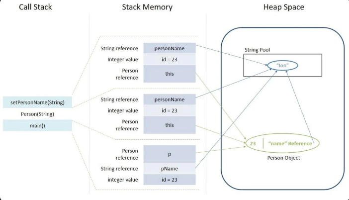
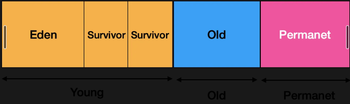

# 🤖 Java 가이드 : 개념 및 개발

Java 언어의 기초 문법부터 객체지향, 멀티스레드, 컬렉션 등 여러 주제를 다룬 문서입니다.

---

## 📘 주요 개념

### 기본형 타입 (Primitive Type) vs 참조형 타입 (reference type)
- **기본형 타입**
  1. 타입종류
     - 논리형 : boolean (1byte)
     - 문자형 : char (2byte)
     - 정수형 : byte (1byte), short (2byte), int (4byte), long (8byte)
     - 실수형 : float (4byte), double (8byte)
  2. 특징
     - 메모리의 **stack**에 값(value) 자체를 저장
     - 객체가 아니기 때문에 **NULL 불가**
     - 산술 연산 가능
     - 저장공간에 실제 값을 가짐
     - 변수 선언 동시에 메모리 생성
     ```Java
        int a = 10;
        double pi = 3.141592;
        boolean flag = true;
        char ch = 'A';
        ```
  3. 값 전달 방식
      - 실제 값이 복사되어 전달
     ```Java
        void modify(int x) {
        x = 100;    // x의 값이 복사되어 전달되므로, 원본 x의 값이 변하지 않음
        }
        ```

- **참조형 타입**
    1. 타입종류
       - 클래스 (class)
       - 인터페이스 (interface)
       - 배열 (array)
       - 열거형 (enum)
    2. 특징
        - 기본형 이외의 타입 ( ex) 배열(Array), 열거형(enum), 인터페이스(interface), 클래스(class) )
        - 실제 객체는 **힙(heap)** 에 할당되고, stack에는 메모리 주소가 저장
        - 객체이기 때문에 **NULL을 대입 할 수 있음** / 모든 참조형의 기본값은 **NULL**
        - 런타임에 생성된 객체이므로, **크기&구조를 자유롭게 정의**
       ```Java
          String str = "Hello, Java!";
          int[] number = {1, 2, 3, 4, 5};
          List<String> list = new ArrayList<>();
          MyClass obj = new MyClass();
          ```
    3. 값 전달 방식
        - 객체 참조 값 (주소)가 복사되어 전달
       ```Java
          void modifyArray(int[] arr) {
            arr[0] = 99;    // 참조가 복사되어 전달되므로, 같은 배열의 객체를 참조하여 내부 값이 바뀜
          }    
          ```


---


### String 문자열
- 문자열을 다루는 가장 기본적이고 중요한 참조형 타입 클래스
  ```java
  public final class String
    implements java.io.Serializable, Comparable<String>, CharSequence, Constable, ConstantDesc {
    
    @Stable
    private final byte[] value;
  }
  ```
- 특징
  + Immutable class (final 키워드 사용)
    * 한 번 생성된 문자열 값은 변하지 않는다. 
    * 할당 연산자(=) 또는 플러스 연산자(+) 사용 시 참조 값이 바뀌지 않고 새로운 값을 만들 후 참조하는 값을 이동시킨다
    ```java
    String a = "test";
    a += "test"; // 기존 test 위치에 추가되는 것이 아니라 testtest 를 만들고 참조하는 값의 위치를 바꾼다
    ```
  + Method Area 생성 (String Pool) 
    ```java
    String a = "test";
    String b = "test";
    String c = new String("test");
    String d = new String("test");
    
    System.out.println(a == b); // true
    System.out.println(a == c); // false
    System.out.println(b == c); // false
    System.out.println(c == d); // false
    
    System.out.println(c.intern() == a); // true (intern() → Pool 참조)
    ```
    * 변수 a 에 문자열 할당 시 String Pool에 test 가 만들어고 a 는 해당 값을 참조한다. 동일한 문자열을 b = "test" 를 넣으면 새로운 값이 아닌 기존 값을 찾아서 참조하게 된다.
    * new 사용 시 Heap 생성 된 문자열의 참조 값은 할당 연산자로 생성된 문자열의 참조 값과 같지 않다
    * 동일한 값은 공유됨
    * intern() 키워드 Heap 객체 -> Pool 객체로 전환
- 형변환
  + 데이터 타입 -> String 으로 변환 시
  ```java
  String convertedValue = String.valueOf(Object); 
  ``` 
  + String 에서 다른 데이터 타입으로 변환 시
  ```java
  int index = 1;
  String str = "4885";

  int num = Integer.parseInt(str);
  double doubleNum = Double.parseDouble(str);
  float floatNum = Float.parseFloat(str);
  char c = str.charAt(index);
  ```
- 자주 쓰이는 함수
  + 대소문자 : a.toLowerCase(), a.toUpperCase()
  + 포함여부 : a.contains()
  + 값비교 : contentEquals()
  + 시작/종료 매치 : starsWith(), endsWith()
- 관련된 심화 주제
  + StringBuilder/StringBuffer, JVM 구조


---


### Equals
- 자바에서 **equlas()** 함수는 객체의 동등성을 비교하는 데 사용됩니다.
- 기본적으로 Object 클래스에 정의되어 있으며, 두 객체가 메모리상에서 동일한 객체를 참조하는지 비교합니다.

- 대부분의 경우, 객체가 메모리상에서 동일한 객체인지보다는 객체의 **값**이 동일한지를 비교하고 싶을때가 많습니다.
- 예를 들어, 두개의 String 객체가 서로 다른 메모리 위치에 있더라도 내용이 같다면 동등하다고 판단하고 싶을 것 입니다.
- 이럴 때 **equals()** 를 오버라이드하여 객체의 논리적인 동등성을 비교하도록 구현합니다.


- **Equals 메서드 규약**
  1. 반사성 : 어떤 객체 o에 대해 **o.equals(o)** 는 항상 **true**를 반환해야 합니다.
  2. 대창성 : 어떤 객체 o1과 o2에 대해 **o1.equals(o2)** 가 **true**를 반환하면, **o2.equals(o1)** 도 **true**를 반환해야 합니다.
  3. 추이성 : 어떤 객체 o1, o2, o3에 대해 **o1.equals(o2)** 가 **true**이고, **o2.equals(o3)** 가 true를 반환하면, **o1.equals(o3)** 도 **true** 를 반환해야 합니다.
  4. 일관성 : 어떤 객체 o1과 o2에 대해 **equals()** 비교에 사용되는 정보가 변경되지 않는 한, **o1.equals(o2)** 의 호출 결과는 **항상 동일**해야 합니다.
  5. null과의 비교 : 어떤 객체 o에 대해 **o.equals(null)** 은 **항상 false**로 반환 해야 합니다.


- **hashCode 규약**
  1. equals 비교에 사용되는 정보가 변경되지 않았다면, 애플리케이션이 실행되는 동안 객체의 hashCode메서드는 몇 번을 호출해도 **항상 같은 값**을 반환 해야 합니다.
  2. equals(Object)가 두 객체를 같다고 판단했으면, 두 객체의 hashCode 값은 동일 해야 합니다.
  3. 두 객체를 다르다고 판단했더라도, 두 객체의 hashCode 값은 같을 수 있습니다.

- hashCode를 재정의 하지 않았을 경우 생기는 문제점
  1. 같은 값을 가진 객체가 서로 다른 해시값을 갖게 될 수 있습니다.
    ```java
  class Person {
            String name;
            int age;

            Person(String name, int age) {
                this.name = name;
                this.age = age;
            }
            // hashCode() 재정의 안 함
            // equals() 재정의 안 함 (기본 Object의 equals() 사용)
        }

    Person person1 = new Person("Alice", 30);
    Person person2 = new Person("Alice", 30);

    System.out.println(person1.hashCode()); // 예: 123456789
    System.out.println(person2.hashCode()); // 예: 987654321 (다른 값)
    ```
  2. 특히 HashMap의 key 값으로 해당 객체를 사용할 경우 문제가 발생합니다.
     + HashMap은 key-value 쌍을 저장하는 자료구조입니다. HashMap은 key 객체의 hashCode() 값을 사용하여 해당 객체가 저장 될 "버킷"을 결정 합니다.
       그리고 같은 버킷 내에서는 equals() 메서드를 사용하여 key 객체의 동등성을 최종적으로 확인합니다.
     + hashCode()를 재정의 하지 않아 같은 값을 가진 객체가 서로 다른 해시 값을 갖게 된다면, HashMap에서 해당 객체를 찾거나 저장 할때 문제가 발생합니다. 
     ```java
     Person person1 = new Person("Alice", 30);
     Person person2 = new Person("Alice", 30);

     HashMap<Person, String> map = new HashMap<>();
     map.put(person1, "정보 1");

     String info = map.get(person2);
     System.out.println(info); // 결과: null
     ```
     + map.put(person1, "정보 1")을 호출하면, HashMap은 person1의 hashCode() 값을 계산하여 특정 버킷에 "정보 1"을 저장합니다.
     + 이제 person2 객체를 사용하여 HashMap에서 "정보 1"을 가져오려고 합니다.
     + 결과는 **null**이 됩니다. 왜냐하면 HashMap은 person2의 **hashCode()** 값을 계산하는데,
       이 값이 person1의 hashCode() 값과 다르기 때문에 HashMap은 person1이 저장된 버킷이 아닌
       **다른 버킷**을 찾아갑니다. 그 버킷에는 person1 객체가 없으므로 **null**을 반환하게 되는 것입니다.
       논리적으로는 같은 객체임에도 불구하고, hashCode()가 다르기 때문에 HashMap은 이 두 객체를 다른 객체로 취급하게 됩니다.


- equals()와 hashCode()를 같이 재정의해야 하는 이유
  1. hashCode()를 재정의 하지 않으면 같은 값 객체라도 해시값이 다를 수 있다. 따라서 HashTable에서 해당 객체가 저장 된 버킷을 찾을 수 없습니다.
  2. equals()를 재정의 하지 않으면 hashCode()가 만든 해시값을 이용해 객체가 저장 된 버킷을 찾을 수 있지만 해당 객체가 자신과 같은 객체인지 값을 비교할 수 없기 때문에 null을 리턴하게 됩니다.


---


### 추상클래스 vs 인터페이스
- 추상 클래스(Abstract Class) 란?
  + 자바에서 추상 클래스(Abstract Class)는 객체지향 프로그래밍의 중요한 요소 중 하나로, 불완전한 클래스를 의미합니다. 
  + 객체를 직접 생성 할 수 없는 클래스 이며, abstract 키워드를 사용하여 선언됩니다.

- 추상 클래스 특징
  + 추상메서드와 일반메서드를 모두 가질 수 있습니다.
  + 인스턴스 변수를 가질 수 있습니다.
  + 생성자를 가질 수 있습니다.
  + 단일 상속만 가능 합니다. 클래스는 하나의 추상 클래스만 상속 받을 수 있습니다.
  + 객체를 직접 생성할 수 없습니다. 추상 클래스를 상속받는 자식 클래스를 통해 객체를 생성해야 합니다.

- 추상 클래스 사용 목적
  + 공통 기능 및 속성 정의 : 여러 클래스에서 공통적으로 사용되는 필드와 메서드를 정의하여 코드 중복을 줄이고, 일관성을 유지 합니다.
  + 부분적인 구현 제공 : 일부 메서드는 구현을 제공하고, 일부 메서드는 추상 메서드로 남겨두어 자식클래스에서 반드시 구현하도록 강제합니다.
  + 상속 계층 구조의 기반 : 관련된 클래스들의 상속 계층 구조를 구축하기 위해 사용됩니다.

- 소스 예제
  ```java
    abstract class Shape {
        String color;
    
        public Shape(String color) {
            this.color = color;
        }
    
        // 추상 메서드 (자식 클래스에서 반드시 구현해야 함)
        abstract double getArea();
    
        // 일반 메서드
        public String getColor() {
            return color;
        }
    }
    
    class Circle extends Shape {
        double radius;
    
        public Circle(String color, double radius) {
            super(color);
            this.radius = radius;
        }
    
        @Override
        double getArea() {
            return Math.PI * radius * radius;
        }
    }
    
    class Rectangle extends Shape {
        double width;
        double height;
    
        public Rectangle(String color, double width, double height) {
            super(color);
            this.width = width;
            this.height = height;
        }
    
        @Override
        double getArea() {
            return width * height;
        }
    }
    
    public class Main {
        public static void main(String[] args) {
            // 추상 클래스는 직접 객체 생성 불가
            // Shape myShape = new Shape("Red"); // 컴파일 오류
    
            Shape myCircle = new Circle("Blue", 5.0);
            Shape myRectangle = new Rectangle("Green", 4.0, 6.0);
    
            System.out.println("Circle color: " + myCircle.getColor());
            System.out.println("Circle area: " + myCircle.getArea());
    
            System.out.println("Rectangle color: " + myRectangle.getColor());
            System.out.println("Rectangle area: " + myRectangle.getArea());
        }
    }
  ```

- 인터페이스(Interface) 란?
  + 자바에서 인터페이스는 클래스가 구현해야 하는 메서드들의 집합을 정의하는 특별한 종류의 참조형 타입입니다. 
  + 인터페이스는 클래스가 어떤 기능을 제공해야 하는지에 대한 규약 또는 명세를 정의하는 역할을 합니다.
  
- 인터페이스 특징
  + 추상메서드만 가질 수 있습니다.
  + 상수 필드만 가질 수 있습니다.
  + 다중 상속을 지원합니다. 클래스는 여러 인터페이스를 구현할 수 있습니다.
  + 객체를 직접 생성할 수 없습니다. 인터페이스는 구현하는 클래스를 통해 사용됩니다.

- 인터페이스 사용목적
  + 다형성 구현 : 여러클래스가 동일한 인터페이스를 구현함으로써, 인터페이스 타입으로 객체를 참조하여 다양한 구현체를 동일하게 처리 할 수 있습니다.
  + 코드 재사용성 : 공통된 기능을 인터페이스로 정의하고 여러 클래스에서 구현하여 코드 중복을 줄일 수 있습니다.
  + 설계 규약 정의 : 클래스가 따라야할 메서드를 정의하여, 개발자 간의 협업을 제공합니다.

- 소스 예제
  ```java
    interface Animal {
        void makeSound(); // 추상 메서드
        void eat();       // 추상 메서드
    }
    
    class Dog implements Animal {
        @Override
        public void makeSound() {
            System.out.println("Woof!");
        }
    
        @Override
        public void eat() {
            System.out.println("Dog food");
        }
    }
    
    class Cat implements Animal {
        @Override
        public void makeSound() {
            System.out.println("Meow!");
        }
    
        @Override
        public void eat() {
            System.out.println("Fish");
        }
    }
    
    public class Main {
        public static void main(String[] args) {
            Animal myDog = new Dog();
            Animal myCat = new Cat();
    
            myDog.makeSound(); // 출력: Woof!
            myDog.eat();       // 출력: Dog food
    
            myCat.makeSound(); // 출력: Meow!
            myCat.eat();       // 출력: Fish
        }
    }
  ```
  
- 결론
  + 추상 클래스를 사용하는 경우 : 관련된 클래스 간 코드를 공유하고, 클래스들이 공통된 기반 클래스를 가져야 하며, public 외의 접근 제한자를 가진 멤버가 필요할때 사용 합니다.
  + 인터페이스를 사용하는 경우 : 서로 관련 없는 클래스들이 특정 행동 규약을 따르도록하고, 다중 상속의 이점을 활용 하고 싶을때 사용 합니다.


---


### StringBuilder VS StringBuffer
- 개념
    + 가변 문자열을 다룰 수 있도록 설계 된 클래스로 AbstarctStringBuilder 클래스를 상속받아 구현
    + String 클래스와 달리 값을 변경해도 새로운 객체를 생성하지 않기에 문자열 반복 수정하는 경우 성능이 뛰어남
  ```java
  public final class StringBuffer
    extends AbstractStringBuilder
    implements Serializable, Comparable<StringBuffer>, CharSequence {}

  public final class StringBuilder
    extends AbstractStringBuilder
    implements java.io.Serializable, Comparable<StringBuilder>, CharSequence {}
  ```
- 공통점
    + | 항목     | 설명                                                                              |
          |--------|---------------------------------------------------------------------------------|
      | 패키지    | 둘 다 `java.lang` 패키지에 포함되어 있음                                                    |
      | 상속 구조  | 모두 `AbstractStringBuilder`를 상속                                                  |
      | 가변성    | `String`과 달리 내부 문자열이 변경 가능 (mutable)                                            |
      | 내부 구조  | 내부적으로 `char[]` 배열을 사용                                                           |
      | 주요 메서드 | `append()`, `insert()`, `delete()`, `replace()`, `reverse()`, `toString()` 등 동일 |
      | 자동 확장  | 버퍼의 크기가 초과되면 자동으로 확장됨                                                           |
      | 성능     | 문자열 연산 시 `String`보다 훨씬 빠름                                                       |
      | 사용 목적  | 문자열의 빈번한 수정이 필요할 때 사용                                                           |
      | 빌더 패턴  | 자기 자신을 반환하는 빌더패턴 사용                                                             |
    + 빌더 패턴 사용하기에 .append().append().append() 가능한 구조
      ```java
      // StringBuilder
      public StringBuilder append(String str) {
          super.append(str);
          return this;
      }
      
      // StringBuffer
      public synchronized StringBuffer append(StringBuffer sb) {
          toStringCache = null;
          super.append(sb);
          return this;
      }
      ```

- 차이점
    + | 비교 항목         | StringBuilder                         | StringBuffer                           |
          |-------------------|----------------------------------------|----------------------------------------|
      | 도입 시기         | JDK 1.5                                | JDK 1.0                                |
      | 스레드 안전성     | ❌ 비동기 (Thread-unsafe)              | ✅ 동기화됨 (Thread-safe)              |
      | 동기화            | ❌ 없음                                | ✅ 모든 메서드에 `synchronized` 적용   |
      | 성능 (단일 스레드)| 빠름                                  | 느림 (불필요한 동기화 오버헤드)       |
      | 성능 (멀티 스레드)| 데이터 충돌 위험 있음                  | 안전하게 공유 가능                     |
      | 사용 권장 환경    | 단일 스레드                            | 멀티 스레드                            |
      | 대표 사용 예시    | 일반적인 문자열 처리 작업              | 스레드 공유 환경에서의 문자열 처리     |
    + StringBuffer 클래스 내부에 선언된 모든 메서드에 **synchronized** 키워드 사용하고 있음
      ```java
      // StringBuffer
      public synchronized String toString() {
          if (toStringCache == null) {
              return toStringCache =
                      isLatin1() ? StringLatin1.newString(value, 0, count)
                                 : StringUTF16.newString(value, 0, count);
          }
          return new String(toStringCache);
      }
      
      public synchronized String substring(int start) {
          return substring(start, count);
      }
      ```

- 성능 비교 (String vs StringBuilder vs StringBuffer)
    + StringBuilder 와 StringBuffer 비슷 >> String 속도차이가 큼
    + 멀티 스레드 환경이 아니라면 StringBuilder 멀티 스레드 환경이라면 StringBuffer 사용
  ```java
  for (int i = 0; i < n1; i++) str += "a"; // 12초
  stringBuilder.append("a".repeat(n1)); // 0.11초
  stringBuffer.append("a".repeat(n1)); // 0.12 초
  ```
- 주요 메서드
    + append, insert, replace, delete, reverse, toString, capacity, ensureCapacity, charAt, substring
- 추가 팁
    + capacity(초기 용량)을 예상하여 생성하면 성능 높일 수 있음
    + 내부적으로 char [] 사용하기에 이보다 커지는 경우 배열 복사가 일어나기에 최대 치를 고려하면 배열 복사하는 코스트를 줄일 수 있음
  > StringBuilder sb = new StringBuilder(1000); // 초기 용량 설정
  >

---

### 오버로딩(Overloading) vs 오버라이딩(overriding)
- **오버로딩**
    - 같은 클래스 내에서 메서드 이름은 같지만, 매개변수 목록(타입, 개수 또는 순서)이 서로 다른 메서드를 여러 개 정의
    - 특징
      1. 컴파일 시점에 호출될 메서드를 결정 → 정적 바인딩(static binding)
      2. 반환타입만 다른 것은 시그니처가 동일하기 때문에 오버로딩이 아님
      3. 보통 같은 기능의 변형된 버전을 제공할 때 사용
      4. 같은 이름으로 여러 종류의 입력을 받는 편의 메서드를 만들 때 사용
    ```java
        public class Calculator {
        public int add(int a, int b) {
            return a + b;
        }
        public double add(double a, double b) {
            return a + b;
        }
        public int add(int a, int b, int c) {
            return a + b + c;
        }
    }
    
    // 호출
    Calculator calc = new Calculator();
    calc.add(1, 2);       // add(int,int)
    calc.add(1.5, 2.3);   // add(double,double)
    calc.add(1, 2, 3);    // add(int,int,int)
    ```
  
  - **오버라이딩**
      - 상속 관계에서 **자식 클래스가 부모 클래스로부터 물려받은 메서드**를 같은 시그니처(이름·매개변수)로 재정의
      - 특징
        1. 런타임 시점에 실제 객체 타입에 따라 호출될 메서드를 결정 → 동적 바인딩(dynamic binding)
        2. @Override 애노테이션 사용 권장
        3. **접근 제어자**는 부모보다 좁게 바꾸지 못함, **예외 선언(throws)**도 부모 메서드보다 넓게(더 많은) 선언 불가
        4. 다형성을 통해 **부모 타입 변수**로 자식 객체의 오버라이드된 메서드를 호출 가능 
        5. 상속을 활용해 부모 클래스의 기본 동작을 **특정 자식 클래스에 맞춰** 수정하거나 확장할 때 사용
      ```java
    class Animal {
      public void sound() {
          System.out.println("동물이 웁니다");
      }
    }
    
    class Dog extends Animal {
      @Override
      public void sound() {
        System.out.println("멍멍!");
      }
    }

    class Cat extends Animal {
      @Override
      public void sound() {
        System.out.println("야옹~");
      }
    }

    // 호출
    Animal a1 = new Dog();
    Animal a2 = new Cat();
    a1.sound();  // 멍멍!   (Dog.sound)
    a2.sound();  // 야옹~   (Cat.sound)
    ```


---

### Thread 쓰레드
- 개념
  + 프로세스 내부에서 실행되는 작업 단위. 같은 메모리 공간을 공유
  + 프로세스는 실행중인 프로그램 단위. 자체 메모리 공간을 가짐
  + | 항목         | 프로세스 (Process)                          | 쓰레드 (Thread)                               |
    | ---------- |-----------------------------------------|--------------------------------------------|
    | **정의**     | 실행 중인 프로그램                              | 프로세스 내의 실행 단위                              |
    | **메모리 구조** | 고유한 메모리 공간 (Heap, Stack, Data, Code 분리) | 같은 프로세스 내에서 Heap, Code, Data 공유. Stack은 개별 |
    | **속도/성능**  | 생성/전환 비용 큼 (Heavyweight)                | 빠름 (Lightweight)                           |
    | **안정성**    | 하나가 죽어도 다른 프로세스 영향 없음                   | 하나의 쓰레드가 문제 생기면 전체 프로세스에 영향 가능             |
    | **통신 방식**  | IPC 필요 (Socket, Pipe 등)                 | 메모리 공유로 직접 통신 가능                           |
    | **예시**     | 브라우저, 게임, 백그라운드 서비스                     | 브라우저 탭, 음악 앱의 재생/다운로드 쓰레드 등                |

- 쓰레드 생성 3가지 방식 + Runnable 선호 이유
  + 쓰레드 클래스 상속
  ```java
  MyThread myThread = new MyThread();
  myThread.start();
  
  class MyThread extends Thread {
    public void run() {
        System.out.println("Running in MyThread");
    }
  }
  ```
  + Runnable 구현
  ```java
  MyRunnable myRunnable = new MyRunnable();
  Thread thread = new Thread(myRunnable);
  thread.start();
  
  class MyRunnable implements Runnable {
    public void run() {
        System.out.println("Running in MyRunnable");
    }
  }
  ```
  + 람다식 (Java 8 이상)
  ```java
   Runnable r = () -> System.out.println("Running with lambda");
   new Thread(r).start();
  ```
  + Runnable 선호 이유
    * Java 단일 상속만 지원되기에 Thread 상속시 다른 클래스 상속 불가
    * Runnable 인터페이스가 더 유연함
    * ExecutorService 등 고급 API 와 호환성이 좋음
    * | 항목            | Thread 상속 방식                          | Runnable 구현 방식                           |
      |----------------|-------------------------------------------|----------------------------------------------|
      | 구현 방식       | `extends Thread`                          | `implements Runnable`                        |
      | 상속 제약       | 다른 클래스 상속 불가 (단일 상속 한계)    | 다른 클래스와 함께 구현 가능 (유연함)        |
      | 결합도          | 실행 코드 + 쓰레드 실행이 강하게 결합됨   | 실행 로직과 쓰레드 실행 분리 (낮은 결합도)   |
      | 재사용성        | 낮음 (Thread 객체 재사용 어려움)          | 높음 (Runnable 객체 재사용 가능)             |
      | 실무 적합성     | 제한적 사용                                | 선호도 높음 (ExecutorService와 연계 용이)    |


- 쓰레드 생명주기와 상태 변화
  + New -> Runnable -> Running -> Blocked,Waiting,Timed Waiting -> Terminated
  + Thread.getState() 로 확인 가능하며 JVM 에서 관리
  + Runnable 상태에서 JVM 스케쥴러가 유선순위 시간 분할 정책에 따라 실행 시간을 조절
- 관련 개념
  + synchronized, volatile, ReentrantLock, 세마포어, 뮤텍스, 데드락


---


### 객체지향 설계의 5가지 원칙(SOLID)
- 개념
  + 객체지향 설계의 5가지 원칙인 SOLID는 소프트웨어 설계를 더 **이해하기** 쉽고, **유연하며**, **유지보수** 하기 쉽게 만드는 데 도움을 주는 지침 입니다.

- **SRP(Single Responsibility Principle)** : 단일 책임 원칙
  + 개념 : 한 클래스는 단 하나의 책임만 가져야 합니다.
  + 설명 : 클래스를 변경해야 하는 이유는 단 하나여야 한다는 의미 입니다. 
          클래스가 여러 책임을 가지게 되면, 
          한 책임의 변경이 다른 책임과 관련된 코드에 영향을 미칠 수 있어 코드 수정이 복잡해지고 오류 발생 가능성이 높아집니다.
  + 나쁜 예 : User 클래스가 사용자 정보관리, 사용자 인증, 이메일 전송 기능을 모두 가지고 있는 경우, 이메일 전송 로직 변경이 사용자 정보 관리 로직에 영향을 줄 수 있습니다.
  + 좋은 예 : UserInfo(사용자 정보 관리), UserAuthenticator(사용자 인증), EmailService(이메일 전송) 클래스로 분리합니다.

- **OCP(Open-Closed Principle)** : 개방-패쇄 원칙
  + 개념 : 소프트웨어 요소(클래스, 모듈, 함수 등)는 확장에는 열려 있어야 하고, 변경에는 닫혀있어야 합니다.
  + 설명 : 기본 코드를 변경하지 않고도 기능을 추가하거나 확장할 수 있어야 합니다. 이는 주로 추상화와 다형성을 통해 달성됩니다.
  + 나쁜 예 : 특정 구분 값 추가에 따른 클래스 내부의 if-else 문을 계속 수정해야 하는 경우 새로운 구분값이 추가 될때마다 코드를 변경해야 합니다.
  + 좋은 예 : 메서드 인터페이스를 만들고, 각 구분 값에 대한 인터페이스를 구현하도록 합니다. 클래스는 메서드 인터페이스에 의존하여 새로운 구분값이 추가 되어도 기존 코드를 수정할 필요가 없습니다.

- **LSP(Liskov Substitution Principle)** : 리스코프 치환 원칙
  + 개념 : 자식 클래스는 언제나 자신의 부모 클래스로 교체될 수 있어야 합니다.
  + 설명 : 자식 클래스는 부모클래스의 기능을 그대로 수행할 수 있어야 하며,
          자식 클래스를 사용한다고 해서 시스템의 동작이 예상치 못하게 변경되어서는 안 됩니다.
          즉, 부모클래스가 사용되는 곳에 자식 클래스를 넣어도 문제없이 동작해야 합니다.
  + 나쁜 예 : Bird 클래스에 fly()메서드가 있고, Penguin 클래스가 Brid 클래스를 상속 받지만 fly() 메서드를 오버라이드하여, 예외를 던지거나 아무것도 하지 않도록 구현하는 경우, Bird 타입으로 펭귄 객체를 다루면 fly() 호출시 문제가 발생할 수 있습니다.
  + 좋은 예 : fly() 메서드가 필요한 새와 그렇지 않은 새를 구분하는 인터페이스를 도입하거나, 상속 관계를 재검토하여 Penguin이 Bird의 모든 행동 규약을 따르도록 설계합니다.

- **ISP(Interface Segregation Principle)** : 인터페이스 분리 원칙
  + 개념 : 클라이언트는 자신이 사용하지 않는 메서드에 의존하도록 강요되어서는 안 됩니다.
  + 설명 : 하나의 거대한 인터페이스보다는 특정 클라이언트에 특화된 여러 개의 작은 인터페이스로 분리하는 것이 좋습니다. 이렇게 하면 클라이언트는 자신이 필요한 메서드만 알고 사용하게 되어 결합도가 낮아집니다.
  + 나쁜 예 : Worker 인터페이스에 work(), eat(), sleep() 메서드가 모두 포함되어 있고, 로봇 작업자는 eat()이나, sleep()메서드가 필요 없음에도, 이를 구현해야 하는 경우
  + 좋은 예 : Workable(work()), Eatable(eat()), Sleepable(sleep()) 인터페이스로 분리하고, 각 클래스는 필요한 인터페이스만 구현하도록 합니다. 로봇작업자는 Workable 인터페이스만 구현할 수 있습니다.

- **DIP(Dependency Inversion Principle)** : 의존관계 역전 원칙
  + 개념 : 상위 수준 모듈은 하위 수준 모듈에 의존해서는 안 됩니다. 둘다 추상화에 의존해야하며, 추상화는 세부 사항에 의존해서 안 되며, 세부 사항이 추상화에 의존해야 합니다.
  + 설명 : 구체적인 클래스에 직접 의존하기 보다는 인터페이스나 추상클래스에 의존해야 합니다. 이를 통해 모듈 간의 결합도를 낮추고 유연성을 높일 수 있습니다. 의존성 주입은 이 원칙을 구현하는 일반적인 방법 중 하나 입니다.
  + 나쁜 예 : NotificationService 클래스가 구체적인 EmailSender 클래스에 직접 의존하는 경우, 나중에 SMS 알림으로 변경하려면 NotificationService 코드를 수정 해야 합니다.
  + 좋은 예 : MessageSender 인터페이스를 만들고, EmailSender와, SmsSender가 이를 구현하도록 합니다.
            NotificationService는 MessageSender 인터페이스에 의존하며, 실제 사용할 MessageSender 구현체는 외부에서 주입 받습니다.

- SOLID 원칙의 이점
  + 유지보수성 향상 : 코드를 이해하고 수정하기 쉬워집니다.
  + 확장성 향상 : 새로운 기능을 추가하거나 기존 기능을 변경하기에 용이해집니다.
  + 재사용성 증가 : 모듈화가 잘 되어 있어 다른 프로젝트에서도 코드를 재사용하기 좋습니다.
  + 결합도 감소, 응집도 증가 : 모듈 간의 의존성은 줄어들고, 모듈 내의 요소들은 서로 밀접하게 관련됩니다.
  + 테스트 용이성 증가 : 각 모듈을 독립적으로 테스트하기 쉬워집니다.

---

### JVM (Java Virtual Machine)
- 자바 바이트코드(.class 파일)를 실행하는 가상의 컴퓨터(런타임)
- 물리적 OS나 하드웨어와 무관하게 **한번 작성하면 어디서나 실행**
- 바이트코드를 실행하고, 메모리를 관리하며, 플랫폼 독립성과 안정성을 제공하는 자바 프로그램의 **심장** 역할
- 역활
    - 자바 컴파일러가 생성한 바이트코드 기계어로 변환해 실행
    - 메모리 관리 : 힙(객체), 스택(메서드 호출), 메타스페이스(클래스 정보) 등을 할당 또는 회수
    - 가비지 컬렉션(GC) : 더 이상 사용되지 않는 객체를 자동으로 정리
    - JIT(Just-In-Time) 컴파일 : 자주 쓰이는 바이트코드를 네이티브 코드로 변환해 성능 최적화
- JVM 내부구조
    1. 클래스 로더 (Class Loader)
        - .class 파일을 읽어 메모리에 올리고, 의존 클래스로도 로딩
    2. 런타임 데이터 영역
        - 메소드 영역(Method Area / MetaSpace) : 클래스 구조, 상수풀, static 변수
        - 힙(Heap) : new로 생성된 객체
        - 스택(Stack) : 각 스레드별 메서드 호출 정보와 지역변수
        - PC 레지스터 : 현재 실행중인 바이트코드 주소
        - 네이티브 메소드 영역(Native Method Stack) : 네이티브 코드 호출 정보
    3. 실행 엔진 (Excusion Engine)
        - 인터프리터 : 바이트코드를 한 줄씩 해석
        - JIR 컴파일러 : 반복 실행되는 코드를 네이티브로 변환
        - GC 모듈 : 힙에서 사용하지 않는 객체 탐지 및 정리
- JVM 동작 흐름
    1.	소스 코드(.java)를 javac로 컴파일 → 바이트코드(.class)
    2.	클래스 로더가 바이트코드 로딩
    3.	**바이트코드 검증(Bytecode Verifier)** 으로 안전성 검사
    4.	실행 엔진에서 인터프리트 또는 JIT 컴파일 후 실행
    5.	런타임에 필요 시 GC로 메모리 정리
- JVM 장점
    - 플랫폼 독립성 : "Write Once, Run Anywhere"
    - 안정성 : 바이트코드 검증으로 잘못된 메모리 접근 방지
    - 자동 메모리 관리 : 개발자가 직접 free/delete 하지 않아도 됨
    - 성능 최적화 : JIT, GC 튜닝으로 고속 실행이 가능


---


### volatile
- 개념
  + 사전적 의미로 `휘발성`을 뜻함
  + 변수의 값이 여러 쓰레드 간에 공유됨을 보장하는 키워드
  + 메인 메모리와 스레드 로컬 메로리 간의 동기화 문제 해결
- 필요한 이유?
  + Java 에선 각 스레드가 자기만의 캐시를 유지함 → 변수 값이 다른 스레드에 반영 안 될 수 있음
  + 변수 읽기 시 메인 메모리부터 직접 읽어옴
  + 변수 쓰기 시 메인 메모리에 적용(캐시 패싱)
- 언제 쓰면 좋을까?
  + Flag 변수 (true/false) 가 있는 경우
- ❗주의할 점
  + 원자성 보장 X
    * 원자성은 하나의 연산이 중단 없이 단일 동작처럼 수행되는 것
    ```java
    private volatile int count = 0;
    public void increment() {
        count++;
    }
    ```
    * count++ 는 count 읽기, +1 하기, count 쓰기 3단계로 나뉘기에 여러 쓰레드가 동시 접근 시 값이 꼬일 수 있음
  + Thread-Safe X
    * 여러 스레드가 동시에 접근해도 결과가 일관되고 에러 없이 작동하는 상태
    * 변수의 최신값은 공유되지만 그 값에 대해 경쟁조건은 방지하지 못함
  + 그럼 어떻게?
    ```java
    private volatile int count = 0;
    public synchronized void increment() {
        count++;
    }
    
    private AtomicInteger count = new AtomicInteger();

    public void increment() {
        count.incrementAndGet(); // 원자적으로 증가
    }
    ```
    + volatile + synchronized 를 쓰거나 AtomicInteger 클래스 사용 필요


---


### final 키워드
- 개념
  + 자바에서 final 키워드는 **변경 될 수 없음**을 나타내는 비 접근 제어자 입니다.
  + 이 키워드는 변수, 메서드, 클래스에 적용 될수 있으며, 각각의 경우에 다른 의미를 가집니다.

- final 변수
  + 의미
    * 한번 초기화되면 그 값을 절대 변경할 수 없는 상수가 됩니다.

  + 초기화
    * 선언 시점에 초기화 해야합니다.
    * 생성자 내에서 초기화 할 수 있습니다.
    * static 블록 내에서 초기화 할 수 있습니다.

  + 특징
    * final로 선언된 변수는 제할당이 불가능합니다.
    * 만약 final 변수가 객체를 참조하고 있다면, 
      그 참조 자체는 변경할 수 없지만, 참조하는 객체의 내부 상태는 별경 될 수 있습니다.

  + 소스 예제
    ```java
    class MyClass {
          final int MAX_VALUE = 100; // 선언과 동시에 초기화
          final String GREETING;
          static final double PI = 3.14159;
    
          public MyClass(String greeting) {
              this.GREETING = greeting; // 생성자에서 초기화
          }
    
          public void doSomething() {
              // MAX_VALUE = 200; // 컴파일 오류! final 변수는 재할당 불가
              // GREETING = "Hello"; // 컴파일 오류!
          }
      }
      ```

- final 메서드
  + 의미
    * 하위 클래스에서 해당 메서드를 오버라이드 할 수 없도록 만듭니다.

  + 목적
    * 메서드의 구현을 변경하지 못하도록 하여, 핵심적인 동작을 보장하고 싶을 때 사용합니다.
    * 상속 계층 구조에서 특정 메서드의 동작 일관성을 유지하고 싶을 때 사용합니다.

  + 소스 예제
  ```java
  class Animal {
        final void makeSound() {
            System.out.println("동물 소리");
        }
    
        void eat() {
            System.out.println("먹는다");
        }
    }
    
    class Dog extends Animal {
        // @Override
        // void makeSound() { // 컴파일 오류! final 메서드는 오버라이드 불가
        //     System.out.println("멍멍");
        // }
    
        @Override
        void eat() {
            System.out.println("사료를 먹는다"); // 오버라이드 가능
        }
    }
  ```

- final 클래스
  + 의미
    * 해당 클래스를 상속할 수 없도록 만듭니다.
    * 다른 클래스가 이 클래스를 부모 클래스로 사용할 수 없습니다.

  + 목적
    * 클래스의 구현을 완전하게 만들고, 더 이상 확장될 필요가 없다고 판단될 때 사용합니다.
    * 보안상의 이유로 클래스의 변경을 막고 싶을 때 사용합니다.

  + 소스 예제
  ```java
  final class SecureData {
        private String data;
    
        public SecureData(String data) {
            this.data = data;
        }
    
        public String getData() {
            return data;
        }
    }
    
    // class MoreSecureData extends SecureData { // 컴파일 오류! final 클래스는 상속 불가
    //     // ...
    // }
  ```
  
- final 키워드 사용의 이점
  + 불변성 확보 : final 변수를 사용하여 객체의 상태를 변경 불가능하게 만들 수 있습니다.
  + 보안 강화 : final 클래스나 메서드를 사용하여 의도치 않은 변경이나 확장을 막아 시스템의 보안을 강화할 수 있습니다.
  + 설계 명확성 : final 키워드를 사용함으로써 해당 요소가 변경되거나 확장되지 않음을 명시적으로 표현하여 코드의 의도를 더 명확하게 전달 할 수 있습니다.

---

### synchronized
- 멀티스레드 환경에서 동시성 제어(concurrency control)를 위해 사용
- 공유 자원(예: 객체 필드, 컬렉션 등)에 여러 스레드가 접근할 때 발생할 수 있는 경쟁 상태(race condition), 데이터 불일치 등을 방지
1. 기본 개념
    - 모니터 락(monitor lock)
        - 각 객체가 모니터(lock)를 하나씩 가지고 있음
        - 스레드는 synchronized가 선언된 영역에 들어가기 전 해당 객체의 모니터를 획득해야 하고, 끝나면 해제
    - 상호 배제(mutual exclusion)
        - 한 번에 단 하나의 스레드만 락을 획득하므로, 동기화된 영역 내부에서는 다른 스레드가 동시에 실행되지 않음
2. 사용 방법
    1. 메서드 단위 동기화
        - 인스턴스 메서드에 붙이면, this 객체의 모니터를 사용
        - 동일 인스턴스의 다른 synchronized 메서드와 상호 배제
    ```java
    public class Counter {
        private int count = 0;

        // 인스턴스 메서드 전체를 동기화
        public synchronized void increment() {
            count++;
        }

        public synchronized int getCount() {
            return count;
        }
    }
    ```
   2. 블록 단위 동기화
        - 유연성: 동기화 범위를 좁혀서 성능 최적화
        - 원하는 락 객체(일반 Object, 클래스 객체 등) 지정 가능
   ```java
    public class Counter {
        private int count = 0;
        private final Object lock = new Object();

        public void increment() {
            // 특정 객체(lock)만 동기화
            synchronized (lock) {
                count++;
            }
        }
    }
    ```
   3. static synchronized
        - 클래스 전체(모든 인스턴스)에서 하나의 락
        - static synchronized 메서드는 Util.class 객체를 락으로 사용
   ```java
    public class Util {
        private static int value = 0;

        // 클래스 레벨 모니터를 사용 (Util.class)
        public static synchronized void doSomething() {
            value++;
        }
    }
    ```
3. 재진입성
```java
public synchronized void methodA() {
    methodB();  // 같은 스레드가 다시 synchronized를 진입해도 블록됨 없이 실행
}

public synchronized void methodB() {
    // ...
}
 ```
4. 주의사항 및 성능고려
    - 과도한 블록 범위
        - 불필요하게 큰 범위를 동기화하면 성능 저하
        - 가능한 최소 범위로 좁힐 것
    - 데드락(Deadlock)
        - 서로 다른 락을 획득하려고 할 때 교착 상태 발생
    ```java
    synchronized(lockA) {
        synchronized(lockB) { … }
    }
    // 다른 스레드가 lockB 먼저, 그 다음 lockA를 획득하려고 하면 교착 발생
     ```
   - 락 경합(Lock Contention)
        - 락을 획득하려는 스레드가 많으면 대기 시간이 늘어남
        - 필요 시 java.util.concurrent 패키지의 ReentrantLock, ReadWriteLock 등을 고려
5. ex )
```java
public class SafeCounter {
    private int count = 0;

    public void increment() {
        synchronized (this) {   // 또는 synchronized 메서드
            count++;
        }
    }

    public int getCount() {
        synchronized (this) {
            return count;
        }
    }

    public static void main(String[] args) throws InterruptedException {
        SafeCounter counter = new SafeCounter();
        Runnable task = () -> {
            for (int i = 0; i < 1000; i++) {
                counter.increment();
            }
        };

        Thread t1 = new Thread(task);
        Thread t2 = new Thread(task);
        t1.start(); t2.start();
        t1.join(); t2.join();

        System.out.println("최종 count: " + counter.getCount());
        // 동기화 없으면 2000이 안 나올 수 있지만,
        // synchronized 덕분에 항상 2000 출력
    }
}
```

---

### 객체지향프로그래밍(OOP) 특징
- 개요
  + 객체지향 언어는 "객체(Object)"라는 개념을 중심으로 구성된 프로그래밍 방식입니다.
  + 객체는 **상태(필드)**와 **행동(메서드)**를 포함하는 독립적인 단위예요.
- 4대 특징
  + 캡슐화
    * 데이터(필드)와 메서드(기능)를 하나의 객체로 묶고, 외부에서 직접 접근하지 못하도록 보호.
    * **정보 은닉(Information Hiding)**이라고도 함.
    * private/public 가시성, getter/setter
    * 코드의 안정성을 높이고 외부에서 잘못된 변경을 막기 위함
  + 다형성
    * 하나의 객체 또는 메서드가 여러 가지 타입을 가질 수 있는 것
    * 유연하고 확장 가능한 구조를 만들기 위함
    * 다형성 방식으로 메소드 오버라이팅/오버로딩/제네릭/서브타입
  + 상속
    * 기존 클래스의 속성과 기능을 물려받아 새로운 클래스를 만드는 것.
    * extends 키워드를 사용하며 단일상속만 가능
    * 코드의 중복을 막고 불필요한 코드 생산을 막음 그리고 기능을 확장성 있게 구현
  + 추상화
    * 객체의 공통적인 속성과 기능을 추출하여 정의하는 것, 필요한 기능만 공개, 세부는 숨김
    * 추상화는 ‘복잡성을 줄이고 유연함을 높이기 위해’ 사용
      1. 공통점만 뽑아서 정의하면 여러 클래스가 이를 기반으로 동작 가능 → 유지보수, 확장성 증가
      2. 코드 중복을 줄이고, 변경에 강한 설계를 할 수 있음
      3. 인터페이스나 추상 클래스를 통해 "어떻게"보다는 "무엇을" 할 것인지에 집중하게 됨
    * 추상화 방식으로 추상 클래스와 인터페이스 방식
    * | 항목         | 추상 클래스 (`abstract class`) | 인터페이스 (`interface`)               |
      | ---------- | ------------------------- | --------------------------------- |
      | **의미**     | 공통된 속성과 동작을 가진 **상위 개념**  | **기능 규약**만 정의, 구조 설계 위주           |
      | **상속 가능성** | 단일 상속만 가능                 | 다중 구현 가능                          |
      | **필드 포함**  | 상태(변수)와 구현 메서드 포함 가능      | 상태 없음 (Java 8 이상 default 메서드는 가능) |
      | **의도**     | “is-a” 관계. 기본 동작 일부 제공    | “can-do” 관계. 행동 명세만 선언            |
      | **사용 예시**  | 비슷한 객체군을 기반으로 확장          | 다양한 객체가 공통 기능을 가질 때               |
- 정리
  + | 특징  | 설명                 | 키워드 / 예시                   |
    | --- | ------------------ | -------------------------- |
    | 추상화 | 필요한 기능만 공개, 세부는 숨김 | 인터페이스, 추상 클래스              |
    | 캡슐화 | 필드 보호 + 메서드로만 접근   | `private`, `getter/setter` |
    | 상속  | 부모 클래스를 재사용        | `extends`, 코드 재사용          |
    | 다형성 | 같은 메서드 호출, 다른 동작   | 오버라이딩, 동적 바인딩, 인터페이스 활용    |
- 객체지향언어 프로그래밍(OOP) VS 객체지향설계(SOLID)
  + | 항목 | 객체지향프로그래밍 (OOP) | SOLID 원칙                |
    | -- |--------------------|-------------------------|
    | 목적 | 프로그래밍 패러다임 자체      | 객체지향 설계를 더 유연하게 만드는 원칙  |
    | 범위 | 언어의 구조와 개념         | 설계 단계의 규칙               |
    | 역할 | 클래스와 객체 개념을 정의     | 구조적으로 유지보수성과 확장성을 보장    |
    | 예시 | 상속, 캡슐화, 다형성, 추상화  | SRP, OCP, DIP, LSP, ISP |


---


### 자바 메모리 모델
- 개요
    + 자바 프로그램에서 다양한 스레드가 힙 메모리에 접근할 때 발생하는 상호작용과 관련된 규칙 및 보증을 정의합니다.
    + 멀티스레드 환경에서 하나의 스레드가 메모리에 쓴 변경 사항이 다른 스레드에게 언제, 어떻게 보이는지를 규정하는 명세 입니다.
    + 자바 메모리 모델을 이해하는 것은 정확하고 효율적인 동시성 프로그래밍을 작성하는데 매우 중요합니다.

- 메인 메모리와 작업 메모리
    + 메인 메모리 : 모든 스레드가 공유하는 메모리 영역 입니다. 인스턴스 변수, static 변수 등이 여기에 저장됩니다.
    + 작업 메모리 : 각 스레드마다 가지는 로컬 메모리 영역 입니다. CPU 캐시, 레지스터 등이 여기에 해당될 수 있습니다. 스레드는 메인 메모리에서 변수를 자신의 작업 메모리로 가져와 작업하고, 그 결과를 다시 메인 메모리로 저장합니다.

- 가시성 문제
    + 한 스레드가 작업 메모리에서 변수 값을 변경했더라도, 그 변경 사항이 즉시 메인 메모리에 반영되지 않거나,
    + 다른 스레드가 메인 메모리에서 최신 값을 가져오지 않으면, 다른 스레드는 이전 값을 보게 되는 문제가 발생할 수 있습니다.

- 원자성 문제
    + 하나 이상의 연산이 중간에 다른 스레드에 의해 중단되지 않고 하나의 단위처럼 실행된느 것을 의미합니다.
    + 예를 들어 count++ 연산은 실제로는 읽기, 증가, 쓰기의 세 단계로 이루어지므로 원자럭이지 않습니다.
    + 여러 스레드가 동시에 이 연산을 수행하면 예상치 못한 결과가 발생할 수 있습니다.

- 순서 재정렬 문제
    + 컴파일러나 프로세서는 성능 최적화를 위해 코드의 실행 순서를 임의로 변경할 수 있습니다.
    + 싱글 스레드 환경에서는 결과가 동일하게 보장되지만, 멀티스레드 환경에서는 문제가 될 수 있습니다.

- Happens-Before 관계
    + **JMM의 핵심 개념** 중 하나로, 두 연산 사이의 순서 관계를 정의합니다. 연산 A가 연산 B보다 "happens-before" 관계에 있다면, A의 결과는 B에게 반드시 보이며, A는 B보다 먼저 실행된 것으로 간주됩니다.
    + **Happens-Before** 규칙의 예
        * 프로그램 순서 규칙 : 한 스레드 내에서 코드에 명시된 순서대로 인식이 실행됩니다.
        * 모니터 락 규칙 : synchronized 블록에서 락을 해제하는 연산은 이후에 같은 락을 획득하는 연산보다 happens-before 관계 입니다. 즉, 한 스레드가 synchronized 블록을 빠져나오기 전에 변경한 내용은 다른 스레드가 해당 블록에 진입할 때 보이게 됩니다.
        * volatile 변수 규칙 : volatile 변수에 대한 쓰기 연산은 이후에 같은 변수에 대한 읽기 연산보다 happens-before 관계 입니다.
        * 스레드 시작 규칙 : Thread.start() 메서드 호출은 해당 스레드의 첫 번째 연산보다 happens-before 관계 입니다.

- volatile 키워드
    + 변수의 가시성을 보장합니다.
    + volatile 변수는 항상 메인 메모리에서 직접 읽고 쓰여지며, 명령어 재정렬을 일부 제한합니다.

- synchronized 키워드 및 java.util.concurrent.locks.Lock 인터페이스
    + 코드 블록 또는 메서드에 대한 원자적인 접근을 보장하며,
    + 락을 획득하고 해제 하는 과정에서 메모리 가시성을 보장합니다.

- final 키워드
    + final 키워드는 생성자 내에서 초기화가 완료되면,
    + 해당 객체의 참조가 다른 스레드에게 공유될때 올바르게 초기화된 값을 볼 수 있도록 보장합니다.


---


### 자바 메모리 구조
 - 개요
   + 자바 프로그램이 실행되면 JVM은 OS로부터 메모리를 할당받고, 그 메모리를 용도에 따라서 여러 영역으로 나누어 관리를 합니다.
   + JVM의 메모리 공간은 크게 Method 영역, Stack 영역, Heap 영역, PC Registers, Native Method Stack으로 구분되고, 데이터 타입에 따라 각 영역에 나눠서 할당 되게 됩니다.

 - Method 영역
   + 모든 스레드가 공유하는 메모리 공간 입니다.
   + JVM이 시작될 때 생성되며, 주로 클래스 및 인터페이스와 관련된 정적인 정보들을 저장 합니다.
   + Method 영역에 있는 것은 어느곳에서나 접근 가능 합니다.
   + Method 영역의 데이터는 프로그램의 시작부터 종료가 될 때 까지 메모리에 남아 있으며, static 메모리에 있는 데이터들은 프로그램이 종료될 때까지 어디서든 사용이 가능 합니다.

- Stack 영역
  + 각 스레드마다 개별적으로 생성되고 관리되는 메모리 공간입니다. 
  + 주요 역할은 메서드 호출과 관련된 정보를 저장하고 관리하는 것입니다.

- Heap 영역
  + 프로그램 실행 중에 동적으로 생성되는 객체와 배열 인스턴스가 저장되는 주된 메모리 공간입니다.
  + Heap 영역에 있는 오브젝트들을 가리키는 레퍼런스 변수는 stack에 적재를 합니다.
  + Heap 영역은 Stack 영역과 다르게 보관되는 메모리가 호출이 끝나더라도 삭제 되지 않고 유지 됩니다.
  + Heap 영역에 있는 인스턴스를 참조하지 않게 된다면 GC에 의해 메모리에서 정리 됩니다.

- PC 레지스터 영역
  + 각 스레드마다 개별적으로 생성되는 매우 작은 메모리 ㅎㅎㅎㅎㅎ효공간 입니다.
  + 스레드가 현재 실행 중인 JVM 명령어의 주소를 저장하는 데 사용되는 메모리 영역 입니다.
  + 멀티스레드 환경에서 CPU 점유를 넘겨주었다가 다시 돌아올 때 하고 있던 일을 기억하기 위해 저장 합니다.

- Native Method Stack
  + Native Method Stack은 자바의 바이트 코드가 아닌, 다른 언어로 작성된 메서드를 담아두는 공간입니다.


---


### 가비지 컬렉션
- 개념
  + 가비지 컬렉션은 프로그램이 더 이상 사용하지 않는 객체를 자동으로 탐지하고 메모리에서 회수하여
  재사용 가능헤가 만드는 JVM의 자동 메모리 관리 기능이다.
  + 개발자가 free() 같은 명시적 해제를 하지 않아도 JVM이 힙(HEAP) 에 있는 객체를 관리함

- 원리
  + JVM 은 힙 메모리를 여러 영역으로 구분하고 객체의 생존 기간에 따라 다르게 관리
  + 참조 그래프(Reachability Graph)를 탐색하여 더 이상 참조되지 않는 객체를 unreachable 로 판단하고 제거
  + stop-the-world 방식으로 잠시 애플리케이션 실행을 멈춘 뒤 동작하는 방식이 일반적

- 영역
  + 메모리 구조
    * 
  + 영역
    * 
    * Young Generation
      1. 새롭게 생성된 객체가 배치되는 공간
      2. 대부분의 객체는 이곳에서 생성되고 곧바로 소멸
    * Old Generation
      1. Young 영역에서 일정 횟수 이상 살아남은 장수 객체가 옮겨지는 공간
      2. 더 오래 유지되는 객체를 보관
    * Permanent Generation
      1. 클래스 메타데이터(클래스 정의, 메서드 ,상수 등)를 저장
      2. 자바 8 이후에는 Metaspace 로 대체

- GC 종류
  + Minor GC
    * Young Generation 에서 수행되는 가비지 컬렉션
    * 속도 빠르며 자주 발생
    * 작은 영역에서 단기 객체를 신속하게 수거
  + Major GC
    * Old Generation 포함하여 전체 힙 영역을 대상으로 하는 컬렉션
    * 더 느리고 애플리케이션 정지 시간이 길어짐
    * 메모리가 부족할 때 주로 발생

- 결론
  + JVM 의 가비지 컬렉션은 메모리 자동 관리를 가능하게 해주지만, Minor/Major GC,
  Young/Old/Permanent 같은 개념을 이해해야 불필요한 Full GC, 메모리 누수 등 피하면서 효율적 튜닝 가능

- 면접 관련 질문
  + JVM에서 Young Generation과 Old Generation의 차이는 뭔가요?
    * Young Generation은 새롭게 만들어진 객체가 저장되는 영역으로,
      짧은 생존 주기를 가진 객체를 빠르게 수거하기 위해 Minor GC가 자주 일어납니다.
      Old Generation은 Young에서 살아남은 장수 객체가 저장되는 공간으로,
      Major GC가 일어나 전체 힙을 대상으로 수거할 때 포함됩니다.
  + Major GC가 자주 발생하면 어떤 문제가 있을까요?
    * Major GC는 힙 전체(Old 영역 포함)를 정리하기 때문에
      stop-the-world 시간이 길어지고, 사용자 경험에 영향을 주거나 성능 저하가 발생할 수 있습니다.
      따라서 힙 튜닝이나 객체 생명주기 관리를 통해 Major GC 빈도를 줄이는 것이 중요합니다.
  + 자바 8부터 PermGen이 사라진 이유는 무엇인가요?
    * PermGen은 클래스 메타데이터 크기를 고정된 영역에 저장했는데,
      메타데이터가 많아지면 OutOfMemoryError를 일으키기 쉬웠습니다.
      그래서 자바 8부터는 PermGen 대신 Metaspace를 도입해
      메타데이터를 네이티브 메모리에 저장하고, 크기를 유연하게 관리할 수 있게 개선했습니다.


---


### 리플렉션(Reflection)
- 정의
  + 자바 리플렉션은 프로그램 실행 중에 자기자신을 검사하고 조작할 수 있는 기능을 제공하는 API입니다.
  + 일반적으로 컴파일 시점에 클래스나 메서드의 이름을 알고 있어야 해당 코드를 실행할 수 있지만, 
    리플렉션을 사용하면 런타임에 클래스의 이름만 문자열로 알고 있어도 해당 클래스의 정보를 얻거나, 객체를 생성하고, 메서드를 호출하며 필드 값을 변경하는 등의 작업을 수행할 수 있습니다.
- 주요 기능 및 사용 사례
  + 클래스 정보 얻기
    * 런타임에 클래스의 이름, 슈퍼클래스, 인터페이스, 접근 제한자, 생성자, 메서드, 필드 등 상세 정보를 얻을 수 있습니다.
  + 객체 생성
    * Class 객체의 newInstance() 메서드 또는 Constructor 객체의 newInstance() 메서드를 사용하여 런타임에 객체를 동적으로 생성할 수 있습니다.
    * 이를 통해 특정 조건에 따라 다른 클래스의 객체를 생성하는 유연한 코드를 작성할 수 있습니다.
  + 메서드 호출
    * Method 객체를 얻은 후, invoke() 메서드를 사용하여 해당 메서드를 동적으로 호출할 수 있습니다.
    * 메서드 이름이나 파라미터 타입을 런타임에 결정하여 호출할 수 있습니다.
  + 필드 값 접근 및 수정
    + Field 객체를 얻은 후, get() 메서드로 필드 값을 읽고, set() 메서드로 필드 값을 변경할 수 있습니다.
    + private 필드에도 접근 제한을 우회하여 접근할 수 있는 기능을 제공합니다.
- 리플렉션의 장점
  + 유연성 및 확장성: 런타임에 동적으로 코드를 분석하고 실행할 수 있어 매우 유연한 프로그래밍이 가능합니다. 플러그인 아키텍처, 프레임워크 개발 등에 유용합니다.
  + 코드 분석 도구: 디버거, 프로파일러, 테스트 프레임워크 등에서 클래스 구조를 분석하는 데 사용됩니다.
  + 프레임워크 및 라이브러리: Spring, Hibernate와 같은 많은 프레임워크들이 의존성 주입(DI), ORM, 어노테이션 처리 등을 위해 내부적으로 리플렉션을 광범위하게 사용합니다. 
- 리플렉션의 단점 및 주의사항:
  + 성능 저하: 일반적인 메서드 호출이나 필드 접근보다 훨씬 느립니다. 컴파일 시점의 최적화를 활용할 수 없고, 런타임에 많은 검사와 조회를 수행하기 때문입니다. 성능에 민감한 곳에서는 사용을 자제해야 합니다.
  + 캡슐화 위반: private 멤버에도 접근할 수 있게 되어 객체지향의 캡슐화 원칙을 깨뜨릴 수 있습니다. 이는 코드의 안정성을 해치고 유지보수를 어렵게 만들 수 있으므로 신중하게 사용해야 합니다.
  + 컴파일 시점 타입 체크 불가: 리플렉션을 통해 접근하는 대상의 존재 여부나 타입 일치 여부를 컴파일 시점에 확인할 수 없습니다. 런타임 오류 발생 가능성이 높아집니다.
    코드 가독성 및 유지보수성 저하: 리플렉션을 과도하게 사용하면 코드가 복잡해지고 이해하기 어려워질 수 있습니다. 
- 결론: 자바 리플렉션은 강력한 기능이지만, 그만큼의 비용과 위험성을 수반합니다. 
       일반적인 애플리케이션 개발에서는 직접 사용할 일이 많지 않을 수 있지만, 
       프레임워크를 개발하거나 특정 동적 기능이 필요한 경우 유용하게 활용될 수 있습니다. 
       사용할 때는 항상 성능과 캡슐화, 안정성 측면을 고려해야 합니다.


---


### throw/throws
- throw vs throws 의 차이
   * | 구분    | throw             | throws                |
             |-------|-------------------|-----------------------|
      | 역할    | 예외를 **직접 발생**시킴   | 예외를 **메서드 선언부에서 위임**함 |
      | 위치    | 메서드 **본문 내부**     | 메서드 **선언부** ( () 뒤에 ) |
      | 예외 개수 | **하나의 예외**만 사용 가능 | 여러개 예외를 ,로 나열 가능      |
      | 사용대상  | Exception 개체      | Exception 클래스 명       |

1. throw (예외를 직접 발생시킴)
   - 특정 조건에서 **예외 개체를 new 해서** 직접 던지는 것
   - 반드시 Throwable의 하위 클래스만 가능
   - 문법
     ```java
        throw new 예외객체;
     ```
   - 예제
     ```java
        public void checkAge(int age) {
            if (age < 18) {
                throw new IllegalArgumentException("나이는 18세 이상이어야 합니다.");
            }
        }
     ```
     + 예외 객체를 new 해서 직접 던지는 것 = throw

2. throws (예외를 위로 전달)
   - 해당 메서드에서 발생할 수 있는 **예외를 호출자에게 떠넘기는 것**
   - 메서드 선언부에 사용
   - 문법
     ```java
        public void 메서드명() throws 예외클래스 { ... }
     ```
   - 예제
     ```java
        public void readFile(String path) throws IOException {
            FileReader fr = new FileReader(path);
        }
     ```
     + IOException이 발생할 수 있으니, 호출한 곳에서 처리하게 throws로 명시

3. 함께 사용하는 예
   ```java
      public void read(String path) throws IOException {
            if (path == null) {
                throw new IllegalArgumentException("경로는 null일수 없습니다.");
            }
   
            throw new IOException("파일을 읽을 수 없습니다.");
      }
   ```
   + throw -> 실제 예외를 던짐
   + throws -> 예외가 발생할 수 있으니 호출자에게 책임을 넘

4. checked vs Unchecked
   * | 구분           | 설명                           | 예시                        |
                  |--------------|------------------------------|---------------------------|
     | checked 예외   | 반드시 throws 또는 try-catch 필요   | IOException, SQLException |
     | Unchecked 예외 | Runtime-Exception 계열 - 생략 가능 | NullPointerException, IllegalArgumentException    |


---


### instanceof
- 개념
  + 객체가 특정 클래스 or 인터페이스 타입인지 확인하는 연산자
  + 런타임에 타입을 검사하며 다형성(업캐스팅/다운캐스팅) 상황에서 주료 활용

- 사용법
  + ```java
    public void typeCheck(Object obj) {
        if (obj instanceof String){
            String s = (String) obj; //안전하게 캐스팅
            System.out.println(s.length());    
        }
    } 
    ```
  + `obj` 가 `String` 의 인스터인지 확인 후 안전하게 다운캐스팅
  + null 검사할 때는 `null instanceof Something` 항상 false

- 코틀린 타입 검사와 차이점
  + 코틀린에서는 `is` 연산자를 사용하며, `instanceof` 와 개념상 동일하지만 스마트 캐스트(smart cast) 
  + ```kotlin
    if (obj is String) println(obj.length)
    ```
    * 자바처럼 별도의 명시적 캐스팅이 필요 없음
    * 조건문 블록 안에서 자등으로 타입 보장
    * Java 14 에서 가능 `obj instanceof String s` 로 체크

- 다형성(Polymorphism) 관점에서 고려할 점
  + `instanceof`는 부모 타입으로 업캐스팅된 객체를 다시 다운캐스팅할 떄 주로 사용
  + 지나치게 `instanceof`에 의존하면 다형성의 장점을 살리지 못하고 타입 분기 코드가 늘어나는 문제 생길 수 있음
  + 다형적 구조라면 메서드 오버라이딩으로 문제를 해결하는 것이 더 바람직함

- `instanceof` vs `is` 비교
  + | 항목      | Java `instanceof` | Kotlin `is` (스마트 캐스트) |
    | ------- | ----------------- | --------------------- |
    | 타입 검사   | `instanceof`      | `is`                  |
    | 캐스팅 필요  | 수동 캐스팅 필요         | 자동 스마트 캐스트            |
    | 가독성     | 비교적 장황            | 더 간결, 안전              |
    | null 검사 | null이면 false      | null이면 false          |

- 면접 관련 질문
  + instanceof 언제 쓰면 좋을까?
    * 업캐스팅된 객체를 다시 특정 타입으로 안전하게 캐스팅 할 때 사용하며
    다형성을 이용하다가 하위 클래스의 메서드나 필드를 써야하는 경우 instanceof 로 타입 체크 후
    안전하게 다운 캐스팅을 한다
  + 코틀린의 is 와 자바의 instanceof 차이점?
    * 코틀린의 is 는 자바의 instanceof 와 같은 역할을 하고
    추가적으로 smart cast 가 적용되기에 형변환 없이 해당 블록안에서 사용 가능함


---


### Wrapper 클래스
- 정의
    + Java에서 **Wrapper 클래스(Wrapper Class)**는 8개의 기본 데이터 타입(primitive types)에 해당하는 값을 객체(object)로 다루기 위해 사용되는 클래스들입니다.
    + 각 기본 타입에 대해 매칭되는 Wrapper 클래스가 존재합니다.

- 기본 타입과 Wrapper 클래스 매칭
    + | 기본 타입 (Primitive Type) | Wrapper 클래스 (Wrapper Class) | 
      |------------------------|-----------------------------|
      | byte                   | Byte                        | 
      | short                  | Short                       | 
      | int                    | Integer                     | 
      | long                   | Long                        | 
      | float                  | Float                       | 
      | double                 | Double                      | 
      | char                   | Character                   | 
      | boolean                | Boolean                     | 

- Wrapper 클래스가 필요한 이유: Java는 객체 지향 언어이지만, 성능상의 이유로 기본 데이터 타입을 객체가 아닌 값으로 직접 다룹니다. 하지만 다음과 같은 상황에서는 기본 타입을 객체로 다뤄야 할 필요가 있습니다.
    + 컬렉션 프레임워크(Collection Framework) 사용 시
        * ArrayList, HashMap과 같은 Java의 컬렉션 클래스들은 객체만 저장할 수 있습니다. 기본 타입의 값을 직접 저장할 수 없으므로, 해당 값을 Wrapper 클래스의 객체로 감싸서 저장해야 합니다.
    + 제네릭(Generics) 사용 시
        * 제네릭 타입 파라미터에는 참조 타입(객체 타입)만 올 수 있습니다. 기본 타입을 직접 사용할 수 없습니다.
    + null 값 표현 시
        * 기본 타입은 null 값을 가질 수 없습니다. (예: int 변수는 항상 어떤 정수 값을 가져야 함)
        * Wrapper 클래스의 객체는 null을 가질 수 있으므로, 값이 없거나 아직 할당되지 않은 상태를 표현해야 할 때 유용합니다.
    + 객체 지향적인 메서드 활용 시
        * Wrapper 클래스는 해당 타입과 관련된 유용한 상수나 메서드들을 제공합니다.

- 박싱(Boxing)
  + 기본 타입의 값을 해당하는 Wrapper 클래스의 객체로 변환하는 과정을 말합니다.

- 언박싱(UnBoxing)
  + Wrapper 클래스의 객체에서 기본 타입의 값을 다시 꺼내는 과정을 말합니다.

- 오토박싱(AutoBoxing)
  + 기본 타입의 값이 필요한 곳에 Wrapper 클래스 객체가 사용되거나, Wrapper 클래스 객체가 필요한 곳에 기본 타입 값이 사용될 때 컴파일러가 자동으로 박싱/언박싱 코드를 추가해줍니다.
  + ```java
    Integer autoWrappedInt = 10; // 오토박싱 (int -> Integer)
    ArrayList<Integer> list = new ArrayList<>();
    list.add(20); // 오토박싱 (int 20 -> Integer 객체로 변환되어 리스트에 추가)
    ```

- 오토언박싱(AutoUnBoxing)
  + 객체를 해당 기본 타입으로 자동으로 변환하는 것을 의미합니다.
  + ```java
    Integer someInteger = new Integer(30);
    int autoUnboxedInt = someInteger; // 오토언박싱 (Integer -> int)
    int result = someInteger + 5;     // someInteger가 오토언박싱되어 int로 변환된 후 연산
    ```
    
- Wrapper 클래스의 주요 특징
  + **불변(Immutable)**: Wrapper 클래스의 객체는 생성된 후 내부 값을 변경할 수 없습니다. 값을 변경하려면 새로운 객체를 생성해야 합니다. 이는 스레드 안전성을 높이고 예측 가능한 동작을 보장합니다.
  + **java.lang 패키지**: 모든 Wrapper 클래스는 java.lang 패키지에 속해 있으므로, 별도의 import 문 없이 사용할 수 있습니다.
  + **Number 클래스 상속**: 숫자 타입의 Wrapper 클래스들(Byte, Short, Integer, Long, Float, Double)은 추상 클래스인 Number를 상속받습니다. Number 클래스는 숫자 값을 다양한 기본 타입으로 변환하는 메서드(예: intValue(), doubleValue())를 제공합니다.