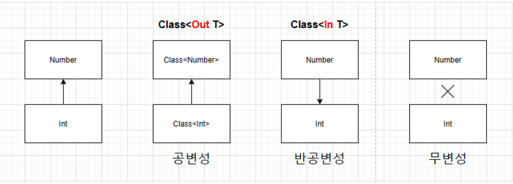

# 🤖 Kotlin 가이드 : 개념 및 개발

Kotlin 언어의 문법, 함수형 프로그래밍, 코루틴 등 안드로이드 개발자에게 필요한 핵심 개념 등 모든 것을 다룬 문서입니다.

---

## 📘 주요 개념

### object 키워드
- 정의
  + 클래스를 정의함과 동시에 인스턴스를 생성하는 키워드
  + 싱글톤 패턴을 간결하게 구현할 수 있게 해주며 코드 간결성 확보 및 Thread Safe
  + 최초 참조 시점에 단 한번만 인스턴스가 생성됨 (lazy + synchornized)
  + JVM class loader가 클래스 로딩을 Thread-safe하게 보장하기에 락 없이 안전
  
- 주요 사용 케이스
  + 싱글톤 (Singleton)
    * 하나만 존재하는 객체 정의
    * 생성자 호출 필요없고 Thread-safe 함
    * ```kotlin
      object Logger {
        fun log(msg: String) {
            println("Log: $msg")
        }
      }
      
      Logger.log("message") // 호출
      ```
  + 동반객체(Companion Object)
    * 클래스 내부에서 정적 멤버(static memeber)처럼 사용
    * @JvmField, @JvmStatic 붙이면 Java와의 상호운용성 을 더 쉽게 할 수 있다.
    * ```kotlin  
      class User(val name: String) {
          companion object {
              fun create(name: String): User = User(name)
              var country = "Korea" 

              @JvmStatic val BASE_ADDRESS = "서울특별시" // java static 처럼 
          }
      }
    
      User.create("Alice") // 클래스 이름으로 호출 가능
      User.BASE_ADDRESS // 서울특별시 java static 처럼 사용 가능
      ```
  + 익명객체
    * 일회성으로 인터페이스 또는 추상 클래스를 구현할 때 사용
    * Android 리스너 구현에 자주 사용
    ```kotlin
    val buttonClickListener = object: View.OnClickListener {    
        override fun onClick(v: View?) {
            println("Clicked!")
        }
    }
    ```
  + Object Declaration
    * 상속 구조나 전략 객체로 사용
    * 동일한 인터페이스를 구현한 여러 객체 중 하나를 선택해 실행 전략을 바꾸는 패턴
    * PaymentProcessor는 PaymentStrategy라는 상위 타입만 알고 있음
    * 실제 객체는 KakaoPay, CreditCard 등 다양하게 대체 가능 → 런타임 다형성
    * 조건에 따라 전략을 바꾸거나, 클라이언트 코드가 객체의 구체 타입을 몰라도 사용 가능
    * 전략 객체는 런타임에 교체 가능하며, 객체 간의 의존성 분리 + 다형성 확보가 가능
    ```kotlin
    interface PaymentStrategy {
        fun pay(amount: Int)
    }

    object KakaoPay : PaymentStrategy {
        override fun pay(amount: Int) {
            println("카카오페이로 $amount 원 결제")
        }
    }

    object CreditCard : PaymentStrategy {
        override fun pay(amount: Int) {
            println("신용카드로 $amount 원 결제")
        }
    }

    class PaymentProcessor(var strategy: PaymentStrategy) {
        fun processPayment(amount: Int) {
            strategy.pay(amount)
        }
    }

    fun main() {
        val processor = PaymentProcessor(KakaoPay)
        processor.processPayment(10_000)  // 카카오페이로 결제

        processor.strategy = CreditCard
        processor.processPayment(20_000)  // 신용카드로 결제
    }
    ```

- 기타
  + `object`는 생성자가 없으므로 생성자 매개변수는 가질 수 없다.
  + 내부적으로 `final`, `static`, `thread-safe singleton`으로 컴파일 됨

- 면접 예상 질문 & 답변
  + Q1. `object`는 어떻게 thread-safe한 Singleton을 보장하나요?
    * `object`는 JVM의 class loading 단계에서 한 번만 초기화되며 이 과정은 JVM 자체가 thread-safe 보장하므로 별도의 락이나 synchronized 키워드 없이 안전함. (Lazy initialization + Classloader Locking)
  + Q2. `object`와 `companion object`의 차이는 무엇인가요?
    * `object`는 클래스 외부에서 싱글톤 객체를 정의할 때 사용하며, `companion object`는 클래스 내부에서 정적 멤버처럼 동작하게 하기 위해 사용. 둘 다 싱글톤이지만 클래스 내부인지 외부인지의 차이가 있음
  + Q3. `object`와 Java의 `static` 키워드는 어떤 차이가 있나요?
    * Java의 `static` 클래스 로딩 시점에 메모리에 올라가는 반면 코틀린의 `object`는 최초 참조 시점에 lazy 하게 초기화 됨. 또한, Kotlin은 함수, 필드, 클래스 등에서 정적 멤버를 만들기 위해 `companion object` + `@JvmStatic` 활용


---


### lateinit & lazy
- 정의
  + 코틀린에서 non-null 타입 프로퍼티를 나중에 초기화할 수 있도록 지원하는 두 가지 메커니즘
  + `lateinit` & `lazy` 2가지 방식 제공

- lateinit
  + 선언
    ```kotlin
    lateinit var myProperty : String
    ```
  + 목적
    * 선언 시 즉시 초기화할 수 없는 non-null var 프로퍼티를 나중에 명확히 초기화할 필요 있을 때 사용
  + 제약사항
    * var 프로퍼티에만 사용할 수 있습니다.
    * Nullable 타입에는 사용할 수 없습니다.
    * 기본 자료형(Int, Boolean 등) 사용할 수 없음 (박싱된 타입 가능)\
    * 커스텀 getter/setter를 불가
    * 클래스 내부에서만 사용 가능 (top-levl 사용 불가)
  + 주의점
    * lateinit 프로퍼티는 사용하기 전에 반드시 초기화 필요
    * ::myProperty.isInitialized 로 체크 가능

- lazy
  + 선언
    ```kotlin
    val myLazyProperty : String by lazy { 
      println("초기화 수행") 
      "Hello Lazy" 
    }
    ```
  + 목적
    * 초기화 비용이 큰 객체를 최초 사용 시점까지 늦추고 싶을 때
    * 객체가 한 번만 초기화되고 이후 절대 변경되지 않아야 할 때
  + 제약사항
    * val 프로퍼티에만 사용 가능
    * 초기화 블록은 단 한 번만 실행
  + 특징
    * 필요에 따라 `PUBLICATION`, `NON`E 등의 스레드 안전 모드로 변경 가능
    * 초기화 블록은 최초 접근 시에만 실행
    * 기본적으로 LazyThreadSafetyMode.SYNCHRONIZED로 동작하기에 멀티스레드 환경에서도 안전하게 한 번만 초기화 됨

- 비교
  + | 조건                            | 추천 방식      | 설명                          |
    | ----------------------------- | ---------- | --------------------------- |
    | 생성자에서 초기화 불가능, 나중에 수동으로 넣어야 함 | `lateinit` | 주로 의존성 주입(DI), 뷰 바인딩 등에서 사용 |
    | 초기화 비용이 크고, 최초 접근 시 자동 초기화    | `lazy`     | 싱글톤, 캐시, 설정값 로딩 등에서 적합      |
    | 값이 변경될 수 있음                   | `lateinit` | `var` 기반                    |
    | 값이 한 번만 설정되고, 불변              | `lazy`     | `val` 기반                    |

- 면접 관련 질문
  + `lateinit`과 `lazy`는 각각 어떤 상황에 쓰이나요?
    * lateinit은 초기화 시점을 개발자가 직접 제어해야 하는 경우 사용하며 주로 DI, Android view 바인딩 등에서 유용
    * lazy는 초기화가 자동으로 이루어지고 한 번만 실행되며, 초기화 비용이 큰 객체나 싱글톤 객체에 적합
  + `lateinit` 사용 시 주의할 점은?
    * 초기화 전에 접근하면 UninitializedPropertyAccessException 예외가 발생
    * val이나 기본 타입에는 사용할 수 없고, 반드시 non-null 참조 타입 + var 사용
  + `lazy`의 스레드 안전성은 어떻게 보장되나요?
    * 기본적으로 lazy는 LazyThreadSafetyMode.SYNCHRONIZED 모드로 작동함. 이는 여러 스레드에서 동시에 접근하더라도 초기화 블록이 한 번만 실행되도록 보장함. 필요에 따라 다른 모드로 변경할 수 있음 (PUBLICATION, NONE)


---


### Safe Call / Elvis 연산자
- 개념/정의
  + NPE(Null Pointer Exception) 방지하기 위해 nullable 타입과 null-safe 연산자 지원
  + `?.` safe call 과 `?:` Elvis 연산자 2가지를 주로 사용

- Safe Call 연산자 (?.)
  + 객체가 null 아닐 경우에만 메서드나 프로퍼티에 접근
  + 객체가 null 이면 연산을 건너뛰고 결과로 null 반환
  + NPE(Null Pointer Exception) 방지

- 사용법
  + ```kotlin
    val result = someObject?.someMethod()

    data class User(val name: String?)

    val user: User? = null
    val nameLength = user?.name?.length
    println(nameLength) // 출력: null
    ```
  
- Elvis 연산자 (?:)
  + 좌변이 null 일 경우 우변 값 사용
  + 기본값, 예외처리, 빠른 리턴 등에 활용
  
- 사용법
  + ```kotlin
    val value = nullableValue ?: defaultValue

    // Safe Call 연산자 + Elvis 연산자 함께 쓰는 예
    val user: User? = null
    val nameLength = user?.name?.length ?: 0
    println(nameLength) // 출력: 0
  
    // Android 에서 자주 쓰는 패턴
    // null이면 return 처리
    val token = prefs?.getString("token", null) ?: return

    // 예외 처리
    val user = findUser() ?: throw IllegalStateException("User not found")
    ```

- 요약
  + | 연산자  | 역할                 | 반환 결과               |
    | ---- | ------------------ | ------------------- |
    | `?.` | null이면 호출 or 접근 생략 | `null`              |
    | `?:` | null이면 우측 기본값 사용   | non-null 값 또는 throw |

- 면접 관련 질문
  + Safe Call 연산자와 Null 체크의 차이는?
    * Safe Call 연산자(?.)는 null 여부를 명시적 조건 없이 간결하게 처리할 수 있어 가독성이 높고, 체이닝에도 적합합니다. (예: a?.b?.c?.d) 기존의 if (a != null) a.b 구조보다 훨씬 직관적입니다.   
  + Elvis 연산자와 기본값 할당의 차이는?
    * Elvis 연산자(?:)는 null일 경우에만 우측 값을 사용하므로, 기본값이 조건적으로만 적용 된다. 단순한 기본값 할당이 아니라 null 체크와 동시에 fallback을 처리하는 연산자임
  + Elvis 연산자로 예외 처리가 가능한 이유는? 
    * ?: 우측은 표현식이므로, 값을 반환하거나 예외를 던지는 것도 허용되기에 이를 통해 null이 발생할 경우 한 줄로 throw 처리가 가능해지고, 코드가 더 간결하면서도 의도를 분명하게 표현할 수 있음


---


## var vs val
- 개념
  + var 변경 가능한 변수 (mutable)
  + val 변경 불가능한 변수 (immutable)
- 공통점
  + | 항목                     | 내용                                    |
    | ---------------------- | ------------------------------------- |
    | **둘 다 변수 선언에 사용**      | Kotlin에서 변수를 선언할 때 `var` 또는 `val`을 사용 |
    | **타입 추론 가능**           | `var name = "John"`처럼 타입 명시 없이 선언 가능  |
    | **null 가능성, 범위 규칙 동일** | 둘 다 `?`로 nullable 여부 설정 가능, scope는 동일 |
- 차이점
  + | 항목             | `var`                              | `val`                                                              |
    | -------------- | ---------------------------------- | ------------------------------------------------------------------ |
    | **가변성**        | 값을 변경할 수 있음                        | 최초 할당 이후 값 변경 불가                                                   |
    | **재할당**        | 가능                                 | 불가능                                                                |
    | **사용 예시**      | 루프 인덱스, 상태 변화 변수                   | 상수, 변경되지 않는 참조값                                                    |
    | **컴파일러 처리**    | 매번 수정 가능성 고려                       | 불변성 보장 → 최적화 유리                                                    |
    | **컬렉션의 내용 변경** | `val`로 선언해도 **내부 요소는 변경 가능** (주의!) | `val list = mutableListOf(1, 2)`는 리스트 요소 변경 가능, 단 `list` 자체 재할당 불가 |
- 예시
  + ```kotlin
    // var: 값 변경 가능
    var name = "Alice"
    name = "Bob" // ✅ 가능

    // val: 값 변경 불가능
    val age = 30
    // age = 31 // ❌ 컴파일 오류

    // val로 선언된 불편 컬렉션의 내부는 변경 가능
    val list = listOf(1,2,3)
    // list 에는 객체를 변경할 수 있는 메소드가 제공되지 않음
    list = listOf(4,5,6) // ❌ 재할당 불가능
    
    // val로 선언된 가변 컬렉션의 내부는 변경 가능
    val numbers = mutableListOf(1, 2, 3)
    numbers.add(4) // ✅ 가능
    // numbers = mutableListOf(5, 6) // ❌ 재할당 불가능
    ```
  + val 의 의미는 재할당이 불가능하고 가변 컬렉션의 내부 값의 변경은 가능함
- 결론
  + 기본적으로 val 을 사용하고 변수를 만들고 필요한 경우에만 var 사용하는 것이 코틀린 가이드
  + val이 많을수록 코드 안정성, 스레드 안전성 증가
  + val 사용 시 **불변객체 지향(immutability)**로 인한 버그 예방 가능
  + 안드로이드 예
    ```kotlin
    class MyViewModel : ViewModel() {
       private val _uiState = MutableLiveData<UiState>()
       val uiState: LiveData<UiState> = _uiState  // 외부에는 읽기 전용으로 노출
    }
    ```
    * val을 쓰면 ViewModel의 구조적 명확성(읽기 전용 참조)이 보장됨
    * 실제 상태 변경은 내부 로직에서만 가능하게 설계 → 클린 아키텍처, MVVM 패턴에서 권장되는 방식
    * 의도하지 않은 재할당 방지
    * 상태 추적이 쉬움 → 참조가 고정돼 디버깅, 로깅, 추적이 수월


---


### 스코프 함수(let, run with, apply, also)
- 객체의 컨텍스트 내에서 코드 블록을 실행할 수 있게 해주는 특별한 함수들 입니다.
- 스코프 함수들은 코드를 더 간결하고 읽기 쉽게 만들어주며, 주로 객체에 대한 연속적인 연산을 수행하거나, 객체의 프로퍼티에 접근하여 초기화 또는 설정 작업을 할 때 유용하게 사용 됩니다.
- 코틀린 표준 라이브러리에는 let, run, with, apply, also 다섯가지의 스코프 함수가 있습니다.

- 컨텍스트 객체 참조 방식
  + this(수신 객체) : 람다 내부에서 컨텍스트 객체를 this로 참조합니다. 객체의 멤버에 직접 접근할 수 있습니다.(run, with, apply)
  + it(람다 인자) : 람다 내부에서 컨텍스트 객체를 단일 인자 it으로 참조합니다.(let, also)

- 반환 값
  + 컨텍스트 객체 자신(apply, also) : 람다 블록을 실행한 후 컨텍스트 객체를 반환합니다. 객체에 대한 추가적인 연쇄 호출이 필요할 때 유용합니다.
  + 람다 결과(let, run, with) : 람다 블록의 마지막 표현식 결과를 반환합니다. 특정 연산의 결과를 변수에 할당하거나, 다른 연산으로 전달해야 할 때 유용합니다.

- let
  + 컨텍스트 객체 : it
  + 반환 값 : 람다 결과
  + 주요 사용 경우
    * Null이 아닌 객체에 대해서만 코드를 실행하는 경우
    * 특정 객체를 사용하여 연산한 결과를 다른 변수에 할당할 때

- run
  + 컨텍스트 객체 : this
  + 반환 값 : 람다 결과
  + 주요 사용 경우
    * 객체의 프로퍼티를 설정하고 동시에 어떤 연산의 결과를 반환해야 할 때
    * 특정 객체의 컨텍스트 내에서 여러 연산을 수행하고 그 결과를 얻고 싶을 때

- with
  + 컨텍스트 객체 : this
  + 반환 값 : 람다 결과
  + 주요 사용 경우
    * 특정 객체의 여러 함수나 프로퍼티에 접근해야 할 때
    * run과 유사하지만, with는 확장 함수가 아니므로 객체를 첫 번째 인자로 전달해야 합니다.

- apply
  + 컨택스트 객체 : this
  + 반환 값 : 컨텍스트 객체 자신
  + 주요 사용 경우
    * 객체의 프로퍼티를 설정하고 그 객체를 반환받고 싶을 때
    * 빌더 패턴과 유사하게 객체를 설정할 때 유용합니다.

- also
  + 컨텍스트 객체 : it
  + 반환 값 : 컨텍스트 객체 자신
  + 주요 사용 경우
    * 객체에 대한 부가적인 작업을 수행하고 싶을 때
    * 원래 객체를 변경하지 않고 추가적인 동작을 수행할 때
    * apply와 유사하지만, 컨텍스트 객체를 it으로 참조합니다.

- 어떤 스코프 함수를 선택해야 할까요?
  + null 검사와 함께 특정 연산을 수행하고 결과를 반환 : let
  + 객체 설정 후 객체 자체를 반환 : apply
  + 객체 설정 후 다른 결과를 반환 : run
  + 객체에 대한 부가적인 작업 후 객체 자체를 반환 : also
  + 특정 객체의 멤버에 반복적으로 접근하여 연산 후 결과를 반환 : with


---

### 타입 캐스팅 
- 정의
  + 하나의 타입을 다른 타입으로 변환하는 행위
  + 코틀린의 경우 타입 캐스팅이 **안전성 중심**으로 설계되어 있어 null or classCastException 줄이는 문법 강조

- 방식
  + | 구분          | 문법              | 설명                                    |
    | ----------- | --------------- | ------------------------------------- |
    | **강제 캐스팅**  | `as`            | 명시적 캐스팅. 실패 시 `ClassCastException` 발생 |
    | **안전한 캐스팅** | `as?`           | 실패 시 예외 대신 `null` 반환                  |
    | **스마트 캐스트** | `is` + if block | 조건문으로 타입 체크 후 자동 캐스팅                  |

- 사용법
  + as 강제 캐스팅
    * ```kotlin
      val any: Any = "Hello"
      val str: String = any as String  // ✅ 성공

      val num: Any = 123
      val str = num as String  // ❌ ClassCastException
      ```
  + as? 안전한 캐스팅
    * ```kotlin
      val any: Any = "Kotlin"
      val str: String? = any as? String  // ✅ "Kotlin"

      val num: Any = 123
      val str: String? = num as? String  // ✅ null 반환 (예외 없음)
      ```
  + is 타입 검사 (스마트 캐스트)
    * ```kotlin
      fun printLength(obj: Any) {
        if (obj is String) {
           println(obj.length)  // obj가 자동으로 String으로 캐스팅됨
        }
      }
      ```
    * is로 체크하면 블록 안에서 자동으로 스마트 캐스팅됨
    * !is는 반대 의미
    * ```kotlin
      fun handleInput(input: Any) {
        when (input) {
           is String -> println("String length: ${input.length}")
           is Int -> println("Double: ${input * 2}")
           else -> println("Unknown type")
        }
      }
      ```


---


### data class
- 데이터를 저장하기 위한 용도로 만들어진 클래스로, 데이터를 다룰 때 필요한 여러 기능을 자동으로 제공함으로써 **간결하고 효율적인 코드작성이 가능**
- 자동으로 생성되는 함수들
    - toString()
    - equals() / hashCode()
    - copy()
    - componentN()
```java
    val user1 = User("철수", 25)
    val user2 = User1.copy(age = 30)

    println(user1)  // User(name=철수, age=25)
    println(user2)  // User(name=철수, age=30)

    val (name, age) = user2
    println(name)   // 철수
    println(age)    // 30
```
- 제약사항
    - primary constructor에 최소 하나 이상의 파라미터가 있어야 함
    - open, abstract, sealed, inner 클래스로 선언할 수 없음
    - 상속은 불가능 (final로 선언 됨)


---


### enum 열거형 클래스
- 정의
  > 미리 정의된 고정된 상수 집합을 표현할 때 사용하는 열거형 클래스

- 기본 사용법
  + ```kotlin
    enum class Direction {
        NORTH, SOUTH, EAST, WEST
    }
    
    val dir = Direction.NORTH
    print(dir.name) // "NORTH"
    print(dir.ordinal) // 0
    ```
  + `name`: 문자열
  + `ordinal`: 순서(0부터 시작)
    
- 예제
  + 생성자와 프로퍼티 사용
    * ```kotlin
      enum class HttpsStatus(val code: Int, val desc: String) {
        OK(200, "Success"),
        NOT_FOUND(404, "Not Found"),
        SERVER_ERROR(500, "Internal Server Error")
      }
      
      val status = HttpsStatus.NOT_FOUND
      println(status.code) // 404
      println(status.desc) // Not Found
      ```
  + 함수 정의도 가능
    * ```kotlin
      enum class Operation {
        PLUS {
           override fun apply(a: Int, b: Int) = a + b
        },
        MINUS {
           override fun apply(a: Int, b: Int) = a - b
        };

        abstract fun apply(a: Int, b: Int): Int
      }
      
      Operation.PLUS.apply(5,3).also { println(it) } // 8
      Operation.MINUS.apply(5,3).also { println(it) } // 2
      ```
    * enum 상수마다 서로 달느 동작 구현 가능
    * abstract 함수 -> 각 상수 오버라이드
  + when 과 함께 쓰임
    * ```kotlin
      fun handleDirection(dir: Direction) = when(dir) {
        Direction.NORTH -> "Going up"
        Direction.SOUTH -> "Going down"
        Direction.EAST  -> "Going right"
        Direction.WEST  -> "Going left"
      }
      ```
    * 코틀린의 when 은 enum을 exhaustive(가능한 모든 경우를 빠짐없이 다룸) 하게 다룰 수 있어 모든 enum 을 다 처리하면 else 없어도 됨
  + values() / valueOf()
    * ```kotlin
      enum class Direction {
        NORTH, SOUTH, EAST, WEST
      }
      
      Direction.values().forEach { println(it) } // 전체 enum 출력
      Direction.valueOf("EAST").also { println(it) } // 문자열 -> enum
      ```
  
- enum vs sealed class
  + | 항목        | enum class           | sealed class                  |
    | --------- | -------------------- | ----------------------------- |
    | 목적        | 고정된 상수 집합            | 계층적인 타입 제한                    |
    | 런타임 확장    | ❌ 불가능 (상수 고정)        | ✅ 하위 클래스 자유롭게 정의 가능           |
    | 인스턴스 속성   | 제한적 (상수당 고정 생성자)     | 유연하게 정의 가능                    |
    | 상태 표현     | 간단한 상태 (예: 방향, 상태코드) | 복잡한 구조적 상태 표현에 유리             |
    | `when` 사용 | 자동 exhaustive 체크     | exhaustive 하려면 else 필요할 수도 있음 |

- 면접 관련 질문
  + enum 대신 sealed class 대신 사용하는 건 언제 적절한지?
    * 상태나 타입이 미리 정의된 값으로 고정되어 있고, 로직이 간단할 때 enum 이 적절
    * 복잡한 상태 표현은 sealed class 가 적절
    * enum 동종의 데이터나 상태 묶을 때 적합
    * sealed class 이종의 타입들을 하나의 계층으로 통합


---


### 확장 함수(Extension Function)
- 정의
  + 확장 함수는 기존 클래스를 상속하거나 Decorator와 같은 디자인 패턴을 사용하지 않고도 클래스에 새로운 기능을 추가할 수 있게 해주는 강력한 기능입니다.
  + 마치 원래 그 클래스에 있던 메서드처럼 호출할 수 있습니다.

- 기본 개념
  + 확장 함수를 선언하려면, 추가하고자 하는 함수의 이름 앞에 수신 객체 타입을 명시합니다.
  + 수신 객체 타입은 함수를 확장하고자 하는 클래스 또는 인터페이스의 이름 입니다.

- 주요 특징 및 장점
  + 코드 간결성 및 가독성 향상
    * 유틸리티 함수들을 특정 클래스와 관련된 것처럼 보이게 하여 코드의 가독성을 높입니다.
  + 기존 클래스 수정 없이 기능 확장
    * Java 표준 라이브러리 클래스나 서드파티 라이브러리의 클래스와 같이 직접 수정할 수 없는 클래스에도 새로운 기능을 추가할 수 있습니다.
  + 정잭 디스패치
    * 확장 함수는 정적으로 디스패치됩니다. 즉, 호출되는 함수는 변수의 컴파일 타임 타입에 의해 결정되며, 런타임 타입에 의해 결정되지 않습니다.
    * 이는 오버라이딩과 다르게 동작합니다. 만약 클래스에 멤버 함수와 동일한 시그니처를 가진 확장 함수가 있다면, 항상 멤버 함수가 우선적으로 호출 됩니다.
  + Null 수신 객체 처리 기능
    * 확장 함수는 수신 객체가 null일 가능성을 염두에 두고 정의할 수 있습니다.
  + 스코프 제한
    * 확장 함수는 일반 함수와 마찬가지로 특정 스코프 내에서만 유효하게 만들 수 있습니다.
    * 파일 최상단에 선언하거나, 클래스 또는 함수 내부에 선언할 수 있습니다.
    * 다른 패키지에서 사용하려면 import 해야 합니다.

- 확장 함수 vs 멤버 함수
  + 캡슐화 : 확장 함수는 클래스 외부에서 정의되므로, 클래스의 private 또는 protected 멤버에는 접근할 수 없습니다. 멤버함수는 클래스의 모든 멤버에 접근 가능 합니다.
  + 오버라이딩 : 멤버 함수는 서브클래스에서 오버라이드될 수 있지만, 확장 함수는 정적으로 디스패치 되므로 오버라이드 개념이 적용되지 않습니다.
  + 확장 함수 사용 시점
    * 기존 클래스에 유틸리티성 기능을 추가하고 싶을 때
    * 특정 타입에 대한 헬퍼 함수를 정의하여 코드의 가독성을 높이고 싶을 때
    * 클래스의 핵심 API의 일부는 아니지만, 해당 클래스의 객체를 다룰 때 자주 사용되는 부가적인 기능을 제공하고 싶을 때
  + 멤버 함수 사용 시점
    * 클래스의 핵심적인 기능을 구현할 때
    * 클래스의 내부 상태에 접근해야 할 때
    * 다형성을 활용하여 하위 클래스에서 동작을 변경할 수 있도록 하고 싶을 때

- 주의사항
  + 확장 함수는 실제로 클래스의 코드를 변경하는 것이 아닙니다. 단지 컴파일러가 해당 함수를 정적 메서드 호출로 변환해주는 syntactic sugar 입니다.
  + 너무 많은 확장 함수를 남용하면 코드를 이해하기 어려워질 수 있으므로, 적절한 상황에서 명확한 목적으로 사용하는 것이 좋습니다.
  + 확장 함수는 코틀린의 유연한 기능 중 하나로 API를 더 깔끔하고 사용하기 쉽게 만드는 데 큰 도움을 줍니다.

- 면접 관련 질문
  + 확장 함수와 유틸 클래스의 차이점은?
    * 전통적인 Java 스타일 유틸 클래스는 Utils.method() 형태이지만 코틀린의 확장함수는 obj.method() 형태로 사용 가능하며 가독성이 좋고, IDE 자동 완성도 더 자연스럽게 동작합니다.
  + 확장 함수 남용 시 단점은?
    * 정적 바인딩이기 때문에 다형성을 기대하면 안 됩니다.
    * 프로젝트 전체에 퍼지면 어디서 정의했는지 추적이 어려워질 수 있습니다.
    * 같은 이름의 확장 함수가 여러 모듈에 정의되면 충돌 가능성도 있습니다.


---


### sealed class
- 상속 가능한 클래스를 같은 **파일 내에서만 정의하도록 제한**한 클래스
- **컴파일러가 모든 하위 타입을 알고있게 되어**, when 문에서 **타입 분기 처리 안전하게 가능**
- 열거형(enum)보다 더 유연한 상태 표현
- when 문 사용할 때 else 없이도 모든 타입 처리 가능
- 불변 상태 모델링에 탁월 (ex) Success, Error, Loading 상태표현)
```kotlin
    sealed class Result
    
    data class Success (val data : String) : Result()
    data class Error (val message : String) : Result()
    object Loading : Result()
```
이 후 when 문에서 사용 방법 :
```kotlin
    fun handle (result : Result) {
        when (result) {
            is Success -> println("성공 : ${result.data}")
            is Error -> println("에러 : ${result.message}")
            is Loading -> println("로딩 중")
        }
    }
```

- 특징
    + | 항목                | 설명                                 |
                |-------------------|------------------------------------|
      | 상속 가능 클래스 제한      | 하위 클래스는 반드시 같은 파일 내에서 정의해야 함       |
      | 추상 클래스처럼 사용       | 직접 인스턴스화 불가능                       |
      | `when`구문 최적화    | 컴파일러가 하위 타입을 모두 인식하므로 `else` 생략 가능 |
      | `enum`보다 확장성 좋음 | 하위 클래스마다 **다른 속성, 로직** 가능          |

  + | 상황                                              | 추천 이유                     |
                    |-------------------------------------------------|---------------------------|
    | API 응답의 상태 표현 (`Success`, `Failure`, `Loading`) | 각 상태별 데이터가 다를 때 유용        |
    | UI 상태 표현 (ex) `LoggedIn`, `LoggedOut`)          | 명확한 타입 기반 상태 관리           |
    | 복잡한 조건 분기                                       | `when`과 함께 쓰면 안정정 + 가독성 향상 |


---


### 구조 분해 선언(Destructuring Declarations)
- 정의
  + 객체의 프로퍼티들을 여러 변수에 한 번에 할당할 수 있게 해주는 편리한 문법입니다.

- 기본 개념
  + ```kotlin
      val (변수1, 변수2, ...) = 객체
      ```
  + 객체의 특정 프로퍼티들이 순서대로 변수1, 변수2 등에 할당 됩니다.

- 동작 방식
  + 구조 분해 선언이 동작하기 위해서는 해당 객체가 특저 ㅇ규약을 따라야합니다.
  + 컴파일러는 componentN()이라는 이름의 연산자 함수를 찾아서 호출합니다.
    * 첫 번째 변수에는 component1() 함수의 반환 값이 할당됩니다.
    * 두 번째 변수에는 component2() 함수의 반환 값이 할당됩니다.
    * 이런 식으로 componentN() 함수가 순서대로 호출됩니다.

- 주요 사용 사례
  + Data Class : 데이터 클래스는 주 생성자에 선언된 프로퍼티에 대해 자동으로 componentN() 함수를 생성해줍니다.
  + ```kotlin
    data class User(val name: String, val age: Int)

    fun main() {
        val user = User("Alice", 30)
        val (name, age) = user // user.component1()은 name에, user.component2()는 age에 할당

        println("Name: $name, Age: $age") // 출력: Name: Alice, Age: 30
    }
    ```

  + Map.Entry : 맵을 반복할 때 키와 값을 한 번에 가져오는 데 유용합니다.
  + ```kotlin
    fun main() {
        val map = mapOf("A" to 1, "B" to 2, "C" to 3)

        for ((key, value) in map) { // map의 각 Entry에 대해 구조 분해 선언 사용
            println("Key: $key, Value: $value")
        }
        // 출력:
        // Key: A, Value: 1
        // Key: B, Value: 2
        // Key: C, Value: 3
    }
    ```

  + 컬렉션과 배열 : 리스트나 배열과 같은 컬렉션도 componentN() 함수를 통해 구조 분해를 지원합니다.
  + ```kotlin
    fun main() {
        val list = listOf("Apple", "Banana", "Cherry")
        val (first, second) = list // list[0]은 first에, list[1]은 second에 할당

        println("First: $first, Second: $second") // 출력: First: Apple, Second: Banana
        // val (a, b, c, d) = list // Error: Index out of bounds, list에는 3개의 요소만 있음
    }
    ```

  + 함수에서 여러 값 반환 : 함수가 여러 값을 반환해야 할 때, 데이터 클래스나 Pair, Triple과 같은 클래스를 반환 타입으로 사용하고, 호출부에서 구조 분해 선언을 통해 각 값을 쉽게 받을 수 있습니다.
  + ```kotlin
    data class Result(val value: Int, val status: String)

    fun process(): Result {
        // ... 어떤 처리 ...
        return Result(42, "Success")
    }

    fun main() {
        val (resultValue, resultStatus) = process()
        println("Value: $resultValue, Status: $resultStatus") // 출력: Value: 42, Status: Success
    }
    ```

  + 필요 없는 값 무시하기 : 구조 분해 선언시 특정 위치의 값이 필요 없다면 밑줄(_)을 사용하여 해당 변수를 무시할 수 있습니다.
  + ```kotlin
    data class Point(val x: Int, val y: Int, val z: Int)

    fun main() {
      val point = Point(10, 20, 30)
      val (x, _, z) = point // y 좌표는 무시
  
      println("X: $x, Z: $z") // 출력: X: 10, Z: 30
    }
    ```

  + 람다 파라메터에서의 구조 분해 : 람다 표현식의 파라메터에도 구조 분해 선언을 사용할 수 있습니다.
  + ```kotlin
    fun main() {
      val userList = listOf(User("Bob", 25), User("Charlie", 35))

      // 람다 파라미터 (name, age)에 User 객체를 구조 분해
      userList.forEach { (name, age) ->
          println("$name is $age years old")
      }
      // 출력:
      // Bob is 25 years old
      // Charlie is 35 years old

      val map = mapOf(1 to "one", 2 to "two")
      map.forEach { (key, value) -> // Map.Entry를 key와 value로 구조 분해
          println("$key -> $value")
      }
      // 출력:
      // 1 -> one
      // 2 -> two
    }
    ```
    
- 질문
  + 구조 분해 선언시 componentN() 함수는 어떤 역할을 하나요?
    * 구조 분해 선언시 내부적으로 호출되는 메서드 입니다. 
      예를 들어 val (x, y) = point는 point.component1()과 point.component2()를 호출합니다. 이는 컴파일러가 자동으로 변환해주는 형태입니다.
  + 구조 분해 선언이 성능에 영향을 줄 수 있나요?
    * 일반적으로 구조 분해는 간단한 메서드 호출로 이루어지기 때문에 큰 성능 부담은 없습니다.
      하지만 복잡한 클래스에서 많은 componentN()을 구현하거나 무분별하게 사용할 경우 가독성이나 성능에 영향을 줄 수 있으니 주의가 필요합니다. 


---


### inline
- 정의
  + 함수를 호출할 때 실제로 함수 호출 코드가 생성되는 것이 아니라, 함수 본문이 호출 지점에 "그대로 복사되는" 방식으로 동작하는 함수
  + 즉, "함수 호출 = 코드 복사 붙여넣기" → 성능 향상, 오버헤드 감소

- 필요한 이유?
  + 고차 함수 호출 시 함수 객체와 람다 객체가 생성되기 때문
  + inline은 이 객체 생성을 없애고 성능을 향상
  + 또한 람다 내부에서 return 사용 가능 등 코드 흐름 유연화

- 사용법
  + ```kotlin
    inline fun log(block: () -> Unit) {
      println("== Start ==")
      block()
      println("== End ==")
    }

    fun main() {
      log {
         println("Hello!")
      }
    }
    
    // 컴파일 시 (개념상)
    fun main() {
       println("== Start ==")
       println("Hello!")
       println("== End ==")
    }  
    ```
  + log() 함수는 호출이 아니라 코드로 펼쳐져 들어감 (인라인화)

- inline 효과
  + | 항목             | 설명                              |
    | -------------- | ------------------------------- |
    | ✅ 성능           | 함수 호출 비용 제거 (특히 람다 객체 생성 안 함)   |
    | ✅ return 흐름 제어 | 람다 내부에서 `return` 가능             |
    | ❌ 코드 크기        | 너무 많이 쓰면 바이너리 커짐 (주의)           |
    | ✅ 제네릭 람다       | `inline` 덕분에 람다에서 reified 사용 가능 |

- 보조 키워드 : noinline, crossinline
  + noinline : 인라인 안하고 객체로 넘기고 싶을 때
    * ```kotlin
      inline fun test(a: () -> Unit, noinline b: () -> Unit) {
        a() // 인라인됨
        b() // 인라인되지 않음
      }
      ```
    * 람다 여러 개 중 일부만 인라인하고 싶을 때 유용
  + crossinline : 람다 안에서 non-local return 못하게 막기
    * ```kotlin
      inline fun doSomething(crossinline action: () -> Unit) {
         Thread {
            action() // 여기서 return 하면 컴파일 에러
         }.start()
      }
      ```
    * 다른 스레드/콜백에서 실행될 람다에는 return 쓰면 위험하므로 금지

- 실무에서 자주 쓰이는 패턴
  + measureTimeMillis { ... }
  + runBlocking { ... } 
  + reified 타입 캐스팅 (ex. inline fun <reified T> ...)
    * ```kotlin
      inline fun <reified T> Gson.fromJson(json: String): T { 
         return this.fromJson(json, T::class.java)
      }
      ```
    * 일반 함수에서는 제네릭 타입 T는 런타임에 소멸되지만, inline + reified 덕분에 런타임에도 타입 정보를 유지 가능

- 면접 관련 질문
  + inline 함수 장점
    * 함수 호출 오버헤드를 줄이고, 람다 객체 생성을 방지해서 성능을 향상
  + noinline 이 필요한가?
    * 람다 중 일부만 인라인하고 싶거나, 해당 람다를 다른 곳에 전달해야 할 경우 사용
  + reified 는 왜 inline 함수에서만 사용할 수 있는가?
    * Kotlin의 제네릭은 기본적으로 타입 소거되지만, inline 함수는 컴파일 시 타입을 알고 있으므로 reified로 타입 유지가 가능
    * > reified 는 제네릭 타입 정보를 런타임에도 유지할 수 있게 해주는 키워드 (단 inline 함수에서만 사용 가능)


---


### Kotlin & Java
- 두 언어 모두 JVM에서 실행되는 언어, 안드로이드 개발이나 서버 개발에서 많이 쓰임 

- 공통점
  + | 항목                 | 설명                                     |
          |--------------------|----------------------------------------|
      | JVM 기반             | 둘 다 **Java Virtual Machine**에서 실행 됨    |
      | Java 라이브러리 사용 가능   | Kotlin은 Java의 모든 API, 라이브러리를 그대로 사용 가능 |
      | 클래스, 객체, 상속        | 객체지향 언어로서 기본 구조 동일                     |
      | 쓰레드, 네트워크, 파일 IO 등 | 기본 기능 거의 동일                            |
      | 안드로이드 개발 가능                   | 둘 다 안드로이드 공식 지원 언어               |

- 차이점
  + | 항목                 | Java                             | Kotlin                                |
              |--------------------|----------------------------------|---------------------------------------|
    | 문법 간결성             | 비교적 장황함                          | 매우 간결함 (`val`, `when`, `dataclass`)   |
    | Null 안정성           | `NullPointerException` 위험 존재     | 컴파일 단계에서 **null** 체크 지원 (`?`, `?:`)   |
    | 데이터 클래스            | 직접 `equals`, `hashCode` 등 작성해야 함 | `data class`로 자동 생성                   |
    | 함수형 프로그래밍          | 람다 지원은 있지만 불편                    | 고차 함수, 람다, `map/filter` 등 자연스러움       |
    | 확장 함수              | 없음                               | 기존 클래스에 함수 추가 가능 (`String.isEmail()`) |
    | 스마트 캐스팅            | 수동 형변환 필요                        | `is` 체크 후 자동 캐스팅                      |
    | 기본 자료형 (Primitive) | `int`, `double` 등 존재             | 모두 객체 타입으로 통합 (`Int`, `double`)       |
    | 코루틴 지원             | 없음 (외부 라이브러리 필요)                 | 코루틴으로 비동기 쉽게 처리 가능                    |
    | Null 처리            | 런타임에서 터짐                         | `?`, `!!`, `?:` 로 컴파일 타임에서 경구         |

- 예시
  1. 변수 선언
     - java
     ```java
        String name = "철수";
     ```
     - kotlin
     ```kotlin
      val name = "철수"   // 자동 타입 추론
     ```
  2. Null 처리
     - java
     ```java
      if (user != null) {
        System.out.println(user.getName());  
      }
     ```
     - kotlin
     ```kotlin
        println(user?.name ?: "이름 없음")
     ```
  3. 데이터 클래스
    - java
     ```java
      public class User {
        String name;
        int age;
      }
     ```
    - kotlin
     ```kotlin
        data class User (val name : String, val age : Int)
     ```


---


### 상속 제어 (open, final, abstract)
- 정의
  + 코틀린에서 상속 제어 키워드는 클래스나 함수, 프로퍼티가 상속/재정의 가능한지 명확하게 제어하는 기능
  + Java 와 기본값이 다르며 코틀린의 안정성과 설계 철학을 보여주는 부분

- 기본 개념 정리
  + | 키워드        | 의미                             | 기본값 여부            |
    | ---------- | ------------------------------ | ----------------- |
    | `final`    | **상속 불가**, 오버라이드 금지            | ✅ Kotlin의 기본값     |
    | `open`     | **상속 가능**, 오버라이드 허용            | ❌ 명시적으로 선언해야 함    |
    | `abstract` | 추상 멤버 또는 클래스, **무조건 오버라이드 필요** | ❌ 추상 클래스에서만 사용 가능 |

- 상세 설명
  + final
    * 클래스, 메서드, 프로퍼티 기본적으로 `final`
    * 오버라이드/상속 하려면 명시적으로 `open` or `abstract` 로 풀어야 함
    * ```kotlin
      class Animal {
         fun sound() { println("Animal sound") } // final이 기본
      }
      ```
  + open
    * 해당 클래스 or 멤버를 상속/재정의 가능하게 만듦
    * ```kotlin
      open class Animal {
         open fun sound() { println("Animal sound") }
      }

      class Dog : Animal() {
         override fun sound() { println("Bark!") }
      }
      ```
  + abstract
    * 클래스 또는 멤버가 추상적이며 하위 클래스에서 반드시 구현해야 함
    * abstract class 인스턴스화 불가

- 면접 관련 질문
  + 추상 클래스와 인터페이스의 차이는?
    * abstract class는 상태(필드)와 구현 메서드를 가질 수 있습니다.
    * interface는 다중 구현이 가능하며, 일부 구현만 제공할 수 있습니다. (Kotlin에서는 interface도 default method 가능)
  + data class 에 open or final 키워드 사용가능한가?
    * data class 기본 적으로 final 이며 open 붙여서 상속 가능하게 만들 수 없음. 붙일 경우 컴파일 에러 발생
    * 자동 생성되는 메서드 (equals(), hashCode(), copy(), toString() 등) 상속 허용 시 예상치 못한 동작이나 버그 발생 가능성 높아짐
    * 데이터 클래스는 단일 데이터 컨테이너로서의 목적에 맞춰 설계됨. 객체지향적 확장보다는 `값 기반 비교(value equality)`가 핵심.
    * 상속이 필요하다면 ? 일반 클래스 또는 composition 으로 써야 함


---


### Range & Progression
- 개요
    + 코틀린에서 Range(범위)와 Progression(수열)은 특정 타입의 값들이 순서대로 나열된 시퀀스를 표현하는 강력하고 유용한 개념입니다.
    + 주로 숫자 타입이나 문자 타입과 함께 사용되며, 반복문, 조건문 등 다양한 상황에서 코드를 간결하고 읽기 쉽게 만들어줍니다.

- Range
    + 개요
        * 닫힌 구간 또는 반 열린 구간으로 정의되는 값들의 집합입니다. 즉, 시작 값과 끝 값을 가지며, 이 두 값 사이의 모든 값을 포함합니다.
    + 생성 방법
        * 표준 라이브러리 kotlin.ranges 패키지에서 제공하는 함수들을 사용하여 Range를 생성할 수 있습니다.
        * .. 연산자 (rangeTo() 함수) : 닫힌 구간을 만듭니다. 끝 값을 포함합니다.
      ```kotlin
        val numbers = 1..4       // 1, 2, 3, 4를 포함하는 IntRange
        val chars = 'a'..'d'     // 'a', 'b', 'c', 'd'를 포함하는 CharRange
      ```
        * ..< 연산자 (rangeUntil() 함수) : 반 열린 구간을 만듭니다. 끝 값을 포함하지 않습니다.
      ```kotlin
        val numbersUntil = 1..<4  // 1, 2, 3을 포함하는 IntRange (4는 미포함)
        val charsUntil = 'a'..<'d'   // 'a', 'b', 'c'를 포함하는 CharRange ('d'는 미포함)
      ```
    + 주요 특징 및 사용법
        * 타입 : 생성되는 Range의 타입은 시작 값과 끝 값의 타입에 따라 결정됩니다.
        * in 연산자와 함께 사용 : 특정 값이 범위 내에 포함되는지 확인하는 데 매우 유용합니다.
      ```kotlin
        val numbers = 1..4       // 1, 2, 3, 4를 포함하는 IntRange
        val chars = 'a'..'d'     // 'a', 'b', 'c', 'd'를 포함하는 CharRange
      ```

- Progression
    + 개요
        * 시작 값, 끝 값, 그리고 증가분을 가집니다.
    + 생성 방법
        * step 변경자 : Range 뒤에 step을 사용하여 증가분을 지정합니다.
      ```kotlin
        val evenNumbers = 0..10 step 2 // 0, 2, 4, 6, 8, 10
        println(evenNumbers.toList())   // [0, 2, 4, 6, 8, 10]
  
        val countdown = 10..0 step 3 // 10, 7, 4, 1
        println(countdown.toList())  // [10, 7, 4, 1] (downTo와 함께 사용하는 것이 더 일반적)
      ```
        * downTo 함수 : 값을 감소시키는 Progression을 만듭니다.
      ```kotlin
        val decreasingNumbers = 5 downTo 1 // 5, 4, 3, 2, 1
        println(decreasingNumbers.toList()) // [5, 4, 3, 2, 1]
  
        val decreasingWithStep = 10 downTo 0 step 2 // 10, 8, 6, 4, 2, 0
        println(decreasingWithStep.toList())       // [10, 8, 6, 4, 2, 0]
      ```

    + 주요 특징 및 사용법
        * 구성 요소 : first, last, step
        * 반복문과 함께 사용 : Progression은 Iterable을 구현하므로 for 루프에서 직접 사용할 수 있습니다.
      ```kotlin
        for (i in 1..5) {
          print("$i ") // 1 2 3 4 5
        }
        println()
  
        for (i in 10 downTo 0 step 3) {
            print("$i ") // 10 7 4 1
        }
        println()
      ```
        * reversed() : Progression의 순서를 뒤집을 수 있습니다.
      ```kotlin
        val numbers = 1..5
        for (i in numbers.reversed()) {
            print("$i ") // 5 4 3 2 1
        }
        println()
      ```
      


---


### 접근제어자
1. public (기본값, 어디서나 접근 가능)
    ```kotlin
        // 파일 : Car.kt
        package com.example.car
   
        class Car {         // public 생략 가능
            fun drive() {
                println("Car is driving")
            }
        }    
   
        // 파일 : Main.kt
        import com.example.car.Car

        fun main() {
            val car = Car()
            car.drive()     // ✅ 접근가능 : public 이라 어디서나 사용 가능
        }
    ```
    - 기본 접근 제어자
    - 다른 패키지/모듈 에서도 접근 가능

2. internal (같은 모듈 내에서만 접근 가능)
    ```kotlin
        // 파일 : Engine.kt
        internal class Engine {
            fun start() {
                println("Engine started")
            }        
        }
        
        // 파일 : Main.kt (같은 모듈 내)
        fun main() {
            val engine = Engine()
            engine.start()      // ✅ 같은 모듈이므로 접근 가능
        }    
    ```
    ```kotlin
        // ❌ 다른 모듈에서
        import com.example.engine.Engine    // ❌ 컴파일 에러
   
        fun main() {
            val engine = Engine()   // ❌ 접근 불가 : internal은 다른 모듈에서 사용 불가
        }
    ```
    - **같은 Gradle 모듈 내**에서만 사용 가능 
    - 외부 SDK로 내보낼 필요 없는 클래스/함수에 적합

3. protected (상속 받은 클래스에서만 접근 가능)
    ```kotlin
        open class Animal {
            protected fun breathe() {
                println("Animal breathing")
            }
    
            fun walk() {
                println("Animal walking")
            }
        }
   
        class Dog : Animal() {
            fun sniff() {
                breathe()   // ✅ protected 이므로 하위 클래스에서 사용 가능
            }
        }    
    
        fun main() {
            val dog = Dog()     
            dog.walk()      // ✅ public method
            // dog.breathe()    // ❌ 외부에서는 접근 불가
        }    
    ```
    - 외부 접근 ❌
    - **상속받은 클래스 내부에서만 접근 가능**
    - Java의 `protected`와 거의 동일 

4. private (같은 클래스 또는 파일 내에서만 접근 가능)
    1. 클래스 내부 제한
        ```kotlin
            class SecretBox {
                private val code = "1234"
       
                private fun unlock() {
                    println("Box unlocked with $code")
                }
       
                fun tryUnlock() {
                    unlock()    // ✅ 클래스 내부이므로 접근 가능
                }
            }
       
            fun main() {
                val box = SerectBox()
                box.tryUnlock()         // ✅ 가능
                // box.unlock()         // ❌ 외부 접근 불가
                // println(box.code)    // ❌ 외부 접근 불가
            }
        ```
    2. 파일 내부 제한 (Top-level)
        ```kotlin
            // 파일 : Utils.kt
            private fun internalHelper() {
                println("Used only within this file")
            }
       
            fun publicApi() {
                internalHelper()    // ✅ 같은 파일 내
            }
        ```
        ```kotlin
            // 파일 : AnotherFile.kt
       
            // internal Helper()    ❌ 호출 불가 - 다른 파일에서는 private 함수 접근 안됨
        ```
        - 클래스의 구현 세부사항 숨길 때 사용
        - 파일 수준에서는 **다른 파일에서 접근 불가**
- 요약정리
    + | 접근 제어자      | 클래스 외부 접근  | 상속 관계 접근 | 같은 파일           | 같은 모듈 | 다른 모듈 |
                                |-------------|------------|----------|-----------------|-------|-------|
      | `public`    | ✅ |  ✅        | ✅               |   ✅    |    ✅   |
      | `internal`  | ✅ |     ✅     | ✅               |    ✅   |    ❌   |
      | `protected` | ❌ |    ✅      | ✅ (클래스 내)       |   ✅    |     ❌  |
      | `private`   | ❌ |  ❌        | ✅ (같은 클래스 / 파일) |   ❌    |    ❌   |

- 실전
    - `internal` : 앱 내부 전용 유틸, 헬퍼, Repository, ViewModel 등 노출 필요 없는 경우
    - `protected` : BaseViewModel, BaseAdapter 등에서 상속 구조 설계 시 유용
    - `private` : 캡슐화 (Encapsulation)를 위해 적극 사용 ()불필요한 노출 방지

- 질문
    + kotlin 접근제어자에는 어떤것들이 있나요?
        * public : 기본값 (어디서나 접근 가능)
        * internal : 같은 모듈 내에서만 접근 가능
        * protected : 상속받은 클래스 내에서만 접근 가능
        * private : 같은 클래스 또는 파일 내에서만 접근 가능
    + Java와 Kotlin의 접근제어자 차이점은?
        * kotlin에는 `default` 접근제어가 없음 -> 대신 internal 사용
        * kotlin의 `internal`은 모듈 기준 (Java에 없음)
        * kotlin에서 top-level 함수클래스도 `private`/`internal` 사용 가능
    + 접근제어자를 왜 명시적으로 설정해야 하나요?
        * 외부로 노출하지 않아야 할 정보를 보호 (캡슐화)
        * Api의 명확한 경계를 정의
        * 유지보수, 재사용성 향상


---


### reified & 제네릭
- 정의
  + reified
    * `구체화된` 컴파일된 코드 안에서 타입 T가 지워지지 않고 유지됨을 의미
    * 코틀린 제네릭 타입 파라미터를 런타임에 사용할 수 있게 해주는 키워드
    * `inline` 함수의 타입 파라미터에서만 사용 가능하며 
    * 일반적으로 불가능한 T::class, T::class.java, is T, as T 같은 표현 사용 가능
  + 제네릭
    * 클래스나 함수가 타입에 의존하지 않고 재사용성 있게 동작할 수 있게 해줌
    * 제네릭은 런타임 시점 타입 정보가 지워짐. 이를 타입 소거라고 부름 (T::class, T::class.java 같은 작업 불가)
    * ```kotlin
      fun <T> printItem(item: T) {
        println(item)
      }
      ```
    * 문제점은 일반 제네릭은 런타임 타입을 알 수 없음
    * ```kotlin
      fun <T> getTypeClass(): Class<T> {
        return T::class.java // compile error cannot use 'T' as reified type parameter
      }
      
      inline fun <reified T> getTypeClass(): Class<T> {
        return T::class.java
      }
      ```

- 활용 방안
  + JSON 파싱 with Gson
    * ```kotlin
      inline fun <reified T> parseJson(json: String): T {
        return Gson().fromJson(json, T::class.java)
      }
      
      val user: User = parseJson(jsonString)
      ```
    * reified 없으면 TypeToken<T>() 같이 우회하는 복잡한 코드 필요
  + 타입 검사
    * ```kotlin
      inline fun <reified T> isOfType(value: Any): Boolean {
        return value is T
      }
      
      val result = isOfType<String>("Hello") // true
      ```
  + ViewModel Factory in Android
    * ```kotlin
      inline fun <reified VM : ViewModel> createViewModel(): VM {
        return ViewModelProvider(this).get(VM::class.java)
      }
      ```
      
- 정리
  + | 상황                             | `reified` 필요 여부 |
    | ------------------------------ | --------------- |
    | 런타임에 타입 검사 (`is`, `as`)        | ✅ 필요            |
    | `T::class`, `T::class.java` 사용 | ✅ 필요            |
    | 단순 타입 재사용, 타입 전달 X             | ❌ 불필요           |
  + 제네릭은 컴파일 시점에만 타입 정보를 가짐 → 런타임엔 지워짐
  + reified는 이 타입 정보를 런타임까지 유지하게 함
  + inline 함수에서만 사용 가능
  + 안드로이드에서 Gson, ViewModel, Retrofit 등과 함께 자주 활용됨

- 면접 관련 질문
  + reified 키워드 언제 왜 사용?
    * reified는 제네릭 타입의 런타임 타입 정보를 유지하고 싶을 때 사용
    * 코틀린의 일반 제네릭은 타입 소거 때문에 런타임에 T::class, is T 같은 연산이 불가능
    * reified를 사용하면 이런 제약을 우회할 수 있음 (단, reified는 inline 함수에서만)
    * 예로 Gson 파싱, 타입 필터링, ViewModelFactory 로 뷰 모델 생성 시
  + 왜 reified는 inline 함수에서만 사용?
    * reified는 타입 정보를 런타임까지 보존해야 하므로, 컴파일 시점에 해당 타입이 코드에 구체적으로 삽입 
    * inline 함수는 컴파일 시점에 함수 본문이 호출된 위치에 직접 복사되기에 제네릭 타입도 실제 타입으로 치환
    * 이 구조 덕분에 T::class, is T 같은 코드가 가능해짐
    * 일반 함수는 이 치환이 일어나지 않기 때문에 reified를 사용 불가


---


### typealias
- 정의
  + typealias는 기준 타입에 새로운 이름을 부여하는 기능입니다.

- 기본 사용법
  + typealias 키워드를 사용하여 새로운 이름과 기존 타입을 연결합니다.
  + ```kotlin
    typealias Name = String
    typealias UserList = List<User>
    typealias ClickListener = (View) -> Unit
    ```
    
- typealias를 사용하는 이유 및 장점
  + 가독성향상 : 복잡하거나 긴 타입 이름을 의미 있는 이름으로 대체하여 코드를 더 쉽게 이해할 수 있도록 합니다.

- 복잡한 제네릭 타입 간소화
  + 제네릭을 사용하는 복잡한 타입을 더 짧고 관리하기 쉬운 이름으로 만들 수 있습니다.
  + ```kotlin
    // typealias 사용 전
    val complexFunction: (List<Map<String, Set<Int>>>, (String) -> Boolean) -> List<String> = { data, predicate ->
    // ...
    emptyList()
    }

    // typealias 사용 후
    typealias DataFilter = (String) -> Boolean
    typealias ComplexData = List<Map<String, Set<Int>>>
    typealias DataProcessor = (ComplexData, DataFilter) -> List<String>

    val simpleFunction: DataProcessor = { data, predicate ->
    // ...
    emptyList()
    }
    ```
    
- 함수 타입 명명
  + 특히 콜백 함수나 고차함수에서 함수 타입을 명확한 이름으로 정의하여 코드의 의도를 더 잘 전달할 수 있습니다. 

- typealias의 특징 및 주의사항
  + 새로운 타입을 만드는 것이 아님 : typealias는 단순히 기존 타입에 다른 이름을 붙이는 것입니다.
  + 생성자를 가질 수 없음 : typealias는 타입의 별칭일 뿐이므로, 자체적인 생성자를 가질 수 없습니다.
  + 상속 제어 불가 : typealias는 클래스가 아니므로, open, final 등의 상속 제어 키워드를 사용할 수 없습니다.
  + 제네릭 타입에도 사용 가능
    ```kotlin
    typealias StringList<T> = List<T> // T는 여전히 제네릭 파라미터
    val names: StringList<String> = listOf("Alice", "Bob")

    // 특정 타입으로 고정할 수도 있음
    typealias IntList = List<Int>
    val numbers: IntList = listOf(1, 2, 3)
    ```
  + 내부 클래스 및 객체에도 사용 가능
    ```kotlin
    class Outer {
        inner class Inner
        object NestedObject
    }

    typealias InnerClass = Outer.Inner
    typealias NestedObj = Outer.NestedObject
    ```
    
- 언제 typealias를 사용하면 좋을까?
  + 코드베이스 전체에서 반복적으로 사용되는 복잡한 타입 시그니처가 있을 때
  + 함수 타입을 매개변수나 반환 타입으로 자주 사용할 때
  + 특정 도메인에 맞는 의미 있는 타입 이름을 부여하고 싶을 때
  + 가독성을 높여 코드 ㅇ지보수를 용이하게 하고 싶을 때


---


### 고차 함수
- **"함수를 인자로 받거나, 함수를 반환하는 함수"**
  ```kotlin
        fun orderFunction (action : () -> Unit) {
            action()    // 전달받은 함수를 실행 
        }
  ```
  - 함수가 함수를 매개변수로 받거나 함수를 반환 = 고차함수

- 사용이유
  + | 장점                           | 설명                               |
              |------------------------------|----------------------------------|
    | ✅ 코드 재사용성 향상                 | 중복 제거, 로직 추상화                    |
    | ✅ 간결한 문법                     | 람다(lamda)와 함께 쓰면 코드가 짧아짐         |
    | ✅ 커스터마이징 용이                  | 특정 동작을 매개변수로 전달 가능 (e.g, 클릭 핸들러) |
    | ✅ Rx/Flow/Coroutine 에도 기반이 됨 | 고차함수 없이는 이들 API 불가능              |

- 고차함수 사용 시 이슈 및 해결책
  + | 주의점      | 설명                                          | 해결책                                       |
                  |----------|---------------------------------------------|-------------------------------------------|
    | 성능 이슈    | 람다나 함수 객체가 힙에 할당 됨                          | `inline` 키워드 사용                           |
    | 메모리 누수   | 람다가 외부 context를 캡처하면 누수 발생 가능 -> 특히 Android | `weak reference`, `lifecycle-aware 처리` 필요 |
    | 디버깅 어려움  | 람다 표현식 중첩 시 추적이 힘듦                          | 함수로 분리해서 명확하게 관리                          |

- 고차함수 구성 요소
  + | 요소      | 설명                                  | 예시                                              |
                      |---------|-------------------------------------|-------------------------------------------------|
    | 함수 타입   | `(Int, Int) -> Int`, `() -> Unit` 등 | `val sum : (Int, Int) -> Int = {a, b -> a + b}` |
    | 함수 파라미터 | 함수를 인자로 전달                          | `fun excute (action : () -> Unit)`              |
    | 함수 반환값  | 함수 자체를 리턴                           | `fun getOperator() : (Int. Int) -> Int`         |

- Kotlin에서 흔히 쓰는 고차함수 예시
  + | 함수                            | 역활      | 설명                              |
                            |-------------------------------|---------|---------------------------------|
    | `map`                         | 변환      | `list.map {it * 2}`               |
    | `filter`                      | 조건 걸러내기 | `list.filter {it > 0}`            |
    | `forEach`                     | 반복      | `list.forEach {println(it)}`      |
    | `run`, `let`, `apply`, `also` | 스코프 함수  | DSL 스타일 코드 구성                   |
    | `setOnClickListener`          | 이벤트 핸들러 | `button.setOnClickListener {...}` |

- 함수 타입 예시
    1. 함수를 인자로 받는 고차함수
       ```kotlin
            fun caculator (x : Int, y : Int, op : (Int, Int) -> Int) : Int {
                return op(x, y)
            }
       
            val result = calculator(5, 3) { a, b -> a + b }
            println(result) // 8
       ```
    2. 함수를 반환하는 고차함수
       ```kotlin
            fun getMulti(factor : Int) : (Int) -> Int {
                return { number -> number * factor }
            }
            
            val triple = getMulti(3)
            println(triple(10)) // 30
       ```
       
- 고차함수 + 람다
    ```kotlin
        fun doSomeThing (action : () -> Unit) {
            println("고차 함수 시작!")
            action()
            println("고차 함수 끝!")
        }
  
        doSomeThing {
            println("람다 실행 됨!")
        } 
  
        // 결과
        // 고차 함수 시작!
        // 람다 실행 됨!
        // 고차 함수 끝!
    ```
  
- 고차함수는 어떨때 사용?
    1. 콜백 함수 구현할 때
        ```kotlin
            fun requestPermission (onGranted : () -> Unit, onDenied : () -> Unit) {
                val granted = true  // 예시
                if (granted) onGranted() else onDenied
            }
        ```
        ```kotlin
            requestPermission(
                onGranted = { println("권한 허용됨") },
                onDenied = { println("권한 거부됨") }
            )    
        ```
       - 사용자가 뭘 할지 외부에서 정해서 전달

    2. 리스트 처리할 때
        ```kotlin
            val names = listOf ("Alice", "Bob", "Charlie")
            
            val upper = names.map { it.uppercase() }
            val filtered = names.filter { it.length <= 4 }
            
            println(upper)      // [ALICE, BOB, CHARLIE]
            println(filtered)   // [Bob]
        ```
        - `map`, `filter` 등은 모두 고차함수
        - 내부적으로 **"이 리스트에 어떤 작업을 해줄까?"** 를 전달받음

    3. 이벤트 처리할 때 (click 등)    
        ```kotlin
            button.setOnClickListener {
                println("버튼 클릭 됨!")     // 이게 바로 람다 -> 고차 함수에 전달되는 것
            }
        ```

- 면접 질문
  + 고차함수란 무엇인가요?
    * 고차함수는 함수를 매개변수로 받거나, 함수를 반환하는 함수입니다.
  + 고차함수를 사용하는 이유는 무엇인가요?
    * 중복제거 및 추상화 : 특정 작업을 외부에서 주입받아 유연하게 처리 가능
    * 콜백 처리 : 네트워크 응답, 클릭 이벤트, 권한 요청 등에 자주 사용
    * List 처리 (map/filter 등) : 컬렉션을 함수형 스타일로 처리 가능
    * 코드 가독성/재사용성 향상
  + inline 함수는 고차함수와 어떤 관계가 있나요?
    * 고차함수는 기본적으로 람다 객체를 생성하기 떄문에 성능 비용이 발생하는데, `inline` 키워드를 붙히면 컴파일시 코드를 직접 삽입 하므로, 성능 최적화 가능
  + 고차함수를 사용할 때 주의해야 할 점은?
    * 람다에서 **context (ex) Activity)**를 캡처하면 메모리 누수 발생이 가능
    * 복잡한 람다 중첩 -> 가독성이 저하
    * 인자가 많으면 오히려 유지보수 어려움


---


### mutable & immutable
- var / val
  1. var (mutable variable)
     + 값을 변경할 수 있음
     + **읽기/쓰기 모두 가능**
     ```kotlin
        var age = 30
        age = 31    // ✅ 가능
     ```
  
  2. val (immutable variable)
     + **한번 초기화되면 값을 변경할 수 없음**
     + 읽기 전용 변수(Read-only)
     + 불변 객체를 참조하거나, 가변 객체를 참조할 수 있지만 참조 자체는 바꿀수 없음
     ```kotlin
        val name = "ABC"
        // name = "New" ❌ 컴파일 오류 발생
     ```

- 컬렉션
  1. List, Set, Map (immutable)
     + 읽기 전용 / 변경 불가능
  2. MutableList, MutableSet, MutableMap (mutable)
     + 요소 추가, 삭제 등 기능
     ```kotlin
      val immutableList = listOf("A", "B", "C")
      // immutableList.add("D") ❌ 불가능
     
      val mutableList = mutableListOf("A", "B", "C")
      mutableList.add("D") // ✅ 가능
     ```
     + val mutableList = mutableListOf(...)에서 mutableList 자체는 변경 불가지만, 내부의 데이터는 변경 가능 (리스트는 mutable)
     + 컬렉션을 불변하게 유지하면 예측 가능하고 안전한 코드 작성이 쉬워짐

- 클래스의 불변성 (immutable Object)
  - kotlin에서는 **데이터 클래스를 불변**하게 설계하는 것을 권장
  ```kotlin
    data class User (val name: String, val age: Int)
    // 모든 프로퍼티가 val로 되어 있어, 인스턴스를 만든 후 값을 변경할 수 없음.
  
    val user = User("Heeju", 30)
    // user.name = "New" ❌ 불가능
  ```
  ```kotlin
    // 프로퍼티를 var로 하여 mutable 객체가 됨
    data class MutableUser (var name: String, var age: Int)
  ```
  
- immutable이 더 좋은 이유
  + | 장점                       | 설명                             |
                  |--------------------------|--------------------------------|
    | ❄️ 예측 가능성   | 상태가 변하지 않아 디버깅, 테스트가 쉬움        |
    | 🔐 스레드 안전성   | 멀티스레드 환경에서 동기화 문제 감소           |
    | 🧠 가독성    | 함수형 프로그래밍 스타일과 잘 어울림           |
    | ♻️ 참조 공유 가능    | 값이 변하지 않기 때문에 안전하게 여러곳에서 공유 가능 |

- 질문
  + val과 var의 차이점이 무엇인가요?
    * val은 읽기전용 변수이며 var은 값이 변경 가능한 변수입니다.
  + kotlin의 List와 MutableList의 차이점이 무엇인가요?
    * List는 읽기전용 컬렉션이며 MutableList는 읽기, 수정이 가능한 컬렉션 입니다.
  + val로 선언된 MutableList의 내용은 변경할 수 있을까요?
    * val로 선언된 리스트는 참조 자체를 바꿀 순 없지만, 내부 요소를 수정가능합니다
    * ex) val list = mutableListOf(1, 2, 3)에서 list.add(4)는 가능
   


---


### init 블록 & constructor()
- `init` 블록
  + 클래스 생성될 때 실행되는 초기화 블록
  + 클래스에 하나 이상 작성 가능하며, 생성자(constructor)보다 먼저 실행됨
  + 주로 검증, 초기 로그, 계산 작업에 사용
  + ```kotlin
    class User(val name: String) {        
        init {
            println("init name is $name")
        }
    }
    ```
    
- `constructor()`
  + 코틀린 클래스는 주 생성자(primary constructor) 와 보조 성성자(secondary constructor) 가질 수 있음
  + 주 생성자는 클래스 헤더에 정의되고, 필드 초기화는 `init 블록`에서 수행 가능
  + 보조 생성자는 `constructor` 키워드 명시적으로 사용
  + ```kotlin
    class User(val name: String) {
        constructor(name: String, age: Int) : this(name) {
            println("constructor name is $name age is $age")
        }
    }
    ```
    
- 차이점
  + | 항목    | `init` 블록       | `constructor()`         |
    | ----- | --------------- | ----------------------- |
    | 실행 시점 | 객체 생성 시 자동 실행   | 명시적으로 호출 필요             |
    | 목적    | 공통 초기화, 검증 로직   | 다양한 생성 방법 제공            |
    | 개수    | 여러 개 가능         | 여러 개 가능 (오버로드)          |
    | 호출 순서 | 생성자 → `init` 순서 | 보조 생성자 → 주 생성자 → `init` |

- 샘플 코드
  + ```kotlin
    class Book(val title: String) {
        init {
            println("책 제목: $title") // init 블록
        }

        constructor(title: String, author: String) : this(title) {
            println("저자: $author") // 보조 생성자
        }

        constructor(title: String, author: String, price: Int) : this(title) {
            println("저자: $author , 가격: $price") // 보조 생성자
        }
    }
    
    val book = Book("해리포터")
    val book1 = Book("해리포터2", "롤링2")
    val book2 = Book("해리포터3", "롤링3", 10000)    
    
    /* 출력 결과
    책 제목: 해리포터
    책 제목: 해리포터2
    저자: 롤링2
    책 제목: 해리포터3
    저자: 롤링3 , 가격: 10000
    */
    ```

- 결론
  + | 개념              | 핵심 역할                      |
    | --------------- | -------------------------- |
    | `init`          | 생성자 호출 후 **공통 초기화** 수행     |
    | `constructor()` | 다양한 생성 경로를 제공하는 **보조 생성자** |
  + init은 `공통 초기화 블록`, constructor()는 `오버로드용 생성자` 서로 보완하는 구조로 쓰인다.

- 면접 관련 질문
  + init 블록과 생성자(constructor)의 차이점은?
  + init 블록이 보조 생성자보다 먼저 실행되는가?
    * 보조 생성자 시작 -> : this(...) 주 생성자 호출 -> 주 생성자의 필드 초기화 + init 블록 실행 -> 보조 생성자의 나머지 블록 실행
    * 보조 생성자가 먼저 호출 되지만 코드 실행은 init 블록이 먼저 실행이 됨
  + 생성자 파라미터를 초기화 외에 검증하고 싶다면 어디?
    * 검증, 로깅, 조건 분기 같은 로직은 init 블록에 넣는 것이 적절
    * 생성자에는 기본값 할당만 하고, 로직은 init에서 분리하는 게 가독성과 유지보수 좋음


---


### Iterable, Sequence
- 코틀린에서 컬렉션 데이터를 다룰 때 Iterable과 Sequence는 중요한 역할을 합니다.
- 두 인터페이스 모두 요소의 시퀀스를 나타내지만, 데이터 처리 방식과 성능 특성에서 큰 차이를 보입니다.

- Iterable
  + 코틀린 표준 라이브러리에서 가장 기본적인 컬렉션 인터페이스 중 하나입니다.
  + 요소들을 반복(iterate) 할 수 있는 능력을 제공합니다. List, Set, Map 등 대부분 코틀린 컬렉션 타입이 Iterable을 구현합니다
  + 특징
    * 반복자(Iterator) 제공 : Iterable 인터페이스는 iterator() 메서드를 정의하며, 이 메서드는 Iterator<T> 객체를 반환합니다.
    * 이 반복자를 통해 컬렉션의 요소를 순차적으로 접근할 수 있습니다.
    ```kotlin
    interface Iterable<out T> {
        operator fun iterator(): Iterator<T>
    }

    interface Iterator<out T> {
        operator fun next(): T
        operator fun hasNext(): Boolean
    }
    ```
    * 다양한 확장 함수 : Iterable에는 map, filter, foreEach, find, groupBy 등과 같이 데이터를 변환하고 조작하는 수 많은 유용한 확장 함수가 정의되어 있습니다.
    * 즉시 계산 / 중간 컬렉션 생성 : Iterable에 대한 대부분의 연산은 즉시 계싼됩니다. 즉, 각 연산이 호출될 때마다 새로운 중간 컬렉션이 생성됩니다.
    ```kotlin
    val numbersList: List<Int> = listOf(1, 2, 3, 4, 5)

    // Iterable의 확장 함수 사용
    val doubledAndEven = numbersList
        .map { it * 2 }       // [2, 4, 6, 8, 10] - 중간 리스트 생성
        .filter { it % 2 == 0 } // [2, 4, 6, 8, 10] - 또 다른 중간 리스트 생성 (이 경우엔 동일)

    println(doubledAndEven) // 출력: [2, 4, 6, 8, 10]

    // for 루프를 통한 반복 (내부적으로 iterator 사용)
    for (number in numbersList) {
        println(number)
    }
    ```
  + 장점
    * 구현이 간단하고 직관적입니다.
    * 작은 크기의 컬렉션이나 연산의 수가 적을 때는 충분히 효율적입니다.
    * 결과 컬렉션이 즉시 필요할 때 유용합니다.
  + 단점
    * 큰 데이터셋이나 여러 단계의 연산 체인에서는 성능 저하가 발생할 수 있습니다.
    * 각 단계마다 새로운 중간 컬렉션을 생성하기 때문에 메모리 사용량과 처리 시간이 늘어날 수 있습니다.

- Sequence
  + Sequence<T>는 Iterable과 유사하게 요소의 시퀀스를 나타내지만, 지연 계산을 통해 데이터를 처리하도록 설계되었습니다.
  + 즉, 실제 연산은 최종 결과가 필요할 때까지 지연됩니다.
  + 특징
    * 지연 계산 : Sequence의 가장 큰 특징입니다. 중간 연산은 즉시 실행되지 않고, 최종 연산이 호출될 때까지 연산 계획만 세워둡니다.
    * 요소별 처리 : 최종 연산이 호출되면, Sequence는 각 요소를 개별적으로 전체 연산 파이프라인에 통과시킵니다. 첫 번째 요소가 map -> filter -> 과정을 거치고, 그 다음 두번째 요소가 같은 과정을 거칩니다.
    * 중간 컬렉션 생성 최소화 : 지연 계산과 요소별 처리 덕분에, Sequence는 중간 단계에서 불필요한 컬렉션을 생성하지 않습니다. 이는 특히 큰 데이터셋을 다룰 때 메모리 효율성과 성능 향상에 크게 기여합니다.
    ```kotlin
    val numbersSequence: Sequence<Int> = sequenceOf(1, 2, 3, 4, 5)
    // 또는 기존 컬렉션을 Sequence로 변환
    // val numbersSequence = listOf(1, 2, 3, 4, 5).asSequence()

    println("Sequence 연산 시작 전")

    val resultSequence = numbersSequence
        .map {
            println("map: $it")
            it * 2
        }
        .filter {
            println("filter: $it")
            it % 2 == 0
        }

    println("Sequence 연산 정의 완료 (아직 실행 안 됨)")

    // 최종 연산 호출 시 실제 연산 시작
    val firstResult = resultSequence.first() // 첫 번째 요소만 필요
    println("첫 번째 결과: $firstResult")

    println("\ntoList() 호출 시 전체 연산")
    val fullResultList = resultSequence.toList() // 모든 요소를 처리하여 리스트로 변환
    println("전체 결과 리스트: $fullResultList")
    ```
  + 장점
    * 큰 데이터셋 처리 시 성능 향상: 중간 컬렉션을 생성하지 않으므로 메모리 사용량이 적고, 불필요한 연산을 줄일 수 있습니다.
    * 무한 시퀀스(Infinite sequences) 처리 가능: generateSequence 등을 사용하여 무한한 요소를 가진 시퀀스를 정의하고, take와 같은 연산으로 필요한 만큼만 잘라내어 사용할 수 있습니다.
    * 효율적인 연산 순서: 각 요소가 전체 파이프라인을 통과하므로, 특정 조건에서 일찍 연산을 중단할 수 있습니다
  + 단점
    * 작은 컬렉션이나 간단한 연산에서는 Iterable보다 약간의 오버헤드가 있을 수 있습니다.
    * 지연 계산의 특성상 디버깅이 조금 더 복잡할 수 있습니다. 

- Iterable vs. Sequence: 언제 무엇을 사용할까?
  + | 특징         | Iterable (예: List, Set)                  | Sequence                                                | 
    |------------|------------------------------------------|---------------------------------------------------------|
    | 계산 방식      | 즉시 계산 (Eager)                            | 지연 계산 (Lazy)                                            | 
    | 중간 컬렉션 생성  | 각 연산마다 생성                                | 최종 연산 시까지 생성 안 함 (최소화)                                  |
    | 요소 처리 순서   | 컬렉션 전체에 대해 단계별로 처리 (map 전체 -> filter 전체) | 각 요소별로 전체 파이프라인 처리 (요소1: map->filter, 요소2: map->filter) |
    | 주요 사용 사례   | 작은 컬렉션, 간단한 연산, 결과가 즉시 필요할 때             | 큰 컬렉션, 여러 단계의 복잡한 연산, 무한 시퀀스, 성능 최적화 필요 시               |
    | 성능 (큰 데이터) | 상대적으로 낮음                                 | 상대적으로 높음                                                | 


---


### DSL (Domain-Specific Language)
- 정의
  + 특정 목적(domain)에 맞게 설계된 **맞춤형 언어 스타일 코드**를 Kotlin 문법 위에서 구현할 수 있는 기능
  + 대표적인 예로 `Gradle Kotlin DSL`, `Jetpack Compose`, `Anko`, `HTML DSL` 등이 있습니다.
  + Kotlin 문법을 활용해서 **내 도메인에 특화된 코드를 자연어처럼 작성**할 수 있게 해줌

- 구성 핵심 요소
  + | 요소                       | 설명                      |
    | ------------------------ | ----------------------- |
    | **Lambda with Receiver** | 람다 내부에서 객체(this)에 접근 가능 |
    | **Extension Function**   | 기존 타입에 새로운 함수 추가 가능     |
    | **Function Literals**    | 함수 자체를 값처럼 전달           |
    | **Named Arguments**      | 매개변수 이름을 코드 안에서 명확하게 표현 |

- 샘플
  + HTML DSL
    * ```kotlin
      fun html(block: HtmlBuilder.() -> Unit): String {
        val builder = HtmlBuilder()
        builder.block()
        return builder.build()
      }
      
      class HtmlBuilder {
        private val content = StringBuilder()

        fun body(block: BodyBuilder.() -> Unit) {
            content.append("<body>")
            val body = BodyBuilder()
            body.block()
            content.append(body.build())
            content.append("</body>")
        }
      
        fun build(): String = content.toString()
      }

      class BodyBuilder {
        private val content = StringBuilder()

        fun p(text: String) {
            content.append("<p>$text</p>")
        }
    
        fun build(): String = content.toString()
      }

        // 사용
        val result = html {
            body {
                p("Hello, Kotlin DSL!")
                p("This is a paragraph.")
            }
        }
        println(result) // <body><p>Hello, Kotlin DSL!</p><p>This is a paragraph.</p></body>
      ```
  + Gradle
    * ```kotlin
      plugins {
        kotlin("jvm") version "1.9.0"
        application
      }

      repositories {
        mavenCentral()
      }

      dependencies {
        implementation("com.squareup.retrofit2:retrofit:2.9.0")
        testImplementation("org.jetbrains.kotlin:kotlin-test")
      }

      application {
        mainClass.set("com.example.MainKt")
      }
      ```
      plugins {}, repositories {}, dependencies {} 전부 DSL
      * 중괄호 안은 this 수신 객체를 활용하는 람다 블록
  + SQL
    * JetBrains 의 Exposed 는 코틀린 DSL 로 SQL 작성할 수 있게 해주는 QRM 쿼리 빌더
    * ```kotlin
      object Users : Table() { 
        val id = integer("id").autoIncrement()
        val name = varchar("name", 50)
        override val primaryKey = PrimaryKey(id)
      }
      
      fun insertUser(name: String) {
            transaction {
                Users.insert {
                    it[Users.name] = name
                }
            }
        }

        fun getAllUsers(): List<String> {
            return transaction {
                Users.selectAll().map { it[Users.name] }
            }
        }
      ```
    * SQL 문법을 함수로 래핑한 DSL
    * insert {}, selectAll().map {} 등이 고차함수 + 람다 수신 기반
    * 타입 안정성 있는 쿼리 작성 가능
  + Jetpack Compose
    * ```kotlin
      fun GreetingScreen(name: String) {
        Column(
            modifier = Modifier.padding(16.dp)
        ) {
            Text(text = "Hello, $name!")
            Button(onClick = { /* handle click */ }) {
            Text("Click Me")
            }
        }
      }
      ```
    * Column {}, Button {}, Text() 전부 DSL 스타일 컴포저블 함수
    * XML 없이 UI를 함수로 구성
    * 중첩 가능, 선언적, 가독성 높음

- 실전 DSL 활용 사례
  + | 사례                | 설명                    |
    | ----------------- | --------------------- |
    | Gradle Kotlin DSL | build.gradle.kts 파일   |
    | Jetpack Compose   | UI 선언을 함수로 구현         |
    | kotlinx.html      | HTML 빌더 DSL           |
    | SQL DSL           | Exposed 같은 라이브러리      |
    | Android UI DSL    | Anko (JetBrains, 구버전) |

- 면접 관련 질문 
  + Q1. Kotlin DSL은 어떤 상황에서 사용하는 게 적절하다고 생각하나요?
    * Kotlin DSL은 특정 도메인에 맞는 구조화된 코드를 더 선언적이고 읽기 쉽게 표현하고 싶을 때 사용하면 좋습니다.
      예를 들어 Gradle 빌드 스크립트, Jetpack Compose UI, SQL 쿼리 등과 같이 구조가 반복되거나 계층적인 데이터를 다룰 때 DSL이 효과적입니다.
      또한, DSL은 특정 API 사용 방식을 제한하거나 직관적으로 만들고 싶을 때도 유용합니다.
  + Q2. Jetpack Compose는 어떻게 DSL로 작동하나요?
    * Jetpack Compose는 Kotlin의 함수형 DSL 문법을 기반으로 설계된 UI 프레임워크입니다.
      각 UI 요소는 @Composable로 표시된 함수이며, 내부적으로는 수신 객체를 가진 람다(lambda with receiver)를 활용해 중첩된 UI 구조를 만들 수 있습니다.
      예를 들어 Column { Text(...) }는 ColumnScope.() -> Unit 형태의 DSL 블록을 받는 구조로, 코드의 가독성과 유지보수성이 좋아집니다.
  + Q3. build.gradle.kts vs build.gradle
    * | 항목       | `build.gradle` (Groovy DSL) | `build.gradle.kts` (Kotlin DSL) |
      | -------- | --------------------------- | ------------------------------- |
      | 언어       | Groovy                      | Kotlin                          |
      | 정적 타입 검사 | ❌ (런타임 에러 가능)               | ✅ (컴파일 타임 타입 체크 가능)             |
      | 코드 완성    | 제한적, IDE 자동완성 잘 안 됨         | 훨씬 우수함 (IntelliJ 완전 지원)         |
      | 문법 유연성   | 더 관대함 (익숙한 Gradle 스타일)      | 문법 더 엄격함, 타입 명확히 필요             |
      | 학습 곡선    | 초반 진입 쉬움                    | Kotlin 익숙하면 훨씬 강력하지만 초반 헷갈림     |
      | 유지보수     | 동적 타입으로 인해 오류 찾기 어려움        | 타입 안정성으로 유지보수 유리                |


---


### 예외 처리
- 코틀린에서 예외 처리는 프로그램 실행 중 발생할 수 있는 오류나 예기치 않은 상황에 대처하여 프로그램이 비정상적으로 종료되는 것을 방지하고, 안정적으로 실행될 수 있도록 하는 중요한 매커니즘입니다.

- 예외의 개념
    + 예외는 프로그램 실행 중 발생하는 오류 상황을 나타내는 객체입니다.
    + 코틀린의 모든 예외 클래스는 Throwable클래스를 상속 받습니다.
    + Exception 클래스는 Throwable의 하위 클래스이며. 일반적으로 애플리케이션 레벨에서 처리해야 하는 예외들을 나타냅니다.
    + 주요 예외 계층 구조
        * Throwable
          |- Error (일반적으로 앱에서 복구 불가능한 심각한 시스템 오류)
          |- Exception (앱에서 처리 가능한 예외)
          |= RuntimeException (주로 프로그래밍 오류로 인해 발생)
          |- IOException (입출력 작업 중 발생하는 예외)

- 코틀린 예외 처리의 특징
    + 모든 예외는 Unchecked Exception : 자바와 달리 코틀린은 Checked Exception과 Unchecked Exception을 구분하지 않습니다.
    + throw 표현식 : 코틀린에서 throw는 문장이 아닌 표현식입니다. 즉, throw는 값을 반환할 수 있으며, 다른 표현식의 일부로 사용될 수 있습니다.
  ```kotlin
  fun fail(message: String): Nothing {
        throw IllegalArgumentException(message)
    }

    val name: String? = null
    val s = name ?: fail("Name required") // Elvis 연산자와 함께 사용
    println(s) // 이 코드는 실행되지 않음
  ```

- 예외 발생시키기(throw)
    + throw 키워드를 사용하여 예외 객체의 인스턴스를 명시적으로 발생시킬 수 있습니다.
  ```kotlin
  fun checkAge(age: Int) {
      if (age < 0) {
          throw IllegalArgumentException("Age cannot be negative: $age")
      }
      println("Age is valid: $age")
  }
  fun main() {
      try {
          checkAge(-5)
      } catch (e: IllegalArgumentException) {
          println("Error: ${e.message}") // 출력: Error: Age cannot be negative: -5
      }
  }
  ```

- 전제 조건 함수 : 코틀린 표준라이브러리는 특정 조건을 만족하지 않을 때 예외를 발생시키는 유용한 함수들을 제공합니다.
    + require(value: Boolean, lazyMessage: () -> Any): 인자가 특정 조건을 만족하는지 검사합니다. value가 false이면 IllegalArgumentException을 발생시킵니다.
    + check(value: Boolean, lazyMessage: () -> Any): 객체의 상태가 특정 조건을 만족하는지 검사합니다. value가 false이면 IllegalStateException을 발생시킵니다.
    + error(message: Any): 무조건 IllegalStateException을 발생시킵니다. 주로 도달해서는 안 되는 코드 경로에 사용됩니다.
  ```kotlin
  fun processInput(input: String?) {
      require(input != null && input.isNotEmpty()) { "Input cannot be null or empty" }
      // ...
  }

  class User(val id: Int, var name: String) {
      fun updateName(newName: String) {
          check(newName.length > 2) { "Name must be longer than 2 characters" }
          this.name = newName
      }
  }
  ```

- 예외 잡기
    + try-catch-finally 블록을 사용하여 예외를 처리합니다.
        * try 블록 : 예외가 발생할 가능성이 있는 코드를 이 블록안에 작성합니다.
        * catch 블록 : try 블록에서 특정 타입의 예외가 발생했을 때 실행될 코드를 작성합니다. 여러 개의 catch 블록을 사용하여 다양한 타입의 예외를 처리할 수 있습니다.
        * finally 블록 : 예외 발생 여부와 관계없이 항상 실행되어야 하는 코드를 작성합니다. finally 블록은 선택 사항입니다.
      ```kotlin
      fun readFile(path: String) {
          var reader: java.io.BufferedReader? = null
          try {
              reader = java.io.File(path).bufferedReader()
              println(reader.readLine())
          } catch (e: java.io.FileNotFoundException) {
              println("Error: File not found at path $path")
          } catch (e: java.io.IOException) {
              println("Error: An IO error occurred: ${e.message}")
          } catch (e: Exception) { // 모든 Exception 타입의 예외를 잡음 (가장 마지막에 두는 것이 일반적)
              println("An unexpected error occurred: ${e.message}")
          } finally {
              try {
                  reader?.close() // 리소스 해제
              } catch (e: java.io.IOException) {
                  println("Error closing reader: ${e.message}")
              }
              println("Finally block executed.")
          }
      }
  
      fun main() {
          readFile("non_existent_file.txt")
          // 출력:
          // Error: File not found at path non_existent_file.txt
          // Finally block executed.
      }
      ```


---


### suspend 함수
- 일시 중단 가능한 함수
  1. 일반 함수처럼 실행 되지만, 실행 중 일시 중단 가능
  2. 일시 중단 후, 중단 된 시점부터 실행
  3. **코루틴 (Coroutine)** 내에서 호출 되어야 함
  4. 내부에서 네트워크, DB 작업 등을 사용할 때 적절한 Dispatcher를 지정해야 함 (withContext(Dispatchers.IO) 같이)

- 사용 이유
  - Thread.sleep()은 **스레드를 멈추기 때문에 UI를 멈춤** -> 버벅임 현상 발생
  - suspend 함수는 **스레드는 유지한 채, 함수 실행만 중단** -> 부드럽고 효율적인 처리 가능

- 사용 방법
  ```kotlin
    suspend fun fetchData() : String {
        delay(1000)           // 1초 일시 중단 (non-blocking)
        return "데이터 완료"  
    }
  ```
  ```kotlin
    lifecycleScope.launch {
        val result = fetcData()     // suspend 함수는 반드시 Coroutine 함수 내에서 호출
        println(result)
    }
  ```
  
- 특징
  + | 항목              | 설명                                        |
    |-----------------|-------------------------------------------|
    | 일시 중단 가능        | delay, network, IO 작업에서 중단하고 나중에 이어서 실행 가능 |
    | 블로킹 아님          | UI 스레드 (block) 하지 않음                      |
    | 코루틴 내부에서만 사용 가능 |  일반 함수나 Main 쓰레드에서 직접 호출 불가능    |

- 일반 함수와의 차이
  + | 일반 함수        | suspend 함수                 |
        |--------------|----------------------------|
    | 중단 불가        | 일시 중단 가능                   |
    | Thread 차단 가능 | Thread 차단하지 않음             |
    | 비동기 처리 어려움   | 비동기 처리 쉽게 가능 (callback 없이) |

- 면접 질문
  + 일반 함수와 suspend 함수의 차이는 무엇인가요?
    * 일반 함수는 호출되면 바로 실행되고, 실행이 끝날때까지 블로킹 됩니다.
    * suspend 함수는 일시 중단이 가능하여 비동기 실행을 할 수 있으며, 스레드를 차단하지 않기 때문에 UI 스레드에서 안전하게 실행 가능합니다.
  + suspend 함수는 어디서 호출할 수 있나요?
    * 코루틴 내에서만 호출 가능합니다. 예를들어 viewModelScope.launch, globalScope.launch 같은 코루틴 빌더 안에서 호출 가능합니다.
  + suspend 함수를 병렬로 실행하려면?
    * coroutineScope 내에서 async를 사용하면 suspend 함수를 동시에 실행할 수 있습니다.


---


### 코루틴 빌더 (runBlocking, launch, async)
- 정의
  + 새로운 코루틴(Job) 생성해서 실행하게 해주는 함수
  + 코루틴을 시작(launch)하거나 비동기적으로 실행(async)하거나 블로킹(runBlocking) 방식으로 시작할 때 쓰는 진입점 함수를 총칭
  + 공통 특징
    * 새로운 Job 생성해 코루틴 실행
    * 부모-자식 코루틴의 구조를 구성
    * 코루틴 컨텍스트(디스패처 등)를 함께 지정 가능

- runBlocking 빌더
  + 정의 
    * 새 코루틴을 생성하고 현재 스레드를 블로킹해서 코루틴이 끝날 때까지 기다림
    * 보통 테스트 or main() 진입점에서 사용
    * 안드로이드 UI 스레드에서 금지 (ANR 발생)
  + 샘플 코드
    * ```kotlin
      fun main() = runBlocking {
        println("runBlocking start")
            launch {
                delay(1000)
                println("done inside launch")
            }
        println("runBlocking end")
      }
      ```

- launch 빌더
  + 정의
    * 새 코루틴(Job) 실행, fire-and-forget (결과 반환 X)
    * 단순 작업, UI 업데이트, 로깅 등
    * launch 함수는 CoroutineScope 인터페이스의 확장 함수
    * CoroutineScope 인터페이스의 부모 코루틴과 자식 코루틴 사의 관계 정리하긴 위한 목적으로 사용되는 구조화된 동시성의 핵심
    * 쓰레드를 호출하는 이유는 코루틴 실행하자마자 끝나므로 대기시간을 위해 설정
  + 샘플 코드
    * ````kotlin
      fun main() {
        GlobalScope.launch {
            delay(1000L)
            println("World!!")
        }

        Thread.sleep(2000L)
      }
      ````
  + 특징
    * 결과를 받을 수 없음
    * 예외는 CoroutineExceptionHandler로 처리하거나 try-catch 필요 
    * 병렬 계산값을 받아야 한다면 async가 더 적합
    * Android 에서는 생명주기와 연관된 viewModelScope.launch 와 같이 쓰는게 좋음

- async 빌더
  + 정의
    * launch 와 비슷하지만 값을 생성하도록 설계
    * Deferred<T> 타입 객체를 리턴하며 T는 생성되는 값의 타입
    * 값을 반환하는 중단 메서드인 await 이 있음
    * 주로 비동기 결과 + 병렬 처리에 적합
  + 샘플코드
    * ```kotlin
      fun main() = runBlocking {
        // 여러 async 코루틴을 병렬 실행
        val deferred1 = async {
            delay(1000)
            "Result from first"
            }
        
        val deferred2 = async {
            delay(1500)
            "Result from second"
            }

        // 1️⃣ 개별 await()
        val res1 = deferred1.await()
        val res2 = deferred2.await()
        println("await() results: $res1, $res2")    

        // 2️⃣ awaitAll()
        val deferredList = listOf(
            async { delay(300); "One" },
            async { delay(400); "Two" },
            async { delay(200); "Three" }
        )
      
        val results = deferredList.awaitAll()
        println("awaitAll() results: $results")
      }
      ```
  + 특징
    * await() 호출 전에는 예외가 전파되지 않음
    * awaitAll() 리스트나 배열 형태의 Deferred 를 한꺼번에 기다림
    * 취소/타임아웃 등은 직접 처리해주는 편이 안전

- 코루틴 빌더 비교
  + | 항목          | launch              | async                        | runBlocking          |
    | ----------- | ------------------- | ---------------------------- | -------------------- |
    | **결과 반환**   | X (fire-and-forget) | Deferred<T> (await()로 결과 수신) | 없음 (결과 필요시 내부에서 변수로) |
    | **스레드 블로킹** | X                   | X                            | O                    |
    | **용도**      | UI 갱신, 단순 실행        | 병렬 결과 계산                     | main/test 진입점        |
    | **코루틴 범위**  | CoroutineScope      | CoroutineScope               | 자신이 블로킹 스코프 역할       |
    | **취소 제어**   | Job                 | Deferred (Job + 결과)          | Job (자신 블로킹)         |

- 결론
  + 코루틴 빌더(runBlocking, launch, async)는 새로운 Job을 만들어 코루틴을 실행하는 진입점 함수다.
  + runBlocking은 테스트나 메인 진입점에서 동기적으로 블로킹하며 코루틴을 시작하고,
  + launch는 결과가 필요 없는 fire-and-forget 코루틴을, async는 결과가 필요한 병렬 코루틴을 처리한다.
  + launch/async는 CoroutineScope에서 사용해 구조화된 동시성을 구성하며, withContext는 빌더는 아니지만 기존 코루틴 안에서 디스패처 전환에 활용된다.
  + Android 환경에서는 viewModelScope.launch 같이 생명주기에 맞춘 Scope를 쓰는 것이 중요하며, 각 빌더의 용도와 예외 처리 방식을 구분해서 써야 안전하다.

- 면접 관련 질문
  + 코루틴 빌더 중 launch와 async의 차이점은?
    * `launch`는 결과를 반환하지 않는 fire-and-forget 방식이며, UI 업데이트나 단순한 동작에 적합합니다.
      반면 `async`는 `Deferred<T> 를 반환`해서 await()로 결과를 받을 수 있는 구조라, 병렬 계산이나 비동기적으로 결과가 필요한 작업에 적합합니다.
  + runBlocking을 안드로이드 UI 스레드에서 사용하면 안 되는 이유는?
    * runBlocking은 현재 스레드를 블로킹하기 때문에, Android UI 스레드에서 사용하면 ANR(응답없음) 이 발생할 수 있습니다.
      runBlocking은 메인함수나 테스트코드처럼 블로킹이 허용되는 환경에서만 사용해야 합니다.
  + async로 여러 병렬 작업을 실행할 때 awaitAll()의 장점은?
    * awaitAll()은 여러 Deferred를 한꺼번에 기다리면서, 코드가 깔끔하고 직관적으로 작성되도록 해줍니다.
      또한 예외가 발생할 경우, 첫 번째 예외를 즉시 전달하고 나머지 Deferred는 자동으로 취소되기 때문에 안정적인 병렬 처리를 보장할 수 있습니다.

---


### Dispatchers & Thread Context & withContext
1. Dispatchers
   - 코루틴이 실행되는 스레드 또는 스레드풀을 지정하는 역할
   - (코루틴을 어디서 실행시킬지 지정하는 스케줄)
   + | Dispatcher             | 특징                                                         |
     |------------------------|------------------------------------------------------------|
     | Dispatchers.Default    | CPU 집중 작업에 적합 (ex) 정렬, 계산). 기본적으로 core 수 만큼의 스레드로 구성된 풀 사용 |
     | Dispatchers.IO         | 디스크, 네트워크 I/O 등에 적합. 더 많은 스레드를 사용하는 풀                      |
     | Dispatchers.Main       | 안드로이드 UI 스레드. UI 조작은 반드시 이 디스패처에서 수행해야 함                   |
     | Dispatchers.Unconfined | 처음에는 호출한 스레드에서 실행되지만, 중단 후 재개 시점에서는 호출한 스레드에서 계속되지 않을 수 있음 |
   - 예시
     ```kotlin
        launch (Dispatchers.Default) {      // CPU 작업
            doCpuIntensiveTask()
        }
     
        launch (Dispatchers.IO) {           // 네트워크, DB 등 I/O
            val result = fetchDataFromNetwork()     
        }
     ```
     
2. Thread Context (CoroutineContext)
   - 코루틴이 실행될때 사용되는 환경정보의 집합체
   - ("코루틴이 어떻게 실행될 것인가"를 설정하는 모든 요소의 묶음)
   - 구성요소 예시
     + Dispatcher -> 어떤 스레드에서 실행할지
     + Job -> 부모-자식 관계를 만들기 위한 단위
     + CoroutineName -> 디버깅용 이름
     + CoroutineExceptionHandler -> 예외 처리용 핸들러
   - 예시
     ```kotlin
        val context = Dispatchers.IO + CoroutineName("FetchJob")
        // context는 IO Dispatcher에서 실행되며 이름이 "FetchJob"인 코루틴을 생성
     ```
     
3. withContext
   - suspend fun withContext(context: CoroutineContext, block: suspend () -> T): T
   - 현재 코루틴을 일시적으로 다른 컨텍스트 (= Dispatcher 등)로 전환해서 실행
   - 작업이 끝난 후에는 원래 컨텍스트로 자동 복귀
   - (주로 비동기 작업을 명확한 Dispatcher로 전환하고 싶을때 사용)
   - 예시
     ```kotlin
        // I/O 작업을 I/O Dispatcher로 이동
     
        suspend fun loadFile() : String {
            return withContext (Dispatchers.IO) {
                File("data.txt").readText()
            }
        }
     ```
     ```kotlin
        // UI 작업
     
        viewModelScope.launch {
            val result = withContext (Dispatchers.IO) { networkCall() }
            withContext (Dispatchers.Main) { textView.text = result }
        }
     ```
   - withContext 와 launch 의 차이
     * | 항목       | launch                | withContext     |
       |----------|-----------------------|-----------------|
       | 반환값      | 없음 (Job)              | 결과를 반환          |
       | 용도       | 병렬 실행 fire-and-forget | 컨텍스트 전환 및 결과 반환 |
       | 중단 가능 여부 | suspend 아님            | suspend 함수      |
   - 예제
     ```kotlin
        fun main() = runBlocking {
            println("🟢 main start: ${Thread.currentThread().name}")

            val result = withContext (Dispatchers.IO) {
                println("🔵 IO 작업 실행 중: ${Thread.currentThread().name}")
                delay(500)
                "데이터"
            }
     
            println("🟢 다시 메인으로: ${Thread.currentThread().name}")
            println("📦 결과: $result")
        }
     ```
   - 요약
     + | 개념               | 설명                                                       |
            |------------------|----------------------------------------------------------|
       | Dispatcher       | 어떤 스레드(풀)에서 코루틴을 실행할지 지정                                 |
       | CoroutineContext | Dispatcher 외에도 Job, Name, ExceptionHandler 등을 포함하는 실행 환경 |
       | withContext      | 특정 컨텍스트를 일시적으로 전환하여 suspend 함수 실행, 결과 반환                 |

- 질문
  + withContext 와 launch의 차이는 무엇인가요?
    * launch는 Job을 반환하고 결과값이 없으며, 병렬처리를 위해 사용됩니다.
    * withContext는 suspend 함수로 결과값을 반환하고, 새로운 context에서 코드를 순차적으로 실행합니다
    * withContext는 주로 전환이 필요할 때, launch는 병렬 작업이나 fire-and-forget 용도로 사용됩니다.
  + UI 스레드에서 무거운 연산을 하면 어떤 문제가 발생하나요? 해결방안은 무엇인가요?
    * UI 스레드에서 무거운 연산을 하면 ANR(Application Not Responding)이 발생할 수 있습니다.
    * Dispatchers.Default 또는 Dispatchers.IO로 context를 전환하여 백그라운드에서 작업하고, UI 업데이트 시에는 다시 Dispatchers.Main으로 돌아와야 합니다.
    ```kotlin
        viewModelScope.launch {
            val result = withContext (Dispatchers.Default) { doHeavyWork() }
    
            withContext (Dispatchers.Main) { updateUI(result) }
        }
    ```
  + Coroutine에서 Dispatcher란 무엇인가요?
    * Dispatcher는 코루틴이 어떤 스레드나 스레드 풀에서 실행될지를 결정하는 요소입니다. 
    * Dispatchers.Main은 UI 스레드, Dispatchers.IO는 네트워크나 디스크 I/O 작업, Dispatchers.Default는 CPU 연산에 적합한 스레드 풀에서 실행됩니다.


---


### CoroutineScope & Scope & Job 관리
- CoroutineScope 정의
  + 코틀린 코루틴에서 구조화된 동시성을 구현하는 핵심요소 입니다.
  + CoroutineScope는 새로운 코루틴을 시작하고 이들의 생명주기를 관리하는 범위를 정의합니다.

- CoroutineScope 개념
  + CoroutineScope는 CoroutineContext의 한 종류로, 특히 Job을 포함하여 코루틴의 생명주기를 제어합니다. 
  + CoroutineScope 내에서 시작된 모든 코루틴은 해당 스코프의 Job의 자식으로 관리됩니다.

- CoroutineScope 주요역할
  + 코루틴의 생명주기 관리
    * CoroutineScope는 자신이 관리하는 모든 자식 코루틴의 생명주기를 추적합니다.
    * 스코프가 취소되면(scope.cancel()), 해당 스코프 내에서 실행 중이던 모든 자식 코루틴도 함께 취소됩니다. 
      이는 리소스 누수를 방지하고 코루틴을 깔끔하게 정리하는 데 매우 중요합니다. 
    * Android의 ViewModel에서 viewModelScope를 사용하면, ViewModel이 소멸될 때 viewModelScope도 취소되어 관련된 모든 코루틴이 자동으로 정리됩니다.
  + 구조화된 동시성 제공
    * "구조화된 동시성"은 코루틴이 명확한 부모-자식 관계를 가지며, 부모 코루틴(또는 스코프)이 모든 자식 코루틴의 완료를 기다리거나 함께 취소될 수 있도록 하는 프로그래밍 모델입니다.
    * CoroutineScope는 이러한 구조를 만들어, 코루틴이 "어디선가 백그라운드에서 떠도는" 것을 방지하고, 예측 가능하며 관리하기 쉬운 동시성 코드를 작성할 수 있게 합니다.
    * 부모 스코프의 Job이 완료되기를 기다리면(scope.coroutineContext[Job]?.join()), 모든 자식 코루틴이 완료될 때까지 기다리게 됩니다.
  + 코루틴 컨텍스트 상속 및 재정의
    * CoroutineScope는 자신만의 CoroutineContext를 가집니다. 이 컨텍스트에는 Job, CoroutineDispatcher, CoroutineName, CoroutineExceptionHandler 등이 포함될 수 있습니다.
    * 스코프 내에서 새로운 코루틴을 시작할 때 (launch, async 등), 자식 코루틴은 기본적으로 부모 스코프의 컨텍스트를 상속받습니다.
    * 필요에 따라 코루틴 빌더에 특정 컨텍스트 요소를 전달하여 부모의 컨텍스트를 재정의하거나 추가할 수 있습니다.
  + 코루틴 빌더의 수신 객체
    * launch, async와 같은 코루틴 빌더는 CoroutineScope의 확장 함수로 정의되어 있습니다. 따라서 이러한 빌더는 CoroutineScope 인스턴스 내에서 호출되어야 합니다.

- CoroutineScope 생성 방법
  + CoroutineScope() 팩토리 함수
    * CoroutineScope(coroutineContext: CoroutineContext): 주어진 CoroutineContext를 사용하여 새로운 스코프를 만듭니다. 일반적으로 Job()과 Dispatcher를 결합하여 컨텍스트를 구성합니다.
    ```kotlin
        val scope1 = CoroutineScope(Job() + Dispatchers.Main)
    ```
  + MainScope() 팩토리 함수
    * UI 관련 작업에 적합한 스코프를 만듭니다. 내부적으로 SupervisorJob()과 Dispatchers.Main을 사용합니다.
    ```kotlin
        val mainUiScope = MainScope() // SupervisorJob() + Dispatchers.Main
    ```
  + Android Jetpack의 생명주기 스코프
    * viewModelScope: ViewModel 클래스의 확장 프로퍼티로, ViewModel이 소멸될 때 자동으로 취소됩니다. 
    * lifecycleScope: LifecycleOwner (예: Activity, Fragment)의 확장 프로퍼티로, 해당 생명주기 객체가 소멸될 때 자동으로 취소됩니다.
  + GlobalScope
    * 애플리케이션 전체 생명주기를 가지는 전역 스코프입니다. 
    * GlobalScope에서 시작된 코루틴은 애플리케이션이 종료될 때까지 계속 실행될 수 있으며, 구조화된 동시성의 이점을 제공하지 않아 리소스 누수나 관리의 어려움을 초래할 수 있습니다. 
    * 특별한 경우가 아니면 사용을 지양해야 합니다.
  + coroutineScope { ... } 빌더
    * 이것은 새로운 CoroutineScope 인스턴스를 직접 만드는 것과는 약간 다릅니다. coroutineScope 빌더는 새로운 자식 스코프를 생성하고, 그 안의 모든 자식 코루틴이 완료될 때까지 현재 코루틴을 일시 중단합니다.
    * 주로 여러 코루틴을 병렬로 실행하고 모두 완료되기를 기다리거나, 특정 작업 그룹에 대한 예외 처리를 통합하려는 경우에 사용됩니다. 
    * 부모 코루틴의 컨텍스트를 상속받지만, Job은 새로 생성하여 자식 코루틴들을 관리합니다. 
    * 만약 이 내부 스코프에서 예외가 발생하면 해당 스코프와 그 자식들만 취소되고, 외부 스코프에는 영향을 미치지 않거나 예외를 전파할 수 있습니다.

- CoroutineScope 사용 시 주의사항
  + **적절한 생명주기에 맞는 스코프 사용**: Android에서는 viewModelScope나 lifecycleScope처럼 컴포넌트의 생명주기와 연동된 스코프를 사용하는 것이 중요합니다.
  + **스코프 취소**: 더 이상 필요하지 않은 스코프는 반드시 cancel()을 호출하여 관련된 모든 코루틴을 정리해야 합니다. (Jetpack 스코프는 자동으로 처리됨)
  + **Job과 SupervisorJob**: 일반 Job은 자식 코루틴 중 하나라도 실패하면 다른 모든 자식과 부모 Job까지 취소시킵니다. 
    반면 SupervisorJob은 자식 코루틴의 실패가 다른 자식이나 부모에게 영향을 주지 않도록 합니다. 
    UI 관련 작업이나 독립적인 여러 작업을 관리할 때 SupervisorJob이 유용할 수 있습니다. 
    MainScope()나 viewModelScope는 내부적으로 SupervisorJob을 사용합니다.

- Scope 정의
  + 다양한 컨텍스트에서 사용될 수 있지만, 일반적으로 변수, 함수, 클래스 등 식별자(identifier)가 유효하게 참조될 수 있는 코드상의 범위 또는 영역을 의미합니다.

- Scope의 주요역할
  + 이름 충돌 방지
    * 서로 다른 스코프에서는 동일한 이름의 변수나 함수를 선언할 수 있게 해줍니다.
    * 각 스코프는 독립적인 이름 공간을 가지므로, 한 스코프의 변수가 다른 스코프의 동일한 이름의 변수와 충돌하지 않습니다.
  + 가시성 및 접근 제어
    * 스코프는 특정 식별자가 코드의 어느 부분에서 보이고 접근 가능한지를 결정합니다.
    * 일반적으로 내부 스코프에서는 외부 스코프의 식별자에 접근할 수 있지만, 외부 스코프에서는 내부 스코프의 식별자에 직접 접근할 수 없습니다.
    * 이는 정보 은닉의 기초가 되며, 코드의 모듈성과 안정성을 높입니다.
  + 메모리 관리
    * 많은 프로그래밍 언어에서 변수의 생명주기는 해당 변수가 선언된 스코프와 밀접하게 관련됩니다.
    * 변수는 스코프에 진입할 때 메모리에 할당되고, 스코프를 벗어날 때 메모리에서 해제될 수 있습니다.
  + 코드의 구조화 및 가독성 향상
    * 스코프를 통해 코드를 논리적인 블록으로 나눌 수 있으며, 이는 코드의 구조를 명확하게 하고 이해하기 쉽게 만듭니다.
    * 변수나 함수의 영향 범위를 제한함으로써 코드의 특정 부분에 집중하여 분석하고 수정하기 용이해집니다.

- Job 정의
  + 실행 중인 코루틴의 핸들 또는 생명주기를 나타내는 객체입니다.
  + 코루틴이 시작될 때마다 해당 코루틴을 대표하는 Job인스턴스가 생성되며, 이를 통해 코루틴의 상태를 추적하고 제어할 수 있습니다.

- Job의 주요역할
  + 생명주기 관리
    * New (생성됨): Job이 생성되었지만 아직 활성화되지 않은 상태 (예: CoroutineStart.LAZY로 시작된 경우). 
    * Active (활성): 코루틴이 현재 실행 중이거나 일시 중단된 상태.
    * Completing (완료 중): Job의 모든 자식 코루틴이 완료되었지만, Job 자체의 완료 작업이 아직 진행 중인 상태.
    * Completed (완료됨): Job이 성공적으로 완료된 상태.
    * Cancelling (취소 중): Job에 취소 요청이 들어왔고, 취소 작업이 진행 중인 상태.
    * Cancelled (취소됨): Job이 취소된 상태.
  + 취소
    * cancel(cause: CancellationException? = null): 해당 Job과 이 Job에 속한 모든 자식 Job들에게 취소 요청을 보냅니다.
  + 대기
    * join(): Job이 완료될 때까지 (성공, 실패, 취소 모두 포함) 현재 코루틴을 일시 중단합니다. 이는 특정 코루틴의 작업이 끝날 때까지 기다려야 하는 경우에 유용합니다.
  + 부모-자식 관계 및 구조화된 동시성
    * Job은 계층 구조를 가질 수 있습니다. 한 코루틴(부모 Job) 내에서 다른 코루틴(자식 Job)을 시작하면, 자식 Job은 부모 Job의 하위 항목이 됩니다.
    * 부모 Job이 취소되면 모든 자식 Job도 재귀적으로 취소됩니다. 이는 구조화된 동시성의 핵심 원칙 중 하나로, 리소스 누수를 방지하고 코루틴의 생명주기를 예측 가능하게 만듭니다.
    * 부모 Job은 기본적으로 모든 자식 Job이 완료될 때까지 완료되지 않습니다.
  + 예외 처리
    * 자식 코루틴에서 처리되지 않은 예외가 발생하면, 해당 예외는 부모 Job으로 전파됩니다.
    * 기본적으로 부모 Job은 예외가 발생하면 자신과 다른 모든 자식 코루틴을 취소시킵니다.
    * CoroutineExceptionHandler를 CoroutineContext에 등록하여 이러한 예외를 처리할 수 있습니다.
  + 자식 Job 접근 및 관리
    * children: Sequence<Job>: 해당 Job의 직접적인 자식 Job들의 시퀀스를 반환합니다. 이를 통해 자식들의 상태를 확인하거나 개별적으로 제어할 수 있습니다. 
      
- | 특징       | 일반 스코프 (Scope)                          | Job (Kotlin Coroutines)                 | CoroutineScope (Kotlin Coroutin   | 
  |----------|-----------------------------------------|-----------------------------------------|-----------------------------------| 
  | 핵심 정의    | 식별자(변수, 함수 등)가 유효하게 참조될 수 있는 코드상의 영역/범위 | 개별 코루틴의 핸들 또는 생명주기를 나타내는 객체             | 새로운 코루틴을 시작하고 이들의 생명주기를 관리하는 범위   | 
  | 주요 관심사   | 식별자의 가시성, 생명주기, 이름 충돌 방지                | 단일 코루틴의 상태 추적, 실행 제어(취소, 대기), 부모-자식 관계  | 여러 코루틴의 그룹화, 일괄적인 생명주기 관리, 컨텍스트 제공 | 
  | 목적       | 코드 구조화, 메모리 관리, 접근 제어                   | 개별 코루틴의 제어 및 상태 확인                      | 구조화된 동시성, 리소스 누수 방지, 코루틴 실행 환경 제공 | 
  | 생성/형성 방식 | 언어의 문법적 구조 (블록 {} , 함수, 클래스 등)          | launch, async 등 코루틴 빌더 호출 시 반환          | CoroutineScope() 팩토리 함수, viewModelScope, lifecycleScope, coroutineScope { } 빌더 등 |
  | "취소" 개념  | 직접적인 "취소" 개념 없음 (스코프를 벗어나면 식별자 해제)      | cancel(): 해당 Job 및 그 자식 Job들에게 취소 요청    | cancel(): 스코프 내 모든 코루틴(Job) 일괄 취소 | 
  | 생명주기     | 식별자가 선언된 영역의 실행 흐름에 따름                  | New, Active, Completing, Completed, Cancelling, Cancelled | 스코프 자체의 생명주기 (예: ViewModel 소멸 시 viewModelScope 취소) | 
  | 주요 기능/연산 | - (언어 규칙에 의해 정의됨)                       | join(), cancel(), isActive, isCompleted, isCancelled | launch(), async(), cancel() (스코프의 Job을 통해) | 
  | 비유       | 도구나 재료를 사용할 수 있는 "작업 공간" (방, 책상)        | 특정 작업을 수행하는 "개별 작업자" 또는 "작업 지시서" | 여러 작업자(코루틴)를 관리하는 "프로젝트 관리 사무실"   |
   

---


### 플랫폼 타입
- 개념
  + 플랫폼 타입(platform type)은 코틀린이 자바 코드를 호출할 때
    * Java 의 Nullable 여부를 정확히 알 수 없기 때문
    * Kotlin 대신 `nullable` / `non-null`을 추론하지 않고 보류하는 타입
  + 이 값이 null 이 될 수도 있고 아닐 수도 있은 개발자가 책임지고 처리하라 라는 의도를 가지는 타입
    * Kotlin 문법상으로는 T! 라고 표현되며 실제 코드에서는 T!가 표기되지는 않지만 컴파일러가 내부적으로 구분해ㅓ서 다룸

- 왜 플랫폼 타입이 생겼는가?
  + Kotlin & Java 는 100% 상호운용을 목표로 하고 있지만 Java 는 @Nullable / @NotNull 같은 어노테이션이 없으면 타입에 null 가능 여부 정보가 없다
  + Kotlin 은 null 안정성을 엄격히 체크하지만 Java 에서 넘어오는 타입의 null 안정성 보장할 수 없음
  + 개발자에게 책임을 맡긴 플랫폼 타입을 도입

- 샘플코드
  + ````java
    public class User {
        public String getName() {
            return null; // 실수로 null 리턴해도 java 는 컴파일 오류 없음
        }
    }
    ````
  + ```kotlin
    val user = User()
    val name = user.name // platform type: String! -> null 체크 강제 안됨
    println(name.length) // NPE 발생 가능 (코틀린이 강제 체크 못함)
    ```
  + user.name 의 타입은 String! 으로 플랫폼 타입으로 처리되며 null이 올 수도 있다는 사실을 코틀린이 보류하고 있음

- 결론
  + 플랫폼 타입은 코틀린과 자바를 연결하기 위한 타협
  + 코틀린이 null 안정성을 유지하면서도 Java 코드를 그대로 쓸 수 있도록 
    * Nullable 여부가 불확실할 때는 플랫폼 타입으로 처리
    * 개발자가 명확하게 null 체크 직접 해줘야 함
    * Java 코드에서 annotation 으로 명확한 정보 표시

- 면접 관련 질문
  + 플랫폼 타입이 Kotlin에 왜 필요한가요?
    * Java 타입 시스템에는 null 안정성 정보가 없기 때문에 코틀린이 자바의 타입을 바로 단정할 수 없음
    그래서 T! 형태의 플랫폼 타입으로 두고 개발자가 책임지고 null 처리 하도록 한 것
  + 플랫폼 타입을 방치하면 어떤 문제가 발생할 수 있나요?
    * 플랫폼 타입은 컴파일러가 null 검사 강제를 하기 않기 때문에 Java 코드에서 null 넘어와도 코틀린
    쪽에서 NPE(NullPointerException) 터질 수 있음. 따라서 플랫폼 타입을 사용할 때는 반드시 null 검증 습관 필요
  + 플랫폼 타입을 null-safe 하게 다루는 방법이 있을까요?
    * safe call(?.), elvis 연산자(?:), 명시적인 null 체크(if value != null)
    * 코틀린 측에서 직접 안전하게 다루거나 자바 코드에 어노테이션(@Nullable, @NotNull) 추가해서
    코틀린이 플랫폼 타입을 올바르게 추론하게 해야합니다.


---


### 가변인자(vararg)
- 정의
  + 코틀린에서 가변인자는 함수를 호출할 때 동일한 타입의 인자를 여러 개 전달하거나, 아예 전달하지 않을 수도 있도록 하는 기능입니다.
  + 함수를 정의할 때 파라미터 이름 앞에 vararg 키워드를 붙여서 사용합니다.
- 기본사용법
  ```kotlin
    fun printNumbers(vararg numbers: Int) {
        for (number in numbers) {
            print("$number ")
        }
        println()
    }

    fun main() {
        printNumbers(1, 2, 3)       // 출력: 1 2 3
        printNumbers(4, 5, 6, 7, 8) // 출력: 4 5 6 7 8
        printNumbers()              // 출력: (아무것도 출력 안 함, 빈 줄)
    }
  ```
- 주요 특징 및 설명
  + **vararg 키워드:** 함수 파라미터를 선언할 때 타입 앞에 vararg를 붙입니다.
  + **내부적으로 배열(Array)로 처리:** vararg 파라미터는 함수 내부에서 해당 타입의 배열로 취급됩니다. 위 printNumbers 예제에서 numbers는 Array<Int> 타입입니다. 따라서 배열과 관련된 모든 연산(반복, 인덱스 접근 등)을 사용할 수 있습니다. 
  + **인자 전달 방식:**
    * 쉼표로 구분하여 여러 개 전달: myFunction("a", "b", "c")
    * 아무것도 전달하지 않음: myFunction() (이 경우 함수 내부에서는 빈 배열로 처리됨)
    * 이미 배열이 있는 경우 (스프레드 연산자 *): 이미 생성된 배열의 요소들을 가변인자로 전달하고 싶을 때는 배열 이름 앞에 스프레드(spread) 연산자 * 를 사용합니다.
    ```kotlin
    fun printValues(vararg values: String) {
            values.forEach { println(it) }
        }

        fun main() {
            val messages = arrayOf("Hello", "World")
            printValues(*messages) // 배열의 각 요소를 개별 인자로 전달
            // 위 코드는 printValues("Hello", "World")와 동일하게 동작합니다.

            // 스프레드 연산자 없이 배열을 직접 전달하면 컴파일 오류 발생
            // printValues(messages) // 오류!
        }
    ```
  + **위치 제약:**
    * 하나의 함수에는 하나의 vararg 파라미터만 허용됩니다.
    * vararg 파라미터는 일반적으로 파라미터 목록의 가장 마지막에 위치하는 것이 좋습니다. 만약 vararg 파라미터 뒤에 다른 파라미터가 온다면, 해당 파라미터에 값을 전달할 때 이름 있는 인자(named argument)를 사용해야 합니다.
    ```kotlin
    fun processData(vararg values: Int, multiplier: Int) {
            for (value in values) {
                println(value * multiplier)
            }
        }

        fun main() {
            // vararg 뒤의 파라미터는 이름 있는 인자로 전달해야 함
            processData(1, 2, 3, multiplier = 10)
            // processData(multiplier = 10, 1, 2, 3) // 이렇게는 안됨 (vararg가 먼저 와야 함)
            // processData(1, 2, 3, 10) // 오류! 10이 values에 포함될지 multiplier에 갈지 모호함
        }
    ```
  + **제네릭과 함께 사용:** vararg는 제네릭 타입과 함께 사용될 수 있습니다.
    ```kotlin
    fun <T> printAll(vararg items: T) {
        for (item in items) {
            println(item)
        }
    }

    fun main() {
        printAll("apple", "banana", "cherry")
        printAll(10, 20, 30)
        printAll(true, false, true)
    }
    ```
    
- vararg를 사용하는 경우:
  + 함수가 가변적인 수의 인자를 받아야 할 때 (예: String.format, 로깅 함수, 컬렉션 빌더 함수 등)
  + 인자의 개수가 명확하지 않거나, 0개부터 여러 개까지 유연하게 처리해야 할 때 

- 장점:
  + 유연성: 함수 호출 시 전달하는 인자의 개수를 자유롭게 조절할 수 있습니다. 
  + 간결성: 여러 개의 오버로딩된 함수를 만들 필요 없이 하나의 함수로 다양한 인자 개수를 처리할 수 있습니다. 

- 주의사항:
  + vararg 파라미터는 내부적으로 배열을 생성하므로, 매우 빈번하게 호출되거나 성능에 민감한 코드에서는 약간의 오버헤드가 발생할 수 있습니다. 하지만 대부분의 경우 이는 무시할 만한 수준입니다. 
  + Java와의 상호운용성: 코틀린의 vararg는 Java의 가변인자(...)와 호환됩니다. 가변인자는 코틀린에서 함수를 더 유연하고 편리하게 작성할 수 있도록 도와주는 강력한 기능입니다.
    
    


___


### Operator Overloading
- operator 키워드를 붙히면 Kotlin이 해당 메서드를 **특수한 연산자로 해석**
- ex) plus() 함수에 operator 붙히면 -> + 연산자로 사용 가능

1. 기본 문법
   ```kotlin
        operator fun plus(other : T) : T
   ```
   + ex) + 연산자 오버로딩
   ```kotlin
        data class Point (val x : Int, val y : Int) {
            operator fun plus (other : Point) : Point {
                return Point (x + other.x, y + other.y)
            }
        }
   
        val p1 = Point(1, 2)
        val p2 = Point(3, 4)
        val p3 = p1 + p2    // plus()로 호출됨
        println(p3)     // Point(x=4, y=6)
   ```
   
2. 오버로딩 가능한 연산자
   * | 연산자 | 함수 이름     | 예시 함수 시그니처                             |
            |-----|-----------|----------------------------------------|
     | +   | plus      | operator fun plus(other: T): T         |
     | -   | minus     | operator fun minus(other: T): T        |
     | *   | times     | operator fun times(other: T): T        |
     | /   | div       | operator fun div(other: T): T          |
     | %   | rem       | operator fun rem(other: T): T          |
     | []  | get, set  | operator fun get(index: Int): T        |
     | ==  | equals    | operator fun equals(other: Any?): Boolean |
     | !=  | equals 사용 | 위와 동일                                  |
     | ++  | inc       |   operator fun inc(): T     |
     | --  | dec       |       operator fun dec(): T    |
     | ()  | invoke    |   operator fun invoke(): T     |
     | in  | contains  |     operator fun contains(value: T): Boolean     |
     | ..  | rangeTo   |   operator fun rangeTo(other: T): ClosedRange<T>     |

3. 주요예시
   - [] 오버로딩 : get, set
   ```kotlin
        class MyList {
             private val data = mutableListOf(1, 2, 3)

             operator fun get(index: Int): Int = data[index]
             operator fun set(index: Int, value: Int) {
                  data[index] = value
             }
        }

        val list = MyList()
        println(list[0])     // get 호출 → 1
        list[0] = 10         // set 호출
   ```
   - == 오버로딩 : equals
   ```kotlin
        data class User(val name: String) {
             override operator fun equals(other: Any?): Boolean {
                    return (other is User) && other.name == name
             }
        }

        val u1 = User("Tom")
        val u2 = User("Tom")
        println(u1 == u2)  // true → equals 호출됨
   ```
   - () 오버로딩 : invoke
   ```kotlin
        class Greeter(val message: String) {
             operator fun invoke(name: String) {
                    println("$message, $name!")
             }
        }

        val g = Greeter("Hello")
        g("Bae")  // invoke 호출 → Hello, Bae!
   ```
   
4. 주의사항
   - operator 키워드는 **정해진 함수 이름**에서만 사용 가능
   - equals를 오버로딩 하면 반드시 hashCode()를 재정의 해야함


---


### infix 함수
- 개념/정의
  + 점(.) or 괄호 없이 중위 포기법으로 호출할 수 있는 함수
  + 마치 연산저처럼 자연스러운 문장형 코드 스타일 (ex a.plus(b) -> a plus b)

- 사용법
  + 선언 시 `infix` 키워드
  + 수신 객체에 대해 하나의 파라미터만 받는 멤버 함수나 확장 함수여야 함
  + vararg or 디폴트 값 매개변수는 불가
  + ```kotlin
    infix fun Int.multiply(x:Int): Int {
        return this * x
    }
    println(5 multiply 3) // 15
    ```

- 특징
  + 점(.) 연산자를 쓰지 않기에 가독성 높임
  + DSL 스타일 코드에 잘 어울림

- 면접 관련 질문
  + infix 함수 왜 필요한가?
    * 점 표기나 괄호를 줄여서 자연스럽게 표현할 수 있게 하여 코드 가독성을 높임
  + infix 함수 사용 조건?
    * 클래스의 멤버 함수 or 확장함수
    * 하나의 파라미터만 받아야 함
    * vararg, 디폴트 파라미터 사용 불가
  + infix 함수와 operator 함수 차이
    * infix 는 중위 표기범을 위한 키워드이고 operator 는 +, -, * 연산자 오버로딩 위한 키워드


---


### Any 클래스
- 정의
  + 코틀린의 Any 클래스는 자바의 Object 클래스와 유사하게 모든 코틀린 클래스의 최상위 타입입니다.
  + 어떤 클래스를 정의하든, 명시적으로 다른 클래스를 상속하지 않으면 자동으로 Any 클래스를 상속받게 됩니다.

- 주요 특징 및 역할
  + 모든 타입의 루트
    * Any는 코틀린 타입 계층 구조의 정점에 위치합니다. 모든 코틀린 타입은 Any 타입으로 간주될 수 있습니다.
    * 따라서 어떤 타입의 값이든 저장할 수 있는 변수를 선언하고 싶을 때 Any 타입을 사용할 수 있습니다.
    * ```kotlin
      val myVariable: Any = "Hello" // String은 Any 타입으로 취급 가능
      val anotherVariable: Any = 123    // Int도 Any 타입으로 취급 가능
      val yetAnotherVariable: Any = true // Boolean도 Any 타입으로 취급 가능
      ```
  + 기본 메서드 제공
    * equals(other: Any?): Boolean
    * hashCode(): Int
    * toString(): String

  + Nullable 타입 (Any?)
    * 코틀린은 Null 안전성을 중요하게 다루므로, null 값을 가질 수 있는 모든 타입의 참조를 나타내기 위해 Any? 타입을 사용합니다.
    * 반면, Any 타입은 null이 아닌 값만 가질 수 있음을 의미합니다.
    * ```kotlin
      var nonNullable: Any = "Cannot be null" // nonNullable = null // 컴파일 오류!
      var nullable: Any? = "Can be null"
      nullable = null // 허용됨
      ```
      
  + Java Object와의 관계
    * 코틀린이 JVM에서 실행될 때, 코틀린의 Any 타입은 Java의 java.lang.Object 타입으로 컴파일됩니다.
    * 따라서 Java 코드와 상호 운용할 때, Java의 Object를 코틀린에서는 Any (또는 Any?)로 다룰 수 있으며, 그 반대도 마찬가지입니다.
  
- 요약
  + kotlin.Any는 코틀린의 모든 클래스의 최상위 부모 클래스로, 
    모든 객체가 가져야 할 기본적인 메서드(equals, hashCode, toString)를 제공하며, 타입 계층 구조의 루트 역할을 합니다. 
    이를 통해 코틀린은 강력한 타입 시스템과 Null 안전성을 유지하면서도 유연한 프로그래밍을 지원합니다.
    

---


### 반공변성
- 개념 및 정의
  + 타입 계층 구조에서 하위 타입 대신 상위 타입을 받도록 허용하는 제네릭 타입 제약 방식
  + 제네릭 타입 매개변수 앞에 `in` 키워드를 붙여 선언
    * 해당 타입이 입력(소비) 전용 명시
    * T의 부모 타입까지 허용하게 만들 수 있음
  + Int 타입이 Number 하위 자료형일 때 Class Box<in T> 선언 시
    * Class Box<Number>는 Class Box<Int> 의 하위 자료형이 됨
  + 

- 예시
  + ```kotlin
    open class Animal
    class Dog : Animal()
    
    class AnimalConsumer<in T> {
        fun consume(animal: T) {
            println("Consumed: $animal")
        }
    }
    
    val dogConsumer: AnimalConsumer<Dog> = AnimalConsumer<Animal>()  // OK (in 사용 시)
    ```
  + `AnimalConsumer<in T>` T의 부모 타입도 안전하게 대입 가능하도록 만듬
  + 'AnimalConsumer<Animal>' 은 `AnimalConsumer<Dog>`로 대입될 수 있음 -> 반공변성

- 필요한 이유?
  + 함수를 인자로 받는 경우, 그 함수가 더 일반적인(상위) 타입을 소비할 수 있어야 유연한 설계가 가능
  + 반공변성은 이런 상황에서 타입 안정성을 유지하면서도 다형성을 허용하기 위해 필요
  + ```kotlin
    fun feedDogs(consumer:AnimalConsumer<Dog>) {
        consumer.consume(Dog())
    }
    ```
    * 만약 `AnimalConsumer<Dog>` 대신 `AnimalConsumer<Animal>` 을 넘길수 없다면 유연한 구조 불가

- 공변성과의 비교
  * | 개념       | 키워드   | 의미                 | 예시 타입 방향                                   |
    | -------- | ----- | ------------------ | ------------------------------------------ |
    | 공변성      | `out` | 생산 전용 (출력만)        | `List<out Animal>` → `List<Dog>` 허용        |
    | **반공변성** | `in`  | 소비 전용 (입력만)        | `Consumer<in Dog>` → `Consumer<Animal>` 허용 |
    | 무공변      | 없음    | 기본값, in/out 둘 다 불가 | `MutableList<T>` 등                         |

- 면접 관련 질문
  + Kotlin에서 in 키워드는 어떤 의미인가요?
    * 제네릭 타입이 입력(소비) 전용으로 상위 타입으로 대체 가능
  + Kotlin의 in과 Java의 ? super T는 어떤 관계인가요?
    * 동일한 의미로 사용
  + 반공변성과 공변성은 서로 반대 방향이라고 보아도 되나요?
    * 공변성(out) 은 생산(출력) 하기에 하위 타입 허용
    * 반공변성(in) 은 소비(입력) 하기에 상위 타입 허용


---


### companion object
- 클래스 내부에서 인스턴스(객체)를 만들지 않고도 사용할 수 있는 정적 영역
- Java의 static과 비슷하지만, Kotlin은 static 키워드가 없고 **객체 기반으로 대신 구현**

1. 사용 방법
   - 문법
      ```kotlin
         class MyClass {
             companion object {
                 const val PI = 3.14
                
                 fun create() : MyClass {
                     return MyClass()
                 }
             }
         }
      ```
   - 사용 방법
      ```kotlin
         val obj = MyClass.create()
         println(MyClass.PI)
      ```
   | MyClass를 생성하지 않아도 **create나 PI에 접근 가능**

2. companion object의 특징
   + | 항목          | 설명                                         |
                 |-------------|--------------------------------------------|
     | 정적 접근       | 클래스명으로 직접 접근 가능 (MyClass.x)                |
     | 싱글턴         | companion object는 클래스 당 **하나**만 존재         |
     | 이름 지정 가능    | companion object Nane { ... } 처럼 이름 줄 수 있음 |
     | 인터페이스 구현 가능 | 다른 객체처럼 인터페이스 구현 가능                        |
     | 자바와의 호환     | 자바에서는 MyClass.Companion.method()로 접근       |

3. 이름 있는 companion object 예시
    ```kotlin
        class Logger {
            companion object Factory {
                fun create() : Logger = Logger() 
            }
        }
   
        // 사용
        val logger = Logger.create()
    ```
   | 이름 지정하면 Logger.Factory.create()로도 접근 가능

4. 사용
   + | 상황                   | 예시                      |
                      |----------------------|-------------------------|
     | 팩토리 메서드 만들기          | MyClass.create()        |
     | 정적 상수 선언             | const val VERSION = 1.0 |
     | 자바 static과 호환        | @JvmStatic              |
     | 클래스 내부에서 공유해야 할 util | companion object 활용     |

5. 예시 (팩토리 + 상수)
   ```kotlin
        class User private constructor (val name : String) {
            companion object {
                const val DEFAULT_NAME = "Guest"
   
                fun create (name : String?) : User {
                    return User (name ?: DEFAULT_NAME)
                }        
            }    
        }
   
        val name1 = User.create("Bae")
        val name2 = User.create(null)
   ```
   
6. 주의사항
   + | 항목                          | 주의할 점                                        |
                           |-----------------------------|----------------------------------------------|
     | static이 없음                  | 반드시 companion object 사용해야 함                  |
     | const는 최상위 or companion only | const val은 반드시 companion object 또는 top-level |
     | companion 내부는 싱글턴           | 상태(state)를 저장할 경우 thread-safe 고려             |

7. 면접 질문 
   + companion object는 어떤 특징을 가지고 있나요?
     * 클래스 내부에 1개만 선언 가능합니다.(싱글턴 객체)
     * 클래스 명으로 직접 접근 가능합니다. (ex) MyClass.name())
     * 일반 객체처럼 인터페이스 구현이 가능합니다.
   + companion object 내부에서 생성자(private constructor)를 사용할수 있는 이유는 무엇인가요?
     * companion object는 클래스 내부에 있으므로 private constructor에도 접근 가능 하여, 외부에서는 생성자를 숨기고 
       create() 같은 팩토리 메서드만 제공하는 패턴을 구현할 수 있습니다.
   + companion object에 상태(state)를 저장해도 되나요?
     * 가능하지만 companion object는 기본적으로 싱글턴이기 때문에 **여러 스레드에서 동시에 접근하면 race condition이 발생합니다.**
     * 따라서 공유상태가 있다면 적절한 동기화 (ex) @Synchronized, volatile)가 필요합니다.


---


### 싱글턴 패턴 및 동기화
1. 기본 개념
   - object 키워드를 사용하면 **자동으로 싱글턴 객체**가 생성
   - 예시
   ```kotlin
        object Logger {
            fun log (msg: String) {
                println("Log : $msg")
            }
        }
   ```
   ```kotlin
        Logger.log("Hello")
   ```
   - object는 클래스처럼 정의되지만 단 **1개의 인스턴스만 생성됨**
   - 별도 생성자 필요 없음 (new 사용 불가)
   - Java의 enum Singleton 처럼 안전하게 단일 객체 보장

2. Kotli이 object만으로 싱글턴이 가능한 이유
   - Kotlin은 내부적으로 **JVM 클래스 로더를 통해 싱글턴 보장을 수행합니다.**
   - 즉, object는 클래스가 처음 사용될 때 **JVM이 한 번만 초기화**해주기 때문에 **Thread-safe(스레드 안전)** 합니다.

3. Thread-safe 한가?
   - 기본적으로 object는 Thread-safe 함.
   - Kotlin의 object는 JVM 클래스 로딩 규칙에 따라 안전하게 초기화 되므로 **멀티스레드 환경에서 절대 2번 생성되지 않는다.**
   - 모두 안전
   ```kotlin
        object DatabaseManager {
            fun connect() = println("DB 연결")
        }    
   ```
   
4. 상태를 가질 경우 주의할 점
   - object는 싱글턴이기 때문에 내부에 var 같은 **mutable state (변경 가능한 값)**를 두면 
     여러 스레드에서 동시 접근할 경우 **경쟁 상태 (Race condition)**가 발생할 수 있음
   - ex)
   ```kotlin
        object Counter {
            var count = 0
   
            fun increment() {
                count++
            }
        }
   ```
   - 멀티스레드 환경에서는 count++가 Thread-safe 하지 않음 -> **동기화 필요**

5. 동기화 (synchronized) 방법
   - @Sychronized 사용 (JVM 에서 제공)
     ```kotlin
          object SafeCounter {
              var count = 0
   
              @Sychronized
              fun increament() {
                  count++
              }            
          }
     ```
        - Jvm의 Sychronized 블록과 동일하게 작동
        - 단점 : 성능 저하 가능성
     
   - AtomicInteger 등 동시성 클래스 사용
     ```kotlin
          import java.util.concurrent.atomic.AtomicInteger
     
          object AtomicCounter {
              private val count = AtomicInteger(0)
     
              fun increment() {
                  count.incrementAndGet()
              }
     
              fun get(): Int = count.get()
          }
     ```
        - AtomicInteger는 **CAS(Compare-And-Set) 기반**으로 동기화를 처리
        - 빠르고 가벼운 방식 -> **멀티스레드 환경에 권장**

6. Lazy Singleton 만드는 방법 (지연 초기화 된 싱글턴)
   ```kotlin
        class MyService private constructor() {
            companion object {
                val instance : MyService by lazy {
                    MyService()
                }
            }
        }
   ```
    - by lazy는 **첫 호출 시 1번만 초기화**
    - 내부적으로 **Thread-safe**

7. Singleton 구현방식 정리
   * | 방식      | 코드          | Thread-safe   | 특징         |
         |---------|-------------|---------------|------------|
     | object  | object A {} |   ✅     | 가장 간단한 싱글턴 |
     | by lazy |  val x by lazy {}   |    ✅    | 지연 초기화     |
     |  @Synchronized     |   메서드에 어노테이션    |   ✅     |   간단하지만 느림         |
     |  AtomicInteger     |    동시성 클래스     |      ✅     |  빠르고 안정적     |

8. 요약
   + | 항목             | 설명                           |
                                |----------------|------------------------------|
     | 기본 싱글턴         | object                       |
     | 상태 있음 + 동기화 필요 | @Synchronized, AtomicInteger |
     | 늦은 초기화     |    by lazy 사용     |
     |  Thread-safe 여부     |     Kotlin object는 기본적으로 Thread-safe     |

9. 면접 질문
   * kotlin object는 왜 thread-safe 하나요?
     + object는 JVM의 class loader에 의해 최초 1회만 초기화되므로, 여러 스레드가 동시에 접근해도 인스턴스가 중복 생성되지 않습니다.
     + Thread-safe가 기본으로 보장됩니다.
   * Kotlin에서 상태(state)를 가지는 싱글턴은 문제가 없나요?
     + 싱글턴 자체는 Thread-safe지만, 내부에 var처럼 mutable state가 있을 경우 Race Condition이 발생할 수 있습니다.
     + 따라서 동기화가 필요하거나, AtomicInteger 등의 동시성 도구를 사용해야 안전합니다.
   * @Synchronized 키워드는 어떤 역할을 하나요?
     + Kotlin에서 @Synchronized는 Java의 synchronized와 동일하게 작동하며, 해당 메서드를 동시에 하나의 스레드만 실행할 수 있게 합니다.
     + 단점은 성능 저하가 발생할 수 있습니다.


---


### 공변성
- 정의
    + Kotlin에서 **공변성(Covariance)**은 제네릭 타입 시스템의 중요한 개념으로,
      타입 계층 구조에서 상위 타입이 필요한 곳에 하위 타입을 안전하게 사용할 수 있도록 허용하는 것을 의미합니다.
      쉽게 말해, List<Dog>를 List<Animal> 타입의 변수에 할당할 수 있게 하는 것입니다 (단, Dog는 Animal의 하위 타입이라고 가정).
      Kotlin에서는 out 키워드를 사용하여 공변성을 선언합니다. out 키워드와 공변성 제네릭 클래스나 인터페이스의 타입 파라미터 앞에 out 키워드를 붙이면,
      해당 타입 파라미터는 **공변적(covariant)**이라고 선언됩니다.
    + ```kotlin
    interface Source<out T> {
        fun nextT(): T // T를 생산(반환)만 함
    }

    fun useSource(strs: Source<String>) {
        val objects: Source<Any> = strs // 이것이 가능! (String은 Any의 하위 타입)
        val obj: Any = objects.nextT() // 반환된 String을 Any로 받을 수 있음
    }
    ```

- out의 의미와 제약 조건
    + 생산자(Producer) 역할
        * out으로 선언된 타입 파라미터 T는 해당 클래스/인터페이스의 멤버 함수에서 오직 반환 타입(out-position)으로만 사용될 수 있습니다.
        * T 타입의 값을 "생산"만 할 수 있습니다.
    + 소비자(Consumer) 역할 불가
        * T 타입의 값을 함수의 매개변수(in-position)로는 사용할 수 없습니다.
        * T 타입의 값을 "소비"할 수 없습니다.

- 공변성이 필요한 이유와 장점
    + 유연성 향상
        * 더 일반적인 타입(상위 타입)을 기대하는 함수나 컬렉션에 특정 타입(하위 타입)의 객체를 안전하게 전달할 수 있게 되어 코드의 유연성과 재사용성이 높아집니다.
    + 타입 안전성 유지
        * out 키워드의 제약 조건 덕분에, 공변성을 사용하더라도 런타임에 타입 오류가 발생하는 것을 컴파일 시점에 방지할 수 있습니다.
    + Java의 ? extends T 와 유사
        * Kotlin의 Source<out T>는 Java의 Source<? extends T>와 유사한 개념입니다.
        * Java에서는 이를 사용처 분산이라고 하며, 와일드카드를 사용하는 곳에서 공변성을 지정합니다.
        * 반면 Kotlin은 선언처 분산을 지원하여 클래스나 인터페이스를 선언할 때 out (또는 in)을 명시합니다.

- 요약
    + 공변성 (out T): "생산자" 역할. T 타입의 객체를 반환만 할 수 있고, 매개변수로 받을 수는 없습니다.
    + C<하위타입>을 C<상위타입>으로 안전하게 취급할 수 있게 합니다 (예: List<String>을 List<Any>로).
    + 타입 안전성을 유지하면서 코드의 유연성을 높입니다.
    + Kotlin의 List<out E>가 대표적인 예입니다. 공변성은 반공변성(in) 및 무공변성(키워드 없음)과 함께 Kotlin 제네릭 시스템의 중요한 부분을 이루며, 더 안전하고 유연한 코드를 작성하는 데 도움을 줍니다.


---

### Unit
- 개념
  + 코틀린에서 Unit은 특별한 의미를 가지는 타입입니다.
  + Java의 void와 유사한 역할을 하지만 몇 가지 중요한 차이점이 있습니다.

- Unit의 주요특징
  + 값을 반환하지 않는 함수의 반환 타입
    * 함수가 명시적으로 어떤 값을 반환하지 않을 때, 그 함수의 반환 타입은 Unit이 됩니다.
    * Java에서 void 키워드를 사용하는 것과 동일한 목적입니다.
    * ```kotlin
      fun printMessage(message: String): Unit { // Unit 반환 타입 명시
        println(message)
      }

      fun Greet() { // 반환 타입 생략 시 컴파일러가 Unit으로 추론
        println("Hello!")
      }
      ```
  + 실제 객체(싱글톤)
    * Java의 void는 단순히 "값이 없음"을 나타내는 키워드인 반면, Kotlin의 Unit은 실제로 object로 선언된 싱글톤 객체입니다.
    * Unit 타입의 값은 단 하나, Unit 객체 그 자체입니다.
    * void와의 가장 큰 차이점 중 하나입니다.
  + 반환 타입 생략 가능
    * 함수의 반환 타입이 Unit일 경우, 명시적으로 : Unit을 적지 않아도 컴파일러가 자동으로 추론합니다.
    * 대부분의 경우 Unit을 직접 코드에 작성할 일은 적습니다.
    * ```kotlin
      fun sayGoodbye() { // 반환 타입이 Unit으로 자동 추론됨
        println("Goodbye!")
      }
      ```
  + 제네릭에서 사용 가능
    * Unit은 실제 타입이기 때문에 제네릭 함수의 타입 인자로 사용될 수 있습니다. 이는 void가 불가능한 부분입니다.
    * 어떤 작업을 수행하고 결과는 반환하지 않지만, 작업 완료 여부 등을 다른 방식으로 처리하는 콜백이나 고차 함수에서 유용하게 사용될 수 있습니다.
  + 명시적인 return Unit 또는 return
    * Unit을 반환하는 함수에서는 return Unit을 명시적으로 작성할 수 있지만, 이는 불필요하며 관용적으로 사용되지 않습니다.
    * 단순히 return 키워드만 사용해도 Unit이 반환되는 것과 동일한 효과를 가집니다 (함수 중간에서 빠져나올 때).
    * ```kotlin
      fun checkAge(age: Int): Unit {
        if (age < 18) {
          println("Minor")
          return // 여기서 함수 종료, Unit 반환
        }
        println("Adult")
      }
      ```

- 왜 void 대신 Unit을 사용할까?
  + 일관성: Kotlin은 모든 것을 객체로 취급하려는 경향이 있습니다. Unit을 객체로 만듦으로써 "값이 없음"조차도 타입 시스템 내에서 일관되게 다룰 수 있습니다.
  + 제네릭 지원: 위에서 언급했듯이, 제네릭 타입 파라미터로 Unit을 사용할 수 있게 되어 함수형 프로그래밍 패턴 등에서 유용합니다.
  + 함수형 프로그래밍과의 조화: 함수형 프로그래밍에서는 모든 함수가 값을 반환하는 것을 선호합니다. Unit은 "의미 있는 값은 없지만, 작업은 완료되었음"을 나타내는 일종의 신호로 볼 수 있습니다. 

- 요약
  + Unit은 Kotlin에서 함수가 아무 값도 반환하지 않음을 나타내는 타입입니다.
  + Java의 void와 유사하지만, Unit은 실제 싱글톤 객체입니다.
  + 반환 타입이 Unit일 경우 생략 가능합니다.
  + 제네릭과 함께 사용될 수 있다는 점이 void와의 중요한 차이점입니다. 일상적인 코딩에서는 Unit을 직접 명시하는 경우는 드물지만, Kotlin의 타입 시스템과 함수형 프로그래밍 패러다임을 이해하는 데 중요한 개념입니다.


---


### 코틀린 & Java 상호운용성
- 상호운용성
    + Kotlin <-> Java 는 100% 상호운용 가능하도록 설계
        * 코틀린 컴파일러는 .kt 파일은 .class (JVM 바이트코드)로 컴파일 함
        * 실행 가능한 Jva 코드와 완전히 동일한 JVM 언어로 변환

- 필요 이유
    + 대부분의 안드로이드 프로젝트는 Java 레거시 코드를 유지하고 또는 코틀린과 섞여있는 경우가 다수
    + 유지보수가 필요하기에 점진적으로 변환 중

- Kotlin -> Java 호출 주요 문법
    + Top-Level function -> 클래스명.function
    + Object -> INSTANCE 로 접근
    + Companion object -> ClassName.Companion
    + @JvmStatic -> static
    + @JvmField -> get/set 없이 필드 접근
    + @JvmOverloads -> 오버로드 자동 생성
    + @file: JvmName("MyUtils") -> 클래스 이름 변경 가능
        * 이름 충돌 가능성 존재

- Java -> Kotlin 호출
    + java 는 null 안전성 정보 없음 -> 코틀린에서 Platform Type(T!) 으로 인식하기에 개발자 처리 필요
    + @Nullable, @NotNull 어너테이션 필요

- 면접 관련 질문
    + Kotlin & Java 는 상호운용 가능한가?
        * 둘다 JVM 위에서 동작하고 컴파일 결과는 동일한 바이트코드(.class)이기 때문에 상호운용 가능
    + Kotlin & Java 동시 사용 시 주의해야 할 점?
        * java는 null 안정성 보장하지 않아서 코틀린의 플랫폼 타입으로 인식 되기에 이를 명확하게 구분/처리, 어노테이션 등 필요


---


### const
- Kotlin에서 **컴파일 타임 상수(Const value)**를 정의할 때, 정의할때 사용하는 키워드 
- **실행 전에 값이 정해져야 하고, primitive type 혹은 String만 가능**

- 기본 사용법
  ```kotlin
      const val PI = 3.14
      const val APP_NAME = "My App"
  ```
  + 이 값들은 **컴파일 상수로 결정되며,** 런타임에 초기화되지 않습니다.

- const & val 의 차이
  * | 항목       | const val                                      | val                 |
                |----------|------------------------------------------------|---------------------|
    | 초기화 시점   | **컴파일 타임**                                     | 런타임                 |
    | 선언 위치    | **top-level, object, companion object 내부만 가능** | 어디든 가능              |
    | 사용 가능 타입 | 기본 타입 (Int, Double, String 등)                  | 모든 타입               |
    | 목적       | 상수 선언 (리터럴 고정 값)                               | 읽기 전용 값 (지연 초기화 가능) |

- 선언 가능한 위치 제안
  1. top-level
    ```kotlin
        const val BASE_URL = "https://api.example.com"
    ```
  2. companion object
    ```kotlin
        class AppConfig {
            companion object {
                const val VERSION = "1.0.0"
            }
        }
    ```
  
- 사용할 수 없는 위치
  ```kotlin
      fun test() {
          const val x = 10  // ❌ ERROR: const는 함수 내부에서 사용 불가
      }  
  ```
  + 함수 내부에서는 val만 사용 가능하고, const는 사용할 수 없음

- const가 필요한 이유
  + **annotation parameter** 등에 리터럴 상수를 넘겨야 할 때
  + **Java interop**에서 public static final처럼 동작해야 할 때
  + enum/DSL에서 리터럴을 상수로 쓸 때

- Java에서 접근할 경우
  ```kotlin
      // Kotlin
      object Config {
          const val TOKEN = "abc123"
      }
  
      // Java
      String Token = Config.TOKEN;  // ⚠️ public static final처럼 사용 가능
  ```
  
- 요약 
  + | 특징       | 설명                            |
                                    |----------|-------------------------------|
    | 선언 키워드   | const val                     |
    | 초기화 시점   | 컴파일 타임                        |
    | 사용 가능 타임 | Int, Long, String 등 기본 타입만 가능 |
    | 선언 위치    |    top-level, object, companion object 내부   |
    | 쓰임새      |   annotation 상수, 공통 리터럴 정의, Java interop    |

- 면접질문
  + val과 const val의 차이는 무엇인가요?
    * val은 **런타임 상수**이고, const val은 **컴파일 타임 상수**이다.
    * const는 기본 타입(Int, Long, String 등)만 가능하며, 선언 위치에 제한이 있다.
  + const는 어디에서 선언할 수 있나요?
    * Top-level (파일 최상단)
    * object
    * companion object
    * ❌ 함수 내부나 클래스 내부에서는 사용할 수 없습니다 (→ val만 사용 가능).
  + 왜 const를 사용하나요? 그냥 val로 하면 안 되나요?
    * const는 컴파일 시점에 값이 확정되기 때문에 더 빠르고 안정적입니다.
    * annotation, Java interop, DSL 상수에 꼭 필요합니다.
    * 예: @Header("Authorization: $TOKEN") 같이 annotation 내부에 들어가야 할 값은 const여야 컴파일됩니다.


---


### KMM (Kotlin Multiplatform Mobile)
- Android 와 Ios 앱에서 **공통 비즈니스 로직(ex) 네트워크, DB, 유틸 등)을 하나의 코틀린 코드로 작성하고**,
-  나머지 UI/플랫폼 특화 코드는 **각 플랫폼에 맞게 따로 구현**할 수 있게 해주는 멀티플랫폼 기술

1. KMM의 핵심 구성
   ```markdown
        ├── shared/ (Kotlin 공통 코드)
        │   ├── commonMain/
        │   │   └── 공유 로직 (ViewModel, Repository, UseCase 등)
        │   ├── androidMain/
        │   │   └── Android-specific 코드 (Context, Room 등)
        │   └── iosMain/
        │       └── iOS-specific 코드 (NSURL, iOS Logger 등)

        ├── androidApp/
        │   └── Android 앱 코드 (Compose/Jetpack)

        ├── iosApp/
        │   └── iOS 앱 코드 (SwiftUI/UIKit)
   ```
    - commonMain: Kotlin 공통 코드 (최대한 많은 로직을 여기에 둠)
    - androidMain, iosMain: 각 플랫폼 전용 구현

2. KMM의 주요 특징 
   + | 특징                  | 설명                                       |
                                         |---------------------|------------------------------------------|
     | Cross-platform 지원   | 하나의 Kotlin 코드로 Android & iOS 대응 가능       |
     | UI는 네이티브            | UI는 각 플랫폼의 기술 유지 (Compose, SwiftUI 등)    |
     | 비즈니스 로직 재사용         | 네트워크, DB, 유즈케이스 등 로직 공유                  |
     | Gradle 기반           | Kotlin DSL 기반 빌드 구성                      |
     | Native Framework 생성 | iOS에서는 XCFramework로 컴파일되어 Swift에서 호출 가능  |

3. 공통화 할 수 있는 코드
   - 비즈니스 로직, 데이터 모델, Repository, Usecase, 네트워크 처리(Ktor 등), 데이터 저장(SQLDelight 등)
   - 🚫 UI, View, Activity, SwiftUI 같은 화면 코드 → 각 플랫폼에서 따로 구현해야 함

4. 예제
    ```kotlin
        // shared/commonMain
        class GreetingViewModel {
            fun greet(): String = "Hello, KMM!"
        }
    ```
   - iOS에서는 Swift에서 호출:
   ```markdown
        let viewModel = GreetingViewModel()
        print(viewModel.greet())
   ```
   - Android에서는 일반 Kotlin처럼 사용:
   ```kotlin
        val vm = GreetingViewModel()
        Log.d("Greet", vm.greet())
   ```
   
5. 대표 라이브러리
   + | 용도            | 라이브러리                 |
                                              |---------------|-----------------------|
     | HTTP 통신       | Ktor                  |
     | DB 저장  | SQLDelight            |
     | 비동기   | Kotlinx.coroutines    |
     | DI       | Koin (KMM 지원), Kodein |
     | 날짜/시간 | kotlinx-datetime      |

6. 장점
   - Kotlin 하나로 Android/iOS 코드 공유
   - UI는 네이티브 그대로 사용 가능
   - 빠른 성능 (네이티브 수준)
   - Kotlin 코드 재사용성 극대화
   - JetBrains + Google 지원 (공식성 ↑)

7. 단점
   - UI 코드 공유는 불가능 (Flutter보다 제한적)
   - iOS 개발자가 Kotlin 이해 필요
   - 아직 일부 라이브러리 생태계 미성숙
   - 초기 설정이 복잡할 수 있음


---


### Label
- 정의
  + 코틀린에서 레이블은 특정 반복문이나 표현식에 이름을 붙이는 방법입니다.
  + 붙여진 이름은 주로 break, continue, return과 같은 점프 표현식과 함께 사용되어 프로그램의 제어 흐름을 더 세밀하게 조종할 수 있게 합니다.

- 레이블의 형태
  + 레이블은 식별자 뒤에 @기호를 붙여서 만듭니다.
  + 예) loop@, abc@, myLabel@ 등이 유효한 레입르 입니다.

- 레이블 사용법
  + 반복문에 레이블 지정
    * for, while, do-while과 같은 반복문 앞에 레이블을 붙일 수 있습니다.
    * ```kotlin
      fun main() {
          loop@ for (i in 1..3) {
              for (j in 1..3) {
                  println("i = $i, j = $j")
                  if (i == 2 && j == 2) {
                      println("Breaking outer loop from inner loop")
                      break@loop // 'loop@'으로 지정된 바깥쪽 for 루프를 종료
                  }
              }
          }
          println("Loop finished")
      }
      ```
  + continue와 함께 사용
    * continue와 함께 레이블을 사용하면 지정된 레이블의 반복문의 다음 반복으로 바로 넘어갈 수 있습니다.
    * ```kotlin
      fun main() {
          outerLoop@ for (i in 1..3) {
              innerLoop@ for (j in 1..3) {
                  if (j == 2) {
                      println("Continuing outerLoop at i=$i, j=$j")
                      continue@outerLoop // 'outerLoop@'의 다음 반복으로 점프 (즉, i가 증가)
                  }
              println("i = $i, j = $j")
              }
          }
      }
      ```

  + return과 함께 사용
    * 람다 식이나 로컬 함수에서 바깥쪽 함수의 특정 지정으로 반환하고 싶을 때 레이블을 사용합니다.

  + 표현식에 레이블 지정
    * 반복문 외의 다른 표현식에도 레이블을 붙일 수 있지만, 주로 break나 continue와 함께 사용되는 반복문에 레이블을 지정하는 경우가 대부분입니다.

  + 언제 레이블을 사용할까?
    * 중첩된 반복문 제어: 안쪽 루프에서 바깥쪽 루프를 직접 break 하거나 continue 하고 싶을 때 매우 유용합니다.
    * 람다 식에서의 반환 제어: 고차 함수에 전달된 람다 식에서 반환 동작을 명확히 하고 싶을 때. 

  + 주의사항
    * 레이블을 과도하게 사용하면 코드의 흐름을 이해하기 어렵게 만들 수 있습니다.
    * 일반적으로 레이블은 복잡한 제어 흐름을 단순화하는 데 도움이 될 수 있지만, 때로는 코드를 리팩토링하여 레이블 없이도 명확한 구조를 만드는 것이 더 좋을 수 있습니다. 
      Kotlin의 레이블은 Java의 레이블과 유사한 개념이지만, 특히 람다 식에서의 반환 제어와 관련하여 Kotlin의 함수형 프로그래밍 특성과 잘 어우러져 사용됩니다.


---


### Nothing 타입
- 개념 및 정의
  + 값이 존재하지 않을 것을 명시적으로 표현하는 특수 타입
  + 정상적인 반환이 절대 없는 함수의 반환 타입으로 사용
  + 이후 코드는 절대 실행되지 않음

- 왜 필요한가?
  + | 목적        | 이유                                |
    | --------- | --------------------------------- |
    | 코드 가독성    | "이 함수는 절대 끝까지 반환 안 함" 을 명시        |
    | 타입 시스템 보완 | 타입 추론 시 `Nothing`을 활용하면 더 안전하게 동작 |
    | 예외 상황 표현  | 예외 던지기, 무한 루프 등에서 사용              |

- 주요 특징
  + | 특징    | 설명                                  |
    | ----- | ----------------------------------- |
    | 하위 타입 | **모든 타입의 하위 타입** (`subtype of all`) |
    | 값 없음  | 인스턴스를 가질 수 없음                       |
    | 종료 명시 | return, throw 등으로 코드 흐름 종료를 표현      |
    | 주 용도  | 예외, 무한 루프, 실패 케이스 함수                |

- 예시
  + 예외 던지는 함수에 사용
    * ```kotlin
      fun fail(message: String): Nothing {
        throw IllegalArgumentException(message)
      }
      ```
    * 값을 반환하지 않으며 타입 추론에 도움을 줌
  + 엘비스 연산자와 함께 사용
    * ```kotlin
      val name:String? = null
      val result = name ?: fail("name cannot be null")
      // result String 으로 타입 추론
      ```
    * fail() 이 Nothing 이라 result 는 String 으로 안전하게 추론
  + when exhaustive
    * ```kotlin
      sealed class Result
      object Success : Result()
      object Failure : Result()
      
      fun handle(result: Result): String = when(result) {
        is Success -> "OK"
        is Failure -> "Fail"
        else -> error("Unknown result") // error() 의 반환 Nothing
      }
      ```

- 면접 관련 질문
  + Nothing 타입이 실무에서 필요한 이유
    * "반환되지 않는다"를 명확하게 타입 시스템에 전달해 코드 가독성 및 타입 추론 도움
  + Nothing 은 어떤 타입의 하위 타입인가?
    * 모든 타입의 하위 타입 (String?, List<Int> 등)
  + Nothing 이 실무에서 쓰이는 케이스
    * 예외를 던지는 fail(), error(), require() 같은 함수
    * 엘비스 연산자 ?: 조합으로 타입 명확하게 유지할 때 사용


---


### tailrec(꼬리 재귀)
- 정의
  + tailrec은 Kotlin에서 꼬리 재귀 최적화를 컴파일러에게 지시하는 변경자입니다. 
  + 꼬리 재귀 최적화는 특정 형태의 재귀 함수를 반복문으로 변환하여 스택 오버플로우 오류를 방지하고 성능을 향상시키는 기법입니다.

- 꼬리 재귀란 무엇일까요?
  + 일반적인 재귀 함수는 자기 자신을 호출한 후, 그 반환된 결과를 가지고 추가적인 연산을 수행합니다.
  + ```kotlin
    fun factorialRecursive(n: Int): Int {
        if (n == 1) {
            return 1
        }
    // 재귀 호출 후 곱셈 연산이 남아 있음
    return n * factorialRecursive(n - 1)
    }
    ```
  + 위 함수에서 factorialRecursive(n - 1)이 반환된 후에 n과 곱하는 연산이 남아있습니다. 
  + 이런 경우, 함수 호출 스택에는 각 재귀 호출에 대한 정보(지역 변수, 다음 실행 위치 등)가 계속 쌓이게 됩니다. 
  + n이 매우 커지면 스택 공간이 부족해져 스택 오버플로우 오류가 발생할 수 있습니다. 
  + 반면, 꼬리 재귀 함수는 재귀 호출이 함수의 마지막 연산이어야 합니다. 
  + 즉, 재귀 호출의 결과를 받아와서 추가적인 작업을 하지 않고 바로 반환해야 합니다.

- tailrec 변경자 사용법 및 조건
  + Kotlin에서 꼬리 재귀 최적화를 적용하려면 함수 앞에 tailrec 변경자를 붙여야 합니다.
  + ```kotlin
    tailrec fun factorialTailRecursive(n: Int, accumulator: Int = 1): Int {
        if (n == 1) {
            return accumulator // 재귀 호출 없이 바로 결과 반환
        }
        // 재귀 호출이 함수의 마지막 연산임
        return factorialTailRecursive(n - 1, n * accumulator)
    }
    ```
  + tailrec 변경자: 함수 선언 앞에 tailrec을 명시했습니다.
  + 누산기 (Accumulator) 사용: 꼬리 재귀 형태로 만들기 위해 accumulator라는 추가 파라미터를 사용했습니다. 이 파라미터는 중간 계산 결과를 계속 누적하여 다음 재귀 호출로 전달합니다.
  + 마지막 연산이 재귀 호출: return factorialTailRecursive(n - 1, n * accumulator) 부분이 함수의 마지막 연산입니다. 재귀 호출의 결과를 받아와서 다른 연산을 하지 않습니다.

- 컴파일러의 최적화
  + 컴파일러는 tailrec으로 표시된 함수가 실제로 꼬리 재귀 형태인지 확인합니다. 만약 조건을 만족하면, 컴파일러는 이 재귀 함수를 다음과 같은 반복문 형태로 변환합니다.

- tailrec 사용 시 주의사항 및 조건
  + 함수 자신을 직접 호출해야 합니다.
  + 재귀 호출이 함수의 마지막 연산이어야 합니다. 재귀 호출 후 어떤 연산도 수행되어서는 안 됩니다.
  + try-catch-finally 블록 안에서 꼬리 호출을 사용할 수 없습니다.
  + 오픈(open) 함수이거나, 상위 클래스의 함수를 오버라이드(override)한 경우에는 tailrec을 사용할 수 없습니다.

- tailrec이 유용한 경우
  + 깊은 재귀가 필요한 알고리즘: 일반 재귀로는 스택 오버플로우가 발생할 수 있는 경우.
  + 함수형 프로그래밍 스타일: 반복문을 재귀로 표현하고자 할 때, 성능 저하 없이 사용할 수 있습니다.

- 요약
  + | 특징     | 설명                                        | 
    |--------|-------------------------------------------| 
    | 키워드    | tailrec                                   |
    | 목적     | 꼬리 재귀 함수를 반복문으로 최적화하여 스택 오버플로우 방지 및 성능 향상 | 
    | 조건     | 재귀 호출이 함수의 마지막 연산이어야 함                    | 
    | 동작     | 컴파일러가 재귀 코드를 효율적인 반복문 코드로 변환              | 
    | 장점     | 스택 오버플로우 방지, 잠재적인 성능 향상, 함수형 스타일 유지       | 
    | 주의사항   | 모든 재귀 함수에 적용 가능한 것은 아니며, 특정 조건을 만족해야 함    |
  + tailrec은 Kotlin에서 재귀를 안전하고 효율적으로 사용할 수 있도록 돕는 강력한 기능입니다. 
    하지만 모든 재귀 함수를 tailrec으로 만들 수 있는 것은 아니므로, 함수의 구조를 꼬리 재귀 형태로 변경해야 할 수도 있습니다.


---


### list & array 차이
- 개념/정의
  + Array 고정 크기이며 같은 타입 요소의 모음
  + List 컬렉션 인터페이스, 크기 유동적, 더 다양한 기능 제공

- 공통점
  + | 공통점            | 설명                            |
    | -------------- | ----------------------------- |
    | 인덱스로 접근 가능     | `list[0]`, `array[0]` 등 사용 가능 |
    | 순서 보장          | 입력된 순서대로 요소 유지                |
    | Iterable 인터페이스 | for-each 루프 사용 가능             |

- 차이점
  + | 항목    | **Array**    | **List**                         |
    | ----- | ------------ | -------------------------------- |
    | 크기    | **고정**       | **유동적 (immutable / mutable)**    |
    | 타입    | 같은 타입 요소만    | 제네릭으로 타입 지정                      |
    | 변경 여부 | 요소 변경 가능     | `List`는 불변, `MutableList`는 변경 가능 |
    | 생성 방식 | `arrayOf()`  | `listOf()`, `mutableListOf()`    |
    | 기능    | 단순 배열        | 다양한 컬렉션 기능 제공                    |
    | 사용 목적 | 고정 크기, 성능 중심 | 컬렉션, 데이터 관리 중심                   |

- 각 특징과 사용 예시
  + Array
    * ```kotlin
      val arr = arrayOf(1, 2, 3)
      arr[0] = 10  // 요소 변경 가능  
      println(arr.joinToString()) // 출력: 10, 2, 3
      ```
    * 크기 고정 (추가/삭제 불가)
    * 요소 변경 가능
    * 배열 연산에 특화
  + List/MutableList
    * ```kotlin
      val immutableList = listOf(1, 2, 3)      // 불변
      val mutableList = mutableListOf(1, 2, 3) // 가변
      mutableList.add(4)
      println(mutableList)  // [1, 2, 3, 4]
      ```
    * List 읽기 전용 변경 불가
    * MutableList 요소 추가/삭제 가능
    * 고차 함수 활용에 용이 (map, filter)

- 면접 관련 질문
  + Array와 List의 가장 큰 차이는?
    * Array 고정 크기를 사용하고 요소 변경 가능
    * List 읽기 전용으로 사용 가변 컬렉션이 필요하면 MutableXXX 사용
  + List와 MutableList의 차이는?
    * List 읽기 전용이라 요소 추가/삭제 불가능
    * MutableList 변경 가능한 컬렉션