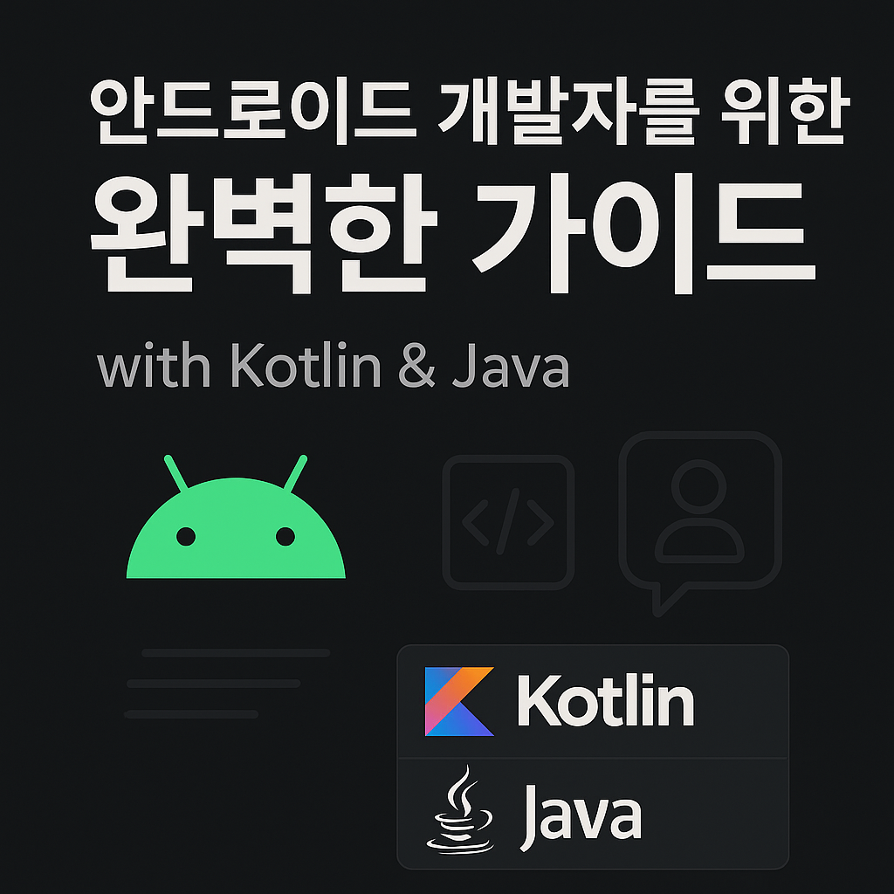

# 안드로이드 개발자를 위한 완벽한 가이드

이 저장소는 **안드로이드 앱 개발자**를 위한 지식 정리 공간입니다.  
Java와 Kotlin 언어를 기반으로 Android의 핵심 개념, 아키텍처 패턴, 비동기 처리, UI 구성 등 
실무와 면접에 모두 활용 가능한 내용을 구조적으로 정리했습니다.

- 👨‍💻 **초보자부터 중급 개발자까지** 모두를 위한 기술 정리
- 📚 **기초 문법부터 실전 적용까지** 단계별 구성
- 🧩 **Android, Java, Kotlin** 세 가지 주제로 분류된 마크다운 노트

> 학습, 복습, 포트폴리오 작성, 면접 준비 등 다양한 목적에 활용할 수 있는 가이드입니다.

## 📝 Table of Contents

- ### Android(https://github.com/cheonjoosung/Interview_Ready/tree/master/Android)
- ### Java(https://github.com/cheonjoosung/Interview_Ready/tree/master/Java)
- ### Kotlin(https://github.com/cheonjoosung/Interview_Ready/tree/master/Kotlin)